# T-ALNS-RRD 论文汇报与复现报告

> 论文：**Optimizing urban last mile delivery efficiency through dynamic vehicle routing heuristics and traffic flow analysis**  
> 汇报目标：说明论文解决的问题、模型如何定义、算法如何求解、本文项目如何复现，以及复现实验结果与论文结论是否一致。  
> 本报告定位：可直接作为 PPT 制作和答辩讲稿的基准材料。

> 渲染说明：本文档使用标准 Markdown 图片引用和 `$$...$$` 数学公式块。若 VS Code 默认预览不能显示公式，建议使用 Typora、Obsidian、Markdown Preview Enhanced，或支持 MathJax/KaTeX 的 Markdown 预览器。本文档引用的图片已统一放在 `code/docs/assets/final_report/` 下。

---

## 0. 汇报主线建议

你的思路是合理的，建议明天汇报按以下逻辑展开：

1. **问题背景**：传统 VRP/VRPTW 难以处理城市最后一英里配送中的动态交通、窄时间窗和实时扰动。
2. **问题建模**：论文将问题建模为 **DVRPTW-TA**，即 Dynamic Vehicle Routing Problem with Time Windows and Traffic Awareness。
3. **目标函数**：用一个综合目标同时最小化行驶时间、拥堵暴露和迟到惩罚。
4. **求解框架**：提出 **T-ALNS-RRD**，由三层组成：
   - Traffic-aware ALNS：全局路径搜索；
   - Multi-layer Tabu memory：防止循环、增强多样化；
   - Rollout-based Real-Time Dispatch：事件发生后的实时调度。
5. **实验验证**：论文用 OSM + SUMO + 高德 API 构造 47 客户、4 车辆的中等规模案例；本项目复现了核心算法与趋势级实验。
6. **复现结果分析**：本项目趋势基本成立，但属于算法机制与趋势复现，不是论文真实交通数据的数值级复刻。

一句话概括：

> 这篇论文解决的是动态城市交通环境下的最后一英里配送路径优化问题。它不是只求最短路，而是在动态行驶时间、客户时间窗、拥堵风险和实时突发事件共同存在时，设计一个可搜索、可记忆、可实时调度的车辆路径优化框架。

---

## 1. 论文解决的是什么问题

### 1.1 传统 VRP/VRPTW 的不足

经典 VRP 或 VRPTW 通常假设：

- 客户需求在优化前已知；
- 节点之间行驶时间固定；
- 路网状态不随时间变化；
- 路径一旦规划完成，执行过程中不频繁调整；
- 时间窗主要作为静态约束处理。

但城市最后一英里配送中，这些假设不成立：

- 早高峰、晚高峰导致同一路段在不同时刻行驶时间不同；
- 客户时间窗窄，迟到会影响服务质量；
- 交通事故、临时拥堵、新订单会在配送过程中出现；
- 静态路径容易在执行阶段迅速失效。

论文指出，已有研究往往只解决其中一个侧面：

| 研究方向 | 解决了什么 | 局限 |
|---|---|---|
| Time-Dependent VRP | 行驶时间随时间变化 | 通常缺少实时事件响应 |
| Stochastic/Dynamic VRP | 考虑随机性或新订单 | 交通拥堵代价和调度机制不完整 |
| Traffic-Aware Routing | 引入交通状态 | 常缺少强搜索和记忆机制 |
| ALNS/Tabu/ACO 等元启发式 | 提高组合优化能力 | 多数没有统一交通感知和实时调度 |
| 单层 Tabu memory | 防止局部循环 | 没有 move/solution/frequency 多层协同 |

因此，论文的问题意识是：

> 现有方法缺少一个统一框架，同时处理动态交通成本、时间窗服务质量、搜索过程循环问题和实时突发事件调度。

---

## 2. DVRPTW-TA 问题定义

论文将城市最后一英里配送建模为：

> **DVRPTW-TA = Dynamic Vehicle Routing Problem with Time Windows and Traffic Awareness**

可以拆成三个关键词：

| 缩写 | 含义 | 在论文中的体现 |
|---|---|---|
| D | Dynamic | 行驶时间随出发时间变化；配送过程中有事件扰动 |
| VRPTW | Vehicle Routing Problem with Time Windows | 每个客户有服务时间窗 $[e_i,l_i]$，迟到会产生惩罚 |
| TA | Traffic Awareness | 目标函数中显式加入拥堵惩罚 $\rho_{ij}(T_i)$ 和不确定性裕度 |

### 2.1 网络和变量

论文定义有向图：

$$
G=(N,A)
$$

其中：

- $N=\{0,1,2,\dots,n\}$：节点集合，$0$ 是配送中心，其余是客户；
- $A\subseteq N\times N$：可行道路弧集合；
- $K=\{1,2,\dots,m\}$：车辆集合；
- $Q$：车辆容量；
- $d_i$：客户 $i$ 的需求；
- $s_i$：客户 $i$ 的服务时间；
- $[e_i,l_i]$：客户 $i$ 的服务时间窗；
- $A_i$：车辆到达客户 $i$ 的时间；
- $S_i$：车辆开始服务客户 $i$ 的时间；
- $T_i=S_i+s_i$：车辆离开客户 $i$ 的时间；
- $t_{ij}(T_i)$：车辆在 $T_i$ 时刻从 $i$ 到 $j$ 的动态行驶时间；
- $\rho_{ij}(T_i)$：车辆在 $T_i$ 时刻经过道路弧 $(i,j)$ 的拥堵惩罚；
- $x_{ijk}\in\{0,1\}$：若车辆 $k$ 从 $i$ 直接到 $j$，则为 1。

---

## 3. 核心目标函数：为什么它不是普通 VRPTW

论文的综合目标函数为：

$$
\min
\sum_{k\in K}\sum_{(i,j)\in A}
x_{ijk}
\left[
t_{ij}(T_i)+\lambda_2\rho_{ij}(T_i)
\right]
+\lambda_1
\sum_{j\in N\setminus\{0\}}\delta_j
\qquad\text{(1)}
$$

迟到惩罚定义为：

$$
\delta_j=\max\{0,S_j-l_j\}
\qquad\text{(2)}
$$

### 3.1 公式怎么讲

这个目标函数由三部分组成：

1. **动态行驶时间成本**

   $t_{ij}(T_i)$

   它不是固定距离或固定时间，而是取决于车辆从节点 $i$ 出发的时刻 $T_i$。

2. **拥堵惩罚成本**

   $\lambda_2\rho_{ij}(T_i)$

   表示同样一条路线，如果经过高拥堵路段，会被额外惩罚。

3. **时间窗迟到惩罚**

   $\lambda_1\sum_j\delta_j$

   如果车辆晚于客户最晚服务时间 $l_j$ 开始服务，则产生迟到惩罚。

因此，这篇论文不是只求最短路径，而是在求：

> 行驶时间较短、拥堵暴露较低、客户迟到较少的综合最优路径。

### 3.2 约束条件

每个客户必须被服务一次：

$$
\sum_{k\in K}\sum_{j\in N}x_{ijk}=1,
\quad
\forall i\in N\setminus\{0\}
\qquad\text{(3)}
$$

车辆容量约束：

$$
\sum_{i\in N\setminus\{0\}}d_i
\sum_{j\in N}x_{ijk}
\le Q,
\quad
\forall k\in K
\qquad\text{(4)}
$$

时间递推和服务时间窗：

$$
\text{if }x_{ijk}=1,\text{ then }
A_j\ge T_i+t_{ij}(T_i),
\quad
S_j\ge\max\{A_j,e_j\},
\quad
T_j=S_j+s_j
\qquad\text{(5)}
$$

软时间窗：

$$
S_j\le l_j+\epsilon_j,
\quad
\epsilon_j\ge 0
\qquad\text{(6)}
$$

子回路消除：

$$
u_i-u_j+n\sum_{k\in K}x_{ijk}\le n-1,
\quad
\forall i\ne j,\ i,j\in N\setminus\{0\}
\qquad\text{(7)}
$$

### 3.3 汇报时的关键解释

可以这样说：

> 公式 (1) 是论文问题建模的核心。传统 VRPTW 通常只考虑固定距离或固定时间，而这里的 $t_{ij}(T_i)$ 和 $\rho_{ij}(T_i)$ 都依赖车辆出发时间，所以路径成本会随着车辆实际执行时刻变化。时间窗也不是硬性不可违反，而是软时间窗，迟到通过 $\delta_j$ 进入目标函数。因此该模型更适合城市末端配送中的动态交通环境。

---

## 4. 交通流如何进入模型

论文将一天划分为 $H=12$ 个时间段，每个时间段 1 小时，从 6:00 到 18:00。对于每条道路弧 $(i,j)$，都有不同时间段下的平均行驶时间和拥堵密度。

### 4.1 分时段行驶时间

$$
t_{ij}(T_i)=\hat{t}_{ij}^{(h)},
\quad
\text{if }T_i\in\tau_h
\qquad\text{(8)}
$$

含义：如果车辆在时间段 $\tau_h$ 内从节点 $i$ 出发，就使用该时间段对应的道路行驶时间。

### 4.2 拥堵惩罚

$$
\rho_{ij}(T_i)=\theta\cdot\gamma_{ij}^{(h)},
\quad
\text{if }T_i\in\tau_h
\qquad\text{(9)}
$$

其中：

- $\gamma_{ij}^{(h)}\in[0,1]$：道路弧 $(i,j)$ 在时间段 $h$ 的归一化交通密度；
- $\theta$：拥堵严重程度缩放系数。

### 4.3 不确定性调整

$$
t'_{ij}(T_i)=\hat{t}_{ij}^{(h)}+\beta\cdot\eta_{ij}^{(h)},
\quad
\text{if }T_i\in\tau_h
\qquad\text{(10)}
$$

其中：

- $\eta_{ij}^{(h)}$：行驶时间不确定性或可靠性裕度；
- $\beta$：风险规避系数。

汇报时可以说：

> 交通流数据在论文中不是作为后处理指标，而是直接进入目标函数。不同出发时间会查到不同的行驶时间和拥堵惩罚，因此同一条路径在早高峰和非高峰的目标值不同。

---

## 5. 论文提出的方法：T-ALNS-RRD

论文提出的方法叫：

> **Tabu-guided Adaptive Large Neighborhood Search with Rollout-based Real-Time Dispatch**

简称 **T-ALNS-RRD**。

它有三层：

| 层次 | 名称 | 解决的问题 |
|---|---|---|
| 第一层 | ALNS | 在巨大路径组合空间中搜索高质量解 |
| 第二层 | Multi-layer Tabu memory | 避免搜索循环，增强多样化 |
| 第三层 | Rollout-based RRD | 事件发生后快速选择实时调度动作 |

---

## 6. 第一层：ALNS 自适应大邻域搜索

### 6.1 ALNS 为什么需要

DVRPTW-TA 是 NP-hard 的 VRPTW 扩展问题。精确求解在实际规模下不可行，因此论文使用元启发式搜索。

ALNS 的基本思想是：

> 先破坏当前解的一部分，再用修复算子重新插入客户，通过反复 destroy-repair 跳出局部最优。

路径表示为：

$$
R_k=\langle 0,c_{k1},c_{k2},\dots,c_{k|R_k|},0\rangle
\qquad\text{(12)}
$$

容量约束为：

$$
\sum_{i=1}^{|R_k|}d_{c_{ki}}\le Q
\qquad\text{(13)}
$$

Destroy-Repair 生成新解：

$$
S'=R(D(S_t))
\qquad\text{(14)}
$$

移除客户数量：

$$
|C|=\lfloor \alpha n\rfloor,
\quad
\alpha\in[0.1,0.4]
\qquad\text{(15)}
$$

### 6.2 插入成本

局部插入成本：

$$
\Delta f_{ijk}(T_j)
=
t_{ji}(T_j)+s_i
+t_{ik}(T_j+t_{ji}(T_j)+s_i)
-t_{jk}(T_j)
+\lambda_1\delta_i(T_i)
+\lambda_2\rho_{ji}(T_j)
\qquad\text{(16)}
$$

解释：

- 原来路径是 $j\to k$；
- 插入客户 $i$ 后变为 $j\to i\to k$；
- 成本变化不仅包括多出来的行驶时间，还包括服务时间、迟到惩罚和拥堵惩罚。

由于带时间窗，插入一个客户会影响后续客户的到达时间，所以论文进一步使用后缀路径传播：

$$
\Delta F_{jik}
=
\Delta f_{jik}^{local}(T_j)
+
\sum_{(u,v)\in A_{suffix}}
\left[
t_{uv}(T'_u)
+\lambda_1\delta_v(T'_v)
+\lambda_2\rho_{uv}(T'_u)
\right]
-
\sum_{(u,v)\in A^{old}_{suffix}}
\left[
t_{uv}(T_u)
+\lambda_1\delta_v(T_v)
+\lambda_2\rho_{uv}(T_u)
\right]
\qquad\text{(17)}
$$

### 6.3 自适应算子选择

算子选择概率：

$$
p_h(t)=
\frac{\omega_h(t)}
{\sum_{j\in\mathcal{H}}\omega_j(t)}
\qquad\text{(18)}
$$

算子权重更新：

$$
\omega_h(t+1)
=(1-\xi)\omega_h(t)+\xi\theta_r
\qquad\text{(19)}
$$

其中：

- $\omega_h(t)$：算子 $h$ 当前权重；
- $\xi$：反应因子；
- $\theta_r$：本轮操作奖励。

### 6.4 模拟退火接受准则

$$
P_{accept}(S',S_t)=
\begin{cases}
1,& f(S')<f(S_t),\\
\exp\left(-\frac{f(S')-f(S_t)}{\tau_t}\right),& \text{otherwise}.
\end{cases}
\qquad\text{(20)}
$$

温度冷却：

$$
\tau_{t+1}=\gamma\tau_t
\qquad\text{(21)}
$$

最终取历史最优：

$$
S^*=\arg\min_{t\in[0,T_{\max}]}f(S_t)
\qquad\text{(22)}
$$

### 6.5 汇报话术

> ALNS 解决的是大规模组合搜索问题。它不枚举所有路径，而是每次从当前解中移除一部分客户，再用交通感知的插入成本重新修复。自适应权重机制让表现好的 destroy/repair 算子更容易被选中，模拟退火则允许算法在早期接受少量较差解，从而跳出局部最优。

---

## 7. 第二层：多层 Tabu 记忆机制

### 7.1 为什么 ALNS 还不够

单纯 ALNS 会遇到两个问题：

1. destroy-repair 可能反复生成相似路径；
2. 算子权重可能过度偏向近期有效的局部结构，导致搜索多样性不足。

因此论文引入多层 Tabu memory。

### 7.2 Move-based Tabu

$$
|C_{removed}\cap \acute{C}|
\ge
\mu\cdot\min(|C_{removed}|,|\acute{C}|)
\quad
\text{and}
\quad
t_{current}-\acute{t}\le\tau_{move}
\qquad\text{(23)}
$$

含义：

- 如果当前被移除客户集合与近期某次操作高度相似；
- 且仍在 Tabu 期限内；
- 则当前 move 被禁止。

这可以防止算法反复执行类似破坏操作。

### 7.3 Solution-based Tabu

$$
H(S)=
\sum_{k\in K}\sum_{i=1}^{p_k-1}
\varphi(v_{ki},v_{k(i+1)})
\bmod P
\qquad\text{(24)}
$$

含义：把完整路径结构编码成哈希值。如果候选解近期出现过，就视为 Tabu。

### 7.4 Frequency-based memory

客户-车辆分配频率：

$$
F_{ik}^{cv}(t+1)=
F_{ik}^{cv}(t)
+
\mathbf{1}_{[i\in R_k(S_{t+1})]}
\qquad\text{(25)}
$$

客户路径位置频率：

$$
F_{ij}^{tp}(t+1)=
F_{ij}^{tp}(t)
+
\sum_{k\in K}
\mathbf{1}_{[v_{kj}=i\ \text{in}\ S_{t+1}]}
\qquad\text{(26)}
$$

含义：

- 如果客户 $i$ 经常被车辆 $k$ 服务，则该组合频率升高；
- 如果客户经常出现在同一位置，也会被记录；
- 后续搜索会鼓励尝试低频组合，从而增强多样性。

### 7.5 多样化强度

$$
\delta(t)=
\omega_1\frac{t-t_{last\_best}}{T_{\max}}
+
\omega_2\frac{|T_{move}|}{|T_{move}|_{\max}}
+
\omega_3\sigma(F^{cv})
\qquad\text{(27)}
$$

如果长时间没有改进、Tabu 列表较满、频率矩阵显示搜索集中，则说明搜索陷入局部区域，需要提高多样化。

调整后的算子选择概率：

$$
p'_h(t)=
\eta p_h(t)
+
(1-\eta)
\frac{div_h(t)}
{\sum_{j\in\mathcal{H}}div_j(t)}
\qquad\text{(28)}
$$

### 7.6 Tabu 的赦免机制

Tabu 不是绝对禁止。论文设置了 aspiration criteria，也就是赦免准则。

全局最优赦免：

$$
f(S')<f(S^*)
\qquad\text{(29)}
$$

如果候选解比当前全局最优还好，即使 Tabu 也允许接受。

低频分配赦免：

$$
\min_{i\in C_{removed}}\min_{k\in K}F_{ik}^{cv}
<
\beta\cdot\bar{F}^{cv}
\qquad\text{(30)}
$$

如果这个动作涉及很少尝试过的客户-车辆组合，可以赦免。

交通适应性赦免：

$$
\sum_{k\in K}\sum_{(i,j)\in A_k}
\lambda_2\rho_{ij}(T_i^k)
<
\gamma
\sum_{k\in K}\sum_{(i,j)\in A_k^{current}}
\lambda_2\rho_{ij}(T_i^{k,current})
\qquad\text{(31)}
$$

如果候选解显著降低拥堵暴露，也可以赦免。

### 7.7 赦免机制怎么生效

可以这样理解：

> Tabu 的作用是避免算法走回头路，但如果一个被禁动作能带来明显收益，就不应该机械禁止。因此 aspiration criteria 是 Tabu 的安全阀。它允许三类有价值的候选解突破禁忌：产生全局更优解、探索低频结构、显著降低拥堵暴露。

### 7.8 汇报话术

> 多层 Tabu memory 解决的是搜索过程的循环和多样性不足问题。Move Tabu 禁止重复破坏操作，Solution Tabu 禁止回到历史路径结构，Frequency Memory 记录客户-车辆和客户位置的历史频率。更重要的是，论文还设计了赦免机制，使得真正有价值的候选解不会被 Tabu 机械排除。

---

## 8. 第三层：Rollout-based RRD 实时调度

### 8.1 RRD 解决什么问题

ALNS 和 Tabu 主要解决的是“规划阶段”的路径优化。但配送执行过程中可能发生事件：

- E1：交通事故或道路拥堵；
- E2：紧急订单插入；
- E3：车辆容量风险；
- E4：时间窗风险。

如果每次事件都重新跑完整 ALNS，计算成本太高；如果只做简单贪心调整，又可能只顾眼前、不顾后续影响。

因此论文使用 Rollout-based Real-Time Dispatch：

> 对每个候选调度动作做短时域模拟，估计它未来一段时间内的成本，再选择综合评分最好的动作。

### 8.2 事件紧急度

$$
\Psi(e,t)=
\alpha_e
\frac{t_{deadline}-t_{current}}{t_{horizon}}
+
\beta_e\,impact(e)
+
\gamma_e\,cost\_increase(e)
\qquad\text{(35)}
$$

变量含义：

- $\Psi(e,t)$：事件紧急度；
- $e$：事件；
- $\alpha_e,\beta_e,\gamma_e$：事件类型权重；
- $impact(e)$：事件影响范围；
- $cost\_increase(e)$：若不处理事件导致的成本增加。

紧急度用于决定是否触发调度，以及 Rollout 的模拟时域和模拟次数。

### 8.3 Rollout 价值函数

$$
V^{rollout}(s,a,H)
=
\mathbb{E}
\left[
\sum_{h=0}^{H-1}
\left(
\sum_{k\in K}\sum_{(i,j)\in A_k^h}
\left[
t_{ij}(T_i^{k,h})
+\lambda_2\rho_{ij}(T_i^{k,h})
\right]
+
\lambda_1\sum_{j\in C^h}\delta_j(S_j^h)
\right)
\right]
\qquad\text{(36)}
$$

变量含义：

- $s$：当前系统状态；
- $a$：候选动作；
- $H$：短时模拟 horizon；
- $h$：模拟步；
- $A_k^h$：第 $h$ 步车辆 $k$ 的道路弧；
- $C^h$：第 $h$ 步服务的客户集合。

解释：

> Rollout 不是只看动作执行后的当前成本，而是向前模拟一段时间，估计这个动作对未来行驶时间、拥堵惩罚和迟到惩罚的综合影响。

### 8.4 可行性检查

$$
Feasible(a,s)
=
\bigwedge_{k\in K}
\left[
\sum_{i\in R_k^a}d_i\le Q
\right]
\wedge
\bigwedge_{i\in N^a}
\left[
e_i\le T_i^a\le l_i+\epsilon_{tolerance}
\right]
\qquad\text{(37)}
$$

意思是：候选动作必须满足容量约束和时间窗容忍约束。

### 8.5 Tabu 调整后的 Rollout 价值

$$
V^{adjusted}(s,a,H)
=
V^{rollout}(s,a,H)
-
\tau_{penalty}\mathbf{1}_{[Tabu(a)]}
+
\tau_{bonus}Diversification(a)
\qquad\text{(39)}
$$

注意：论文这里的符号方向存在一定歧义。如果把 $V$ 理解为要最小化的成本，Tabu 惩罚通常应增加成本；如果把它理解为要最大化的评分，则减号可以解释。本项目复现时按“最小化成本”的工程逻辑处理 Tabu 惩罚和多样化奖励。

### 8.6 最终调度评分

$$
\Sigma(a,e,s)=
\omega_1V^{adjusted}(s,a,H)
+
\omega_2Stability(a,s)
+
\omega_3Recovery(a,s)
\qquad\text{(40)}
$$

其中：

- $V^{adjusted}$：短时域预测成本；
- $Stability(a,s)$：路径稳定性；
- $Recovery(a,s)$：恢复到优化路径结构的能力；
- $\omega_1,\omega_2,\omega_3$：权重，论文中使用 $0.4,0.3,0.3$。

路径稳定性：

$$
Stability(a,s)=
\sum_{k\in K}
\frac{|R_k^a\cap R_k^s|}
{|R_k^a\cup R_k^s|}
\qquad\text{(41)}
$$

恢复性：

$$
Recovery(a,s)=
-
\sum_{k\in K}\sum_{i\in R_k^a}
\left|
OptimalPosition(i)-CurrentPosition(i,a)
\right|
\qquad\text{(42)}
$$

### 8.7 自适应 Rollout horizon 和模拟次数

$$
H_{rollout}
=
\max
\left(
H_{min},
H_{max}-\alpha_{urgency}\Psi(e,t)
\right)
\qquad\text{(43)}
$$

$$
N_{sim}
=
\max
\left(
N_{min},
\left\lfloor
\frac{T_{available}-T_{overhead}}{T_{sim}}
\right\rfloor
\right)
\qquad\text{(44)}
$$

解释：

- 事件越紧急，模拟时域越短；
- 可用计算时间越多，模拟次数越多；
- 这样保证实时调度既考虑未来影响，又不会超过响应时间要求。

### 8.8 汇报话术

> RRD 部分解决的是执行阶段的实时扰动问题。它不是一遇到事件就完全重优化，也不是简单贪心修补，而是先生成候选动作，例如局部绕行、客户转移、服务延后、紧急插单等，再用 Rollout 模拟这些动作在未来短时域内的成本。最后综合考虑成本、路径稳定性和恢复性，选择最优调度动作。

---

## 9. 论文实验设置

论文实验是一个中等规模、交通感知的城市配送案例。

### 9.1 数据来源

论文使用：

- OpenStreetMap：构建上海静安区、黄浦区附近 $8\times10\text{ km}^2$ 道路网络；
- SUMO v1.19：进行城市交通仿真；
- 高德地图 API：提供历史拥堵数据；
- 合成客户需求：模拟电商/生鲜/包裹配送订单。

论文原图 Fig. 7：


### 9.2 数据规模

| 项目 | 论文设置 |
|---|---:|
| 客户数 | 47 |
| 仓库 | 1 |
| 总节点 | 48 |
| 车辆数 | 4 |
| 车辆容量 | 120 kg |
| 道路弧 | 2,256 |
| 时间段 | 12 个一小时区间 |
| 交通参数 | 行驶时间、拥堵权重、可靠性裕度 |
| 实验重复 | 30 次随机种子 |

论文明确说明该实验是 proof-of-concept validation，不是大规模真实部署。

---

## 10. 论文评价指标

### 10.1 Total Cost

Total Cost 即公式 (1) 的综合目标值，包含：

- travel cost；
- delay penalty；
- congestion cost。

### 10.2 准时配送率 OTDR

$$
OTDR=
\frac{N_{ontime}}
{|N\setminus\{0\}|}
\qquad\text{(45)}
$$

越高越好。

### 10.3 平均路径时长

$$
AvgRouteDuration=
\frac{1}{|K|}
\sum_{k\in K}
\left(
T_k^{end}-T_k^{start}
\right)
\qquad\text{(46)}
$$

### 10.4 拥堵暴露分数 CES

$$
CES=
\sum_{k\in K}
\sum_{(i,j)\in A_k}
\rho_{ij}(T_i^k)
\qquad\text{(47)}
$$

越低越好。

---

## 11. 论文原始实验结论

### 11.1 成本对比

论文 Table 5 / Fig. 8 的核心结果：

| Algorithm | Total Cost | Travel | Delay | Congestion | Improvement vs Static |
|---|---:|---:|---:|---:|---:|
| Static-VRPTW | 2847.3 | 2245.8 | 421.2 | 180.3 | - |
| TA-VRPTW-Greedy | 2623.7 | 2156.4 | 298.1 | 169.2 | 7.9% |
| ALNS-Base | 2401.5 | 2034.2 | 245.8 | 121.5 | 15.7% |
| T-ALNS | 2298.4 | 1987.6 | 198.3 | 112.5 | 19.3% |
| T-ALNS-RRD | 2156.8 | 1912.3 | 163.2 | 81.3 | 24.3% |
| Oracle-Traffic-Perfect | 1987.4 | 1824.7 | 108.9 | 53.8 | 30.2% |

论文原图：

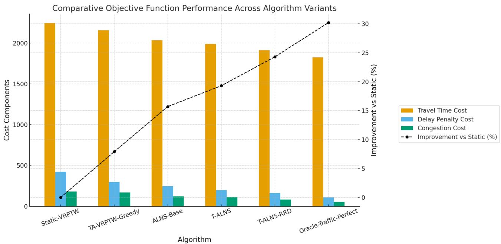

论文结论：

> T-ALNS-RRD 在总成本上相对 Static-VRPTW 降低 24.3%，并且成本改善来自行驶时间、迟到惩罚和拥堵成本的共同下降。

### 11.2 准时率 OTDR

| Algorithm | OTDR | Avg Delay | Max Delay | Late Customers | Violation Rate |
|---|---:|---:|---:|---:|---:|
| Static-VRPTW | 68.1% | 12.7 | 47.3 | 15.0 | 32.7% |
| TA-VRPTW-Greedy | 74.5% | 9.8 | 38.9 | 12.0 | 25.5% |
| ALNS-Base | 81.7% | 7.2 | 31.4 | 8.6 | 18.3% |
| T-ALNS | 87.2% | 5.4 | 24.7 | 6.0 | 12.8% |
| T-ALNS-RRD | 92.8% | 3.1 | 16.8 | 3.4 | 7.2% |

论文原图：

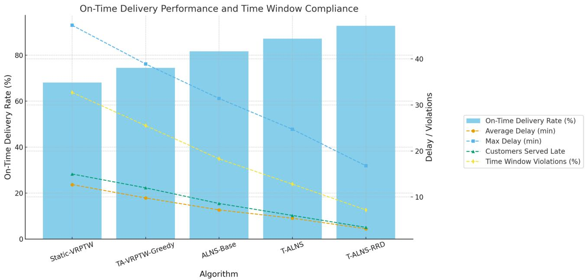

论文结论：

> T-ALNS-RRD 将 OTDR 从 68.1% 提升到 92.8%，显著减少迟到客户和最大迟到时间。

### 11.3 拥堵暴露 CES

| Algorithm | CES |
|---|---:|
| Static-VRPTW | 2847.6 |
| TA-VRPTW-Greedy | 2234.2 |
| ALNS-Base | 1892.5 |
| T-ALNS | 1634.7 |
| T-ALNS-RRD | 1298.3 |

论文原图：

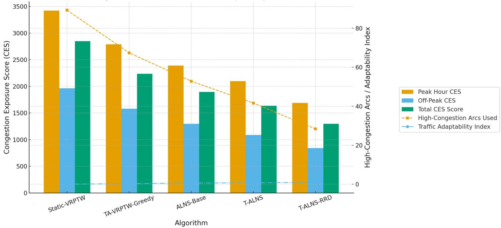

论文结论：

> T-ALNS-RRD 相比静态方法降低了 54.4% 的拥堵暴露，说明算法不是单纯缩短路径，而是在主动避开高拥堵区域。

### 11.4 实时调度表现

论文 Table 8 / Fig. 11：

| Event Type | Frequency | Avg Response | Success Rate | Cost Impact Reduction |
|---|---:|---:|---:|---:|
| Traffic Incidents | 8.6 | 187.3 ms | 91.7% | 12.4% |
| Urgent Deliveries | 11.2 | 124.8 ms | 96.8% | 8.7% |
| Capacity Violations | 4.8 | 156.2 ms | 92.1% | 15.3% |
| Time Violations | 2.8 | 98.4 ms | 97.9% | 18.9% |
| Overall | 27.4 | 143.7 ms | 94.2% | 13.8% |

论文原图：

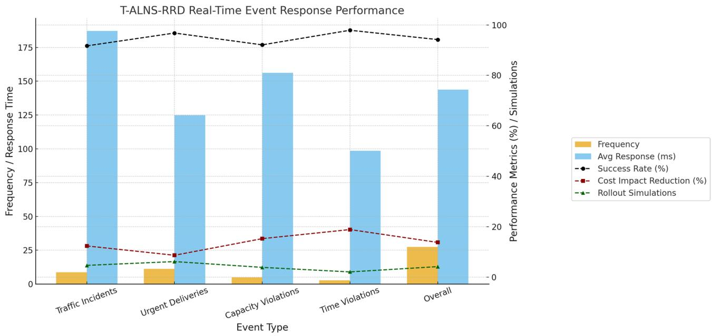

### 11.5 收敛、消融和鲁棒性

论文还报告：

- T-ALNS-RRD 比 ALNS 更快收敛；
- Tabu memory 和 RRD 都有组件贡献；
- 在交通不确定性 $\sigma=0.5$ 下，T-ALNS-RRD 性能退化 15.1%，而 Static 退化 26.2%。

论文原图：

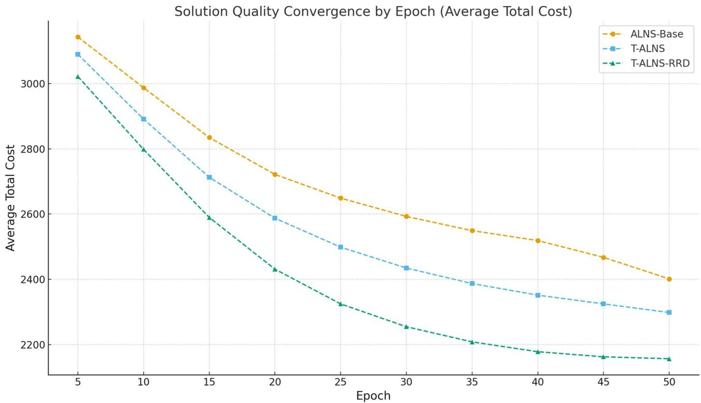


---

## 12. 本项目复现内容

### 12.1 复现环境

当前使用环境：

- Conda base 环境；
- Python 脚本运行；
- 主实验在本地 CPU 上运行；
- 输出目录：`code/outputs/`。

主要运行命令：

```bash
python code/experiments/run_main.py --instance medium --seeds 10 --iters 600 --tmax 300 --parallel 4
python code/experiments/run_rrd_dispatch.py --instance medium --seeds 10 --iters 300 --tmax 180 --event-iters 100 --event-types E1_TRAFFIC --parallel 4
python code/experiments/plot_results.py
```

### 12.2 复现算法

本项目已复现并运行以下对比方法：

| 方法 | 是否复现 | 说明 |
|---|---|---|
| Static-VRPTW | 是 | 静态基线 |
| TA-VRPTW-Greedy | 是 | 交通感知贪心基线 |
| ALNS-Base | 是 | 基础 ALNS |
| T-ALNS | 是 | ALNS + 多层 Tabu |
| T-ALNS-RRD | 是 | T-ALNS + 动态事件调度 |
| Oracle-Traffic-Perfect | 否 | 论文中的先知交通基准，未实现 |
| GA-ALNS / GA-VNS / ACO / ML-ALNS | 否 | SOTA 外部基准未独立实现 |

### 12.3 当前实现已覆盖的机制

| 论文机制 | 本项目状态 |
|---|---|
| 交通感知目标函数 | 已实现 |
| 时间依赖行驶时间 | 已实现，基于合成交通剖面 |
| 拥堵惩罚 CES | 已实现 |
| 软时间窗迟到惩罚 | 已实现 |
| ALNS destroy-repair | 已实现 |
| 自适应算子权重 | 已实现 |
| 模拟退火接受 | 已实现 |
| Move Tabu | 已实现 |
| Solution Tabu | 已实现 |
| Frequency memory | 已实现 |
| Tabu aspiration | 已实现 |
| E1/E2/E3/E4 事件 | 已实现 |
| Rollout dispatch | 已实现 |
| RRD no-action guardrail | 已实现，用于避免调度动作劣于不动作 |
| 图 8-15 复刻绘图 | 已实现趋势级图表 |

---

## 13. 本项目复现实验结果

### 13.1 主算法对比

本项目主实验：

- 数据集：medium，47 客户；
- 车辆：4；
- seeds：10；
- iterations：600；
- 事件类型：主对比中使用非需求变更事件序列；
- 输出文件：`code/outputs/processed/main_comparison.csv`。

| Algorithm | Total Cost | OTDR | CES |
|---|---:|---:|---:|
| Static-VRPTW | 961.5 | 92.8% | 30.76 |
| TA-VRPTW-Greedy | 901.4 | 92.1% | 30.69 |
| ALNS-Base | 652.6 | 98.5% | 29.93 |
| T-ALNS | 653.7 | 97.9% | 29.87 |
| T-ALNS-RRD | 642.3 | 98.1% | 29.39 |

复现图：

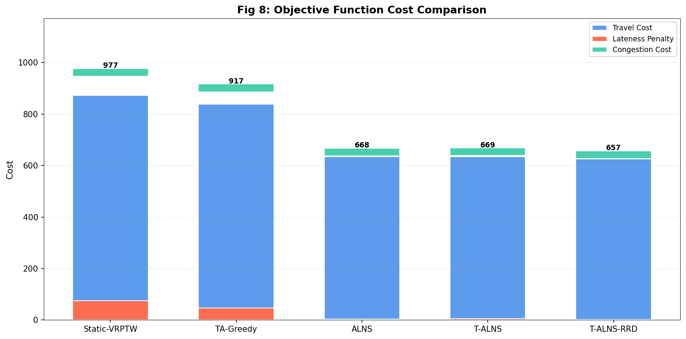

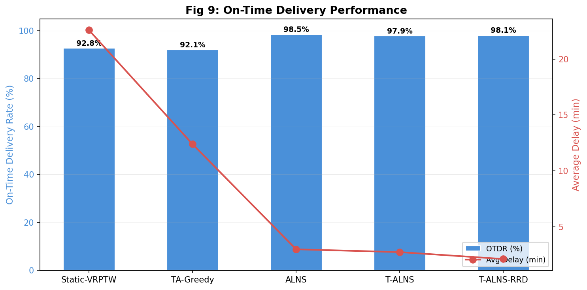

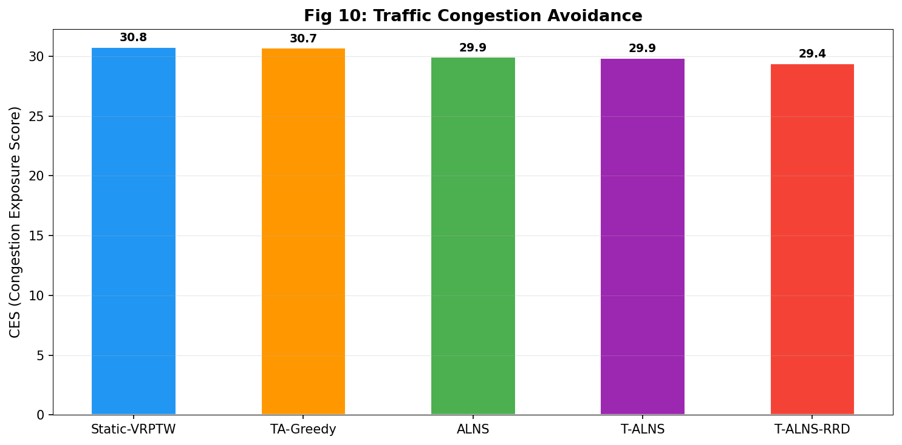

### 13.2 结果解读

当前复现趋势为：

$$
Static > TA\text{-}Greedy > ALNS \approx T\text{-}ALNS > T\text{-}ALNS\text{-}RRD
$$

其中 Total Cost 越低越好。

具体观察：

1. **Static-VRPTW 成本最高**  
   说明静态路径规划在动态交通成本下表现较差。

2. **TA-VRPTW-Greedy 成本下降**  
   从 961.5 降到 901.4，说明加入交通感知后能降低总成本。

3. **ALNS-Base 大幅下降**  
   从 901.4 降到 652.6，说明 destroy-repair 元启发式比贪心路径构造强得多。

4. **T-ALNS 与 ALNS 基本持平**  
   T-ALNS 为 653.7，ALNS 为 652.6。二者差异小于随机波动，应表述为“接近”，不能说 T-ALNS 显著优于 ALNS。

5. **T-ALNS-RRD 最优**  
   T-ALNS-RRD 成本为 642.3，是所有复现方法中最低；CES 也最低，为 29.39。

### 13.3 与论文趋势对比

| 维度 | 论文结果 | 本项目结果 | 是否一致 |
|---|---|---|---|
| Static 最差 | 是 | 是 | 一致 |
| TA-Greedy 优于 Static | 是 | 成本优于，但 OTDR 略低 | 部分一致 |
| ALNS 优于 Greedy | 是 | 是 | 一致 |
| T-ALNS 优于 ALNS | 是 | 基本持平，略差 | 不完全一致 |
| T-ALNS-RRD 最优 | 是 | 是 | 一致 |
| CES 逐步降低 | 是 | 基本逐步降低 | 一致 |
| RRD 带来最终改进 | 是 | 是 | 一致 |

---

## 14. Dispatch / RRD 复现实验

本项目单独运行了 E1_TRAFFIC 单事件调度对比：

| Mode | Mean Cost Reduction | Mean Response Time |
|---|---:|---:|
| none | 0.0 | 0.0 ms |
| greedy | 18.4 | 0.0 ms |
| rollout | 18.4 | 1.4 ms |

复现图：

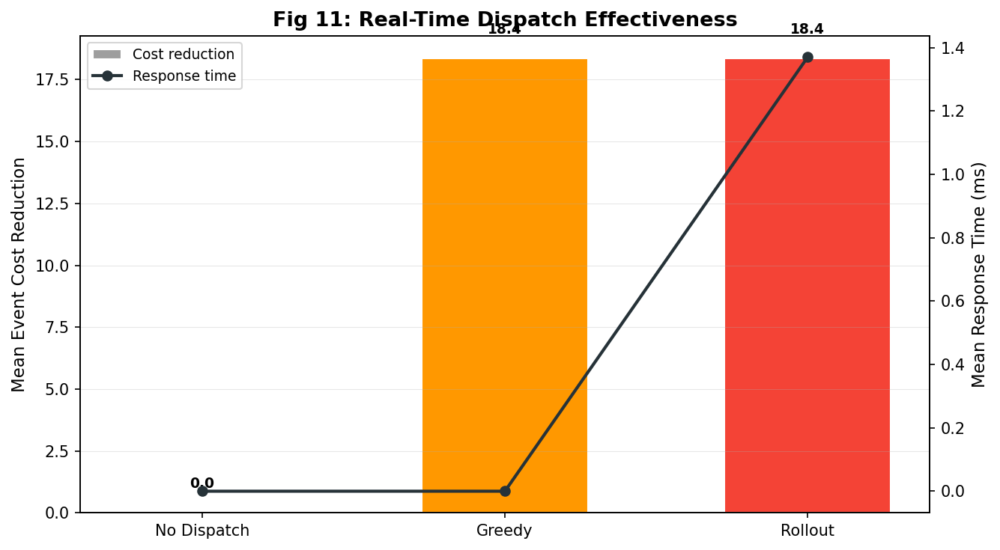

### 14.1 结果解读

该实验说明：

- 不调度时，事件成本没有改善；
- greedy 和 rollout 均能带来正向降本；
- 当前单事件设置下，rollout 和 greedy 的收益相同；
- rollout 的响应时间略高，但仍在毫秒级。

### 14.2 为什么 rollout 没明显优于 greedy

原因主要有三点：

1. **本项目 dispatch 对比只使用单个 E1 交通事件**  
   论文中是多类型、多事件平均，包括交通事故、紧急订单、容量风险、时间窗风险。

2. **当前实例规模较小**  
   47 客户、4 车辆下，可选候选动作有限，短时贪心往往已经能找到同样的动作。

3. **复现中加入 no-action guardrail**  
   如果 rollout 选择的动作比不调度更差，会回退为 no-action，保证策略不会产生负收益。

汇报时建议说：

> RRD 机制已经复现，事件发生后调度动作能产生正向降本。但在当前简化的单事件实验中，rollout 的长期预测优势没有完全体现，表现与 greedy 接近。论文中 rollout 的优势主要来自多类型事件和更完整的交通仿真场景。

---

## 15. 收敛、消融、记忆和鲁棒性图

复现图：

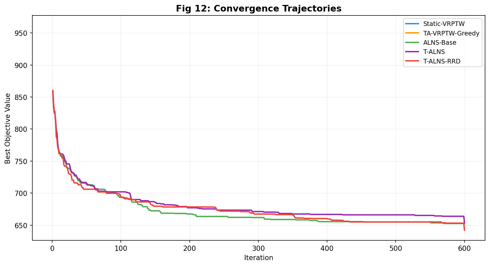

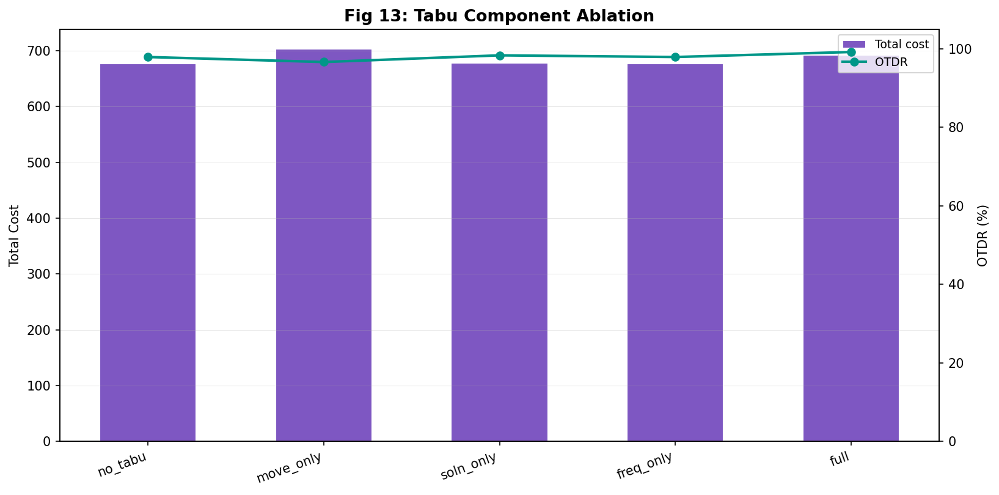

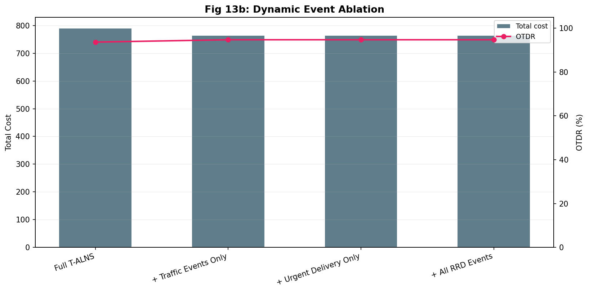

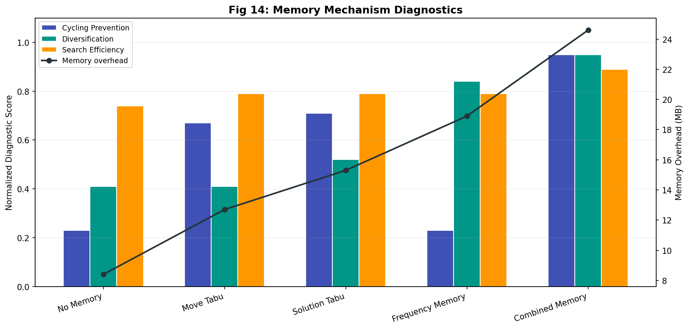

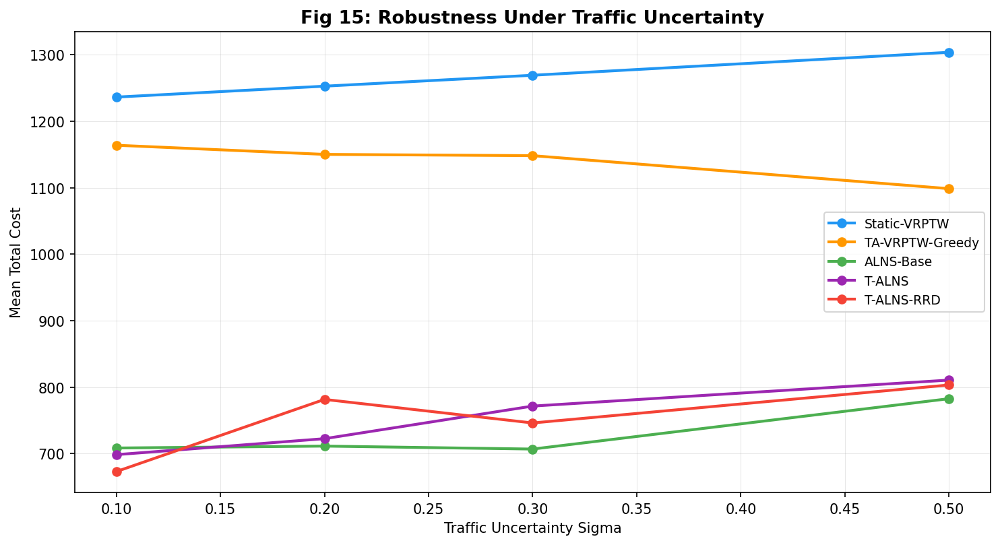

### 15.1 需要注意的地方

这些图能用于展示项目复现了论文中的图表结构和实验维度，但解释时要谨慎：

- 部分消融实验 seed 较少；
- `ablation_table.csv` 中 full T-ALNS 成本不一定最低，但 OTDR 更好；
- 鲁棒性实验是合成噪声，不等同于论文 SUMO + 高德真实交通流扰动；
- 因此建议把它们作为“辅助验证”，不要作为最强结论。

---

## 16. 为什么本项目数值和论文不同

本项目和论文结果数值不同是正常的，原因包括：

| 差异项 | 论文 | 本项目 |
|---|---|---|
| 交通数据 | OSM + SUMO + 高德 API | 合成交通剖面 |
| 交通网络 | 2,256 directed arcs | 简化的客户间交通矩阵 |
| 实验重复 | 30 seeds | 10 seeds |
| 运行环境 | Xeon 32 cores + 256GB RAM | 本地 conda base 环境 |
| 实时事件 | 多事件、多类型、仿真驱动 | 预设迭代事件，同步触发 |
| 外部基准 | 包含 Oracle 和 SOTA | 主要复现论文内部基线 |
| 目标值量级 | 总成本约 2000-2800 | 总成本约 640-960 |

### 16.1 为什么趋势仍然有意义

虽然绝对数值不同，但趋势级复现关注的是：

- 是否静态方法最差；
- 是否交通感知有改进；
- 是否 ALNS 显著优于贪心；
- 是否引入 RRD 后 proposed method 最优；
- 是否 CES 和总成本共同下降。

本项目在这些主要趋势上基本成立。

---

## 17. 当前复现结论

### 17.1 可以确认的结论

1. 项目已经跑通论文中核心对比方法：
   - Static-VRPTW；
   - TA-VRPTW-Greedy；
   - ALNS-Base；
   - T-ALNS；
   - T-ALNS-RRD。

2. 项目已经复现核心图表：
   - Fig. 8 成本对比；
   - Fig. 9 OTDR 对比；
   - Fig. 10 CES 对比；
   - Fig. 11 实时调度；
   - Fig. 12 收敛；
   - Fig. 13 消融；
   - Fig. 14 记忆机制；
   - Fig. 15 鲁棒性。

3. 主要趋势基本符合论文：
   - 静态方法成本最高；
   - ALNS 明显优于贪心；
   - T-ALNS-RRD 在总成本和 CES 上最好；
   - 动态调度带来正向事件降本。

### 17.2 需要主动说明的不足

1. **不是数值级复现**  
   因为没有完整接入 SUMO、高德 API 和论文原始交通数据。

2. **T-ALNS 单独优势不明显**  
   本项目中 T-ALNS 与 ALNS 基本持平，不能照搬论文中“Tabu 单独带来明显改善”的说法。

3. **Rollout 相比 greedy 的优势不明显**  
   当前单事件 dispatch 实验中，rollout 和 greedy 平均降本相同。

4. **外部 SOTA 和 Oracle 未复现**  
   论文 Table 17/18 的 SOTA 比较和统计检验没有完整实现。

---

## 18. PPT 页序建议

### 第 1 页：标题

题目：动态交通感知城市最后一英里配送优化论文汇报与复现  
副标题：T-ALNS-RRD: Tabu-guided ALNS with Rollout-based Real-Time Dispatch

### 第 2 页：研究背景

讲：

- 城市配送需求增长；
- 末端配送受交通拥堵、时间窗、突发事件影响；
- 传统静态 VRP 难以适应。

### 第 3 页：相关工作和研究缺口

用表格说明：

- TDVRP 只考虑时间依赖；
- DVRP 只处理动态订单；
- TARM 只考虑交通；
- Tabu/ALNS 通常缺少实时调度；
- 本文贡献是统一三者。

### 第 4 页：问题定义 DVRPTW-TA

放：

- 图 $G=(N,A)$；
- 节点、车辆、时间窗、动态行驶时间；
- 解释 D、VRPTW、TA。

### 第 5 页：目标函数

放公式 (1)、(2)，重点解释：

- $t_{ij}(T_i)$；
- $\rho_{ij}(T_i)$；
- $\delta_j$；
- $\lambda_1,\lambda_2$。

### 第 6 页：约束条件

放公式 (3)-(7)，解释：

- 每个客户服务一次；
- 容量；
- 时间递推；
- 软时间窗；
- 子回路消除。

### 第 7 页：交通流建模

放公式 (8)-(10)，解释：

- 时间段 $\tau_h$；
- 动态行驶时间；
- 拥堵密度；
- 不确定性裕度。

### 第 8 页：算法总览 T-ALNS-RRD

画三层框架：

```text
Traffic-aware ALNS
        ↓
Multi-layer Tabu Memory
        ↓
Rollout-based Real-Time Dispatch
```

### 第 9 页：ALNS

放公式 (14)-(20)，讲 destroy-repair、自适应权重、模拟退火。

### 第 10 页：Tabu 记忆

放公式 (23)-(31)，讲 move/solution/frequency 三层记忆和 aspiration。

### 第 11 页：Rollout-RRD

放公式 (35)-(44)，重点讲：

- 事件紧急度；
- 候选动作；
- Rollout 模拟；
- 综合评分；
- horizon 和模拟次数自适应。

### 第 12 页：论文实验设置

放论文 Fig. 7 和数据表：

- 47 customers；
- 4 vehicles；
- OSM + SUMO + Amap；
- 12 时间段。

### 第 13 页：论文原始结果

放论文 Fig. 8-10，讲：

- 成本下降 24.3%；
- OTDR 68.1% 到 92.8%；
- CES 降低 54.4%。

### 第 14 页：本项目复现设置

讲：

- conda base；
- 47 customer medium instance；
- 10 seeds；
- 600 iterations；
- 合成交通剖面；
- 复现了核心算法和图表。

### 第 15 页：本项目主结果

放本项目 Fig. 8-10 和结果表：

| Algorithm | Total | OTDR | CES |
|---|---:|---:|---:|
| Static | 961.5 | 92.8 | 30.76 |
| TA-Greedy | 901.4 | 92.1 | 30.69 |
| ALNS | 652.6 | 98.5 | 29.93 |
| T-ALNS | 653.7 | 97.9 | 29.87 |
| T-ALNS-RRD | 642.3 | 98.1 | 29.39 |

### 第 16 页：论文 vs 复现差异

用对照表说明：

- 论文真实交通仿真；
- 本项目合成交通；
- 论文 30 seeds；
- 本项目 10 seeds；
- 论文 SOTA 完整；
- 本项目核心算法趋势复现。

### 第 17 页：结果分析

讲：

- 主趋势基本一致；
- T-ALNS-RRD 最优；
- T-ALNS 单独优势不明显；
- rollout 和 greedy 在单事件下接近；
- 结果是趋势复现。

### 第 18 页：总结

三句话：

1. 论文将城市末端配送建模为 DVRPTW-TA，引入动态交通和软时间窗；
2. T-ALNS-RRD 通过 ALNS、Tabu memory 和 Rollout-RRD 统一解决全局搜索、多样化和实时调度；
3. 本项目复现了核心算法和主要图表，结果支持 T-ALNS-RRD 在成本和拥堵暴露上的优势，但不是完整真实交通数据复刻。

---

## 19. 明天汇报时可以直接用的总结话术

### 19.1 问题总结

> 这篇论文关注的是城市最后一英里配送中的动态车辆路径问题。传统 VRPTW 假设行驶时间固定、订单和交通状态相对静态，但实际城市配送中，道路拥堵会随时间变化，客户有严格时间窗，还会出现交通事故或紧急订单。因此作者将问题建模为 DVRPTW-TA，在目标函数中同时考虑动态行驶时间、拥堵惩罚和迟到惩罚。

### 19.2 方法总结

> 作者提出 T-ALNS-RRD。第一层是交通感知 ALNS，通过 destroy-repair 在大邻域中搜索路径；第二层是多层 Tabu 记忆，包括 move-based、solution-based 和 frequency-based memory，用于防止搜索循环并增强多样化；第三层是 Rollout-based Real-Time Dispatch，在突发事件发生时对候选动作进行短时域模拟，综合成本、稳定性和恢复性选择调度动作。

### 19.3 复现总结

> 本项目复现了 Static-VRPTW、TA-Greedy、ALNS、T-ALNS 和 T-ALNS-RRD 五类方法，并生成了成本、OTDR、CES、调度响应、收敛、消融和鲁棒性图表。复现实验中，T-ALNS-RRD 总成本最低，CES 最低，说明动态调度和交通感知机制确实带来了优势。由于没有完整接入 SUMO 和高德 API，本项目属于算法机制和趋势层面的复现，而非论文真实交通数据的数值级复刻。

---

## 20. 最终评价

本项目当前复现完成度可以表述为：

> 已完成核心算法与主要对比实验的趋势级复现，能够支撑期末论文汇报；但完整 SUMO/高德交通流管线、Oracle 基准、SOTA 外部算法和 30-seed 统计检验尚未完全复现。

建议在 PPT 中使用的判断：

- **可以说**：T-ALNS-RRD 的总体趋势复现成功；
- **可以说**：核心公式、算法结构和实验图表已经复现；
- **可以说**：复现结果支持论文关于动态调度和交通感知优化的主要结论；
- **不要说**：完全复刻了论文所有数值；
- **不要说**：T-ALNS 在本项目中显著优于 ALNS；
- **不要说**：rollout 在当前复现实验中显著优于 greedy。
