# OPEN

# Optimizing urban last mile delivery efficiency through dynamic vehicle routing heuristics and traffic flow analysis

Lu Liu & Tianxia Wang

Urban last-mile delivery systems operate under volatile traffic conditions, narrow delivery windows, and frequent real-time disruptions that limit the effectiveness of static and single-strategy vehicle routing approaches. Existing dynamic and traffic-aware VRP models address these challenges only partially, lacking unified mechanisms for adaptive search, congestion-sensitive cost evaluation, and proactive disruption management. This research introduces a Tabu-guided Adaptive Large Neighborhood Search with Rollout-based Real-Time Dispatch (T-ALNS-RRD), a traffic-aware optimization framework that integrates three previously uncombines components: (a) an ALNS core enhanced with dynamic congestion-penalized cost functions, (b) a multi-layered Tabu memory system with move-based, solution-based, and frequency-based diversification for non-cycling exploration, and (c) a rollout-based dispatch mechanism that conducts bounded-horizon simulations to pre-emptively select disruption responses. Experimental evaluation on a realistic urban delivery scenario involving 47 customers and 4 vehicles demonstrates significant performance advances over static and trafficaware baselines. T-ALNS-RRD achieves a 24.3% reduction in total operational cost, increases on-time delivery rates from 68.1% to 92.8%, and reduces congestion exposure by 54.4%. Under extreme traffic variability, the method limits degradation to 15.1%, compared to 26.2% in static systems. Realtime adaptation enables the successful handling of 27.4 disruptive events per scenario with a 94.2% resolution rate and an average response time of 143.7 ms. Statistical comparison against state-of-theart (SOTA) metaheuristics confirms a performance improvement of 6.6% (p<0.001) under the tested conditions. These findings establish the approach as a validated mid-scale framework for dynamic urban delivery optimization and provide a scalable methodological basis for future large-instance deployments.

Keywords Vehicle routing problem, Urban logistics, Traffic-aware optimization, Real-time dispatch, Adaptive large neighborhood search, Tabu search, Last-mile delivery

The rapid expansion of e-commerce and on-demand delivery services has reshaped urban logistics, creating unprecedented complexity in last-mile distribution systems1 . Global metropolitan regions continue to experience rising delivery volumes, with the last-mile delivery market projected to grow at a 9.8% CAGR between 2025 and 2033, approaching \$373.9 billion in value2,3 . This surge places additional strain on urban transportation networks already challenged by congestion, environmental regulations, and rising expectations for rapid and reliable delivery. Conventional vehicle routing optimization approaches, originally intended for static and predictable environments, are ill-suited to the dynamic, data-rich conditions of modern last-mile operations4 . Unlike traditional formulations, current logistics ecosystems demand solutions that integrate real-time mobility constraints with adaptive decision-making mechanisms.

Urban last-mile delivery is further complicated by highly dynamic and interdependent constraints. Traffic congestion remains one of the most disruptive factors, with peak travel times increasing by 60–80% relative to off-peak conditions in major cities5 . Moreover, the growing prevalence of narrow delivery windows (1–2 h) intensifies routing constraints that historically relied on broader service intervals. Operational disruptions caused by weather variation, traffic incidents, or on-demand delivery requests introduce volatility that requires continuous recompilation of viable routes. The increasing adoption of electric delivery fleets adds another

School of Economy and Trade Management, Yibin Vocational and Technical College, Yibin 644003, Sichuan, China. email: luliu@rediffmail.com

dimension of complexity, as routing strategies must consider limited range, recharging intervals, and energyaware planning6 . These realities underscore the inadequacy of static formulations and highlight the demand for routing mechanisms that adaptively respond to evolving urban conditions.

The Vehicle Routing Problem with Time Windows (VRPTW) has long served as a foundation for delivery optimization research7,8 . However, classical VRPTW formulations rely on assumptions that diverge significantly from urban logistics realities, including static travel times, fixed demand profiles, and complete prior knowledge of the solution space9 . In practice, traffic states fluctuate within minutes, rendering static travel-time assumptions infeasible10. Traditional VRPTW approaches also lack mechanisms to accommodate recurrent mid-route disruptions such as unplanned closures, dynamic order updates, or customer-driven modifications. Without mechanisms for real-time adaptation or continuous cost recalibration, such frameworks degrade rapidly in operational contexts, producing suboptimal routing plans and reduced service quality.

Recent extensions of classical VRP have attempted to incorporate greater realism. Time-Dependent VRP incorporates historical variation in travel times, while stochastic VRP introduces probabilistic treatment of uncertainty in route conditions and customer demand11. Dynamic VRP further extends the formulation by allowing new service requests during route execution, requiring incremental recalculations12. However, most existing approaches address isolated aspects of operational variability rather than integrating real-time responsiveness, traffic-aware evaluation, and adaptive disruption management into a unified routing strategy13 Particularly lacking are models that simultaneously embed congestion-aware cost functions, memory-guided search diversification, and real-time decision support.

Metaheuristics such as Adaptive Large Neighborhood Search (ALNS) have demonstrated strong performance for large-scale and combinatorial VRP instances14. However, classical ALNS relies on heuristic adjustment and historical operator performance without accounting for evolving traffic conditions or real-time disruptions. Its lack of embedded memory-based diversification restricts solution evolution in non-stationary environments. Tabu Search proposals a complementary mechanism to prevent cycling and enhance search diversification, yet its integration with ALNS in traffic-aware routing contexts remains underexplored15,16. Existing studies typically apply single-layer tabu memory in static settings without multi-level control or congestion sensitivity.

A major limitation of current dynamic VRP implementations is their reliance on reactive rerouting, either via minor local adjustments or full reinitialization of routes upon disruption17. These strategies neglect the future impact of immediate actions and fail to compare potential outcomes before execution. Rollout-based decisionmaking frameworks, successfully used in operations research and game theory, proposal the ability to simulate bounded-horizon future states and evaluate candidate options proactively. However, rollout-based adaptation has not been systematically integrated within heuristic search methods for urban delivery or aligned with trafficsensitive route costs.

While hybrid metaheuristics combining Tabu Search and ALNS have appeared in the literature, these models typically employ only move-prevention memory and lack integration with congestion-aware travel costs or proactive preoptimization mechanisms. Similarly, Traffic-Aware Routing Models (TARM) capture dynamic travel times but rely on diversification strategies that are insufficient for highly volatile urban mobility scenarios. The current literature does not present a unified framework that links multi-layered memory structures, congestion-dependent cost functions, and rollout-based dispatch. To the best of current knowledge, no prior work has systematically integrated these capabilities for Urban Delivery Optimization (UDO).

Although large-scale logistics networks may involve several hundred or thousands of customers, algorithmic validation studies in traffic-aware and dynamic VRP commonly begin with controlled mid-sized instances to isolate the effects of individual components. In this work, the use of smaller customer scenarios enables focused evaluation of how congestion-sensitive cost adaptation, layered Tabu diversification, and rollout-based dispatch interact without confounding scalability factors. This mid-scale validation approach is consistent with standard practice in metaheuristic research and establishes a foundation for subsequent large-instance extensions.

This study introduces an Integrated Algorithmic Model (IAM) for Urban Delivery Optimization (UDO) that combines traffic-aware routing, multi-layered Tabu memory, and real-time adaptive rollout-based dispatch within a single framework. The proposed method, termed Tabu-guided Adaptive Large Neighborhood Search with Rollout-based Real-Time Dispatch (T-ALNS-RRD), is designed to address the operational volatility and uncertainty of last-mile logistics. The model comprises three interdependent components: (a) an enhanced ALNS mechanism incorporating dynamic travel costs and congestion-based penalties derived from real-time traffic data; (b) a layered Tabu memory architecture with move-based, solution-based, and frequency-based diversification to steer search trajectories and prevent cycling; and (c) a rollout-based dispatch module enabling limited-horizon simulation of candidate responses for disruption handling and action prioritization.

The key contributions of this work are as follows:

(a) Integration of a multi-layered Tabu memory model expressly calibrated for congestion-sensitive cost landscapes, combining move-based, solution-based, and frequency-based diversification;   
(b) Incorporation of rollout-based real-time dispatch that applies Tabu-guided candidate selection for bounded-horizon evaluation of disruption scenarios;   
(c) Unified embedding of these components within a traffic-aware ALNS framework, enabling simultaneous responsiveness, diversification, and predictive robustness in UDO;   
(d) Comprehensive empirical validation demonstrating improved performance across service reliability, routing efficiency, and computational competitiveness compared to established baselines and SOTA methods.

The remainder of the paper is structured as follows. Section 2 reviews related work on vehicle routing optimization, traffic-aware heuristics, and adaptive decision-making strategies. Section 3 presents the problem formulation, traffic integration mechanism, and the components of the proposed algorithm, including enhancements to ALNS, tabu memory structures, and the rollout-based dispatch methodology. Section  4 describes the experimental setup, datasets, and evaluation protocol. Section 5 reports the results, including baseline comparisons, ablation analysis, robustness testing, and benchmarking against state-of-the-art approaches. Section  6 discusses the implications of the findings and methodological behavior. Section 7 concludes with a summary of contributions and directions for further research in dynamic UDO.

# Literature review

Recent research in the Dynamic Vehicle Routing Problem (DVRP) has advanced along five main directions: TARM, real-time adaptation mechanisms, metaheuristic enhancements, multi-objective optimization, and scalability under uncertainty.

TARM has incorporated predictive travel times into routing decisions. Imran and Won18 introduced the VRPD-DT, a hybrid truck–drone delivery system that integrates Machine Learning (ML)-based travel time predictions with a variable neighborhood descent heuristic, outperforming the static VRP-D.

Adamo et al.19 provided a detailed survey of time-dependent VRP (TDVRP), emphasizing predictive functions derived from real-time data and adaptive neighborhood adjustments. In related work, Mardešić et al.20 examined stochastic DVRP under uncertain traffic, advocating congestion penalties and risk-aware heuristics to preserve feasibility in dynamic networks.

Real-time adaptation has been emphasized in recent studies. Cai et al.21 reviewed dynamic pickup–delivery problems, highlighting the effectiveness of re-insertion heuristics and rollout simulations for rapid dispatch, particularly when strict time limits prevent full re-optimization. Nasution22 developed an adaptive ant colony optimization method with reactive memory and incremental repair, signifying scalability for dense urban conditions with frequent demand fluctuations.

Metaheuristic methods remain dominant in DVRP. Ríos et al.23 classified DVRP variants, reporting that most solutions employ hybrid metaheuristics. Chen et al.24 introduced the Multi-objective Capacity-Adjustment ACO (MCAACO), which extends traditional ACO by incorporating capacity-aware repair, Pareto-front pruning, and dynamic pheromone control. Destroy-and-repair models, such as ALNS, continue to be commonly applied. Adamo et al.25 find adaptive operator selection and memory-based diversification as necessary for improving robustness under dynamic costs.

Multi-objective optimization approaches address the competing requirements of last-mile delivery. Agarwal et al.26 introduced a bi-criterion Steiner-TSPTW for EV logistics, balancing energy efficiency with urban safety by restricting high-risk maneuvers such as left turns. Moradi et al.27 investigated a two-echelon EVRP that combines traffic awareness, energy constraints, and secondary delivery scheduling. These studies highlight the complexity of integrating multiple performance metrics into urban logistics optimization.

Scalability and sustainability trends reflect the integration of Artificial Intelligence (AI)-supported decisionmaking and smart city deployment. Judijanto and Rismanto28 analyzed Intelligent Logistics Systems (ILS) combining real-time data, energy-aware routing, and ML for adaptive urban deliveries. Gönen29 conducted a bibliometric review of post-2020 last-mile delivery research, noting increasing emphasis on AI-based traffic modelling, heuristic re-optimization, and dynamic DMS30–32.

Recent work at the intersection of AI and vehicle routing has shown a decisive shift toward hybrid learned– heuristic pipelines. Comprehensive surveys by Wu et al.33 and Zhou et al.34 map the landscape of neural combinatorial optimization for VRP—pointer/attention models, GNN decoders, and RL policies—as well as “learning for routing” components such as surrogate travel-time/cost predictors, learned destroy–repair operators, and data-driven acceptance schemes. Complementary evidence indicates that hybrids outperform pure learning or pure search on large and noisy instances: El Jaouhari et al.35 review metaheuristics and RL and find consistent gains from coupling them; Sobhanan et al.36 embed a neural cost predictor within a genetic algorithm for hierarchical VRP; Barros-Everett et al.37 show that predicting metaheuristic parameters from instance features improves convergence and stability; and Gückel and Fontaine38 introduce fast ML-based Shapley approximations that enable interpretable, instance-aware tuning. The emerging consensus is to retain a combinatorial search backbone (e.g., ALNS/HGS) while using ML to guide evaluation, operator selection, and hyper parameterization.

Parallel advances focus on real-time traffic, last-mile operations, and deployment constraints. Practiceoriented studies highlight measurable gains from AI-driven dynamic routing for sustainable delivery (Hejazi & Soliman, 2025, SSRN39), outline how ERP platforms integrate AI routing with order/location/ETA data and strict decision latencies (Mhaskey), and survey AI-plus-sensor fusion in autonomous delivery vehicles for urban logistics40. Across these sources, operational requirements recur: streaming inputs, bounded inference, robustness to uncertainty, and explainability for control. These needs motivate architectures that combine fast predictive surrogates with responsive, bounded-horizon control rather than full preoptimization at every event—precisely the niche addressed by rollout-style dispatch layered over a metaheuristic core.

A complementary thread augments routing with reliability and multi-objective reasoning. Almutairi & Owais41 fuse fixed/mobile traffic-sensor signals into a reliable VRP, display reduced late deliveries when reliability is modelled explicitly; Owais & Alshehri42 generate Pareto-optimal paths in stochastic networks, maintaining trade-off frontiers (e.g., time vs. reliability) rather than collapsing objectives. Together, these works suggest clear integration points for traffic-aware metaheuristics, including sensor-informed reliability penalties alongside time-dependent travel and congestion costs, as well as Pareto-guided scoring for global search and real-time dispatch. Within this context, a model such as T-ALNS-RRD—memory-guided diversification for exploration, plus bounded-horizon rollout for immediate adaptation—aligns with current best practices while remaining compatible with learned ETA surrogates, learned operator policies, and instance-aware parameter tuning from the recent AI-for-routing literature.

Table 1 synthesizes these contributions and gaps, showing that while existing studies successfully embed traffic-awareness, robustness, and multi-objective trade-offs into DVRP solvers, few methods fully integrate adaptive memory mechanisms (e.g., Tabu structures) with short-horizon rollout simulations for real-time DMSg under uncertainty. This gap motivates the development of the Tabu-guided Adaptive Large Neighborhood Search with Rollout-based Real-Time Dispatch (T-ALNS-RRD), which is introduced in the following Sect43.

# Methodology

# Problem formulation

Urban last-mile delivery is modeled as a Dynamic Vehicle Routing Problem with Time Windows and Traffic Awareness (DVRPTW-TA) on a directed graph $G = ( N , A )$ . The node set $N = \{ 0 , 1 , 2 , \ldots , n \}$ contains a single depot (node 0) and customer nodes; arcs $A \subseteq \dot { N } \times \dot { N }$ represent feasible directed connections. Travel is time-dependent: the traversal time on arc (i, j) depends on the departure time from i, denoted $t _ { i j } \left( T _ { i } \right)$ .

Each customer $i \in \textit { N } \backslash \{ 0 \}$ has demand $d _ { i }$ , fixed service duration $s _ { i } ,$ and a preferred time window $[ e _ { i } , l _ { i } ]$ . Three time variables are distinguished: Ai (arrival time), Si (start-of-service time after any waiting), and $\dot { T _ { i } } = S _ { i } + s _ { i }$ (departure time). The vehicle set is $K = \{ 1 , 2 , \dots , m \}$ with uniform capacity $\scriptstyle { \overline { { Q } } } .$ . Binary variables $x _ { i j k } \in \ \{ 0 , 1 \}$ } indicates whether vehicle k travels directly from i to j. A congestion penalty $\rho _ { \ i j } \left( T _ { i } \right)$ captures traffic intensity at the time of traversal.

The objective minimizes a composite cost, Eq. (1)

$$
\min \sum_ {k \in K} \sum_ {(i, j) \in A} x _ {i j k} \left[ t _ {i j} \left(T _ {i}\right) + \lambda_ {2} \rho_ {i j} \left(T _ {i}\right) \right] + \lambda_ {1} \sum_ {j \in N \setminus \{0 \}} \delta_ {j}, \tag {1}
$$

where $\delta  { j } = \operatorname* { m a x } \left\{ 0 , S _ { j } - l _ { j } \right\}$ is defined at the start of service and is counted once per customer.

Travel time and congestion remain arc-based; lateness is node-based—soft time windows.

Late service is permitted but penalized on start-of-service, Eq. (2)

$$
\delta_ {j} \equiv \max \left\{0, S _ {j} - l _ {j} \right\} \tag {2}
$$

with $\lambda _ { 1 } , \lambda _ { 2 } \in \mathbb { R } ^ { + }$ Weighting lateness and congestion exposure. Early arrivals wait so that $S _ { j } \geq$ max $\{ A _ { j } , e _ { j } \}$ . Operational constraints. Each customer is served exactly once, Eq. (3)

$$
\sum_ {k \in K} \sum_ {j \in N} x _ {i j k} = 1, \forall i \in N \setminus \{0 \}. \tag {3}
$$

Vehicle capacity is respected, Eq. (4)

$$
\sum_ {i \in N \setminus \{0 \}} d _ {i} \sum_ {j \in N} x _ {i j k} \leq Q, \forall k \in K \tag {4}
$$

Temporal feasibility. For all $k \in \ K$ and all $( i , j ) \in \ A , \operatorname { E q . } \ ( 5 )$

$$
\text { if   } x _ {i j k} = 1 \text {   then   } A _ {j} \geq T _ {i} + t _ {i j} (T _ {i}), S _ {j} \geq \max \left\{A _ {j}, e _ {j} \right\}, T _ {j} = S _ {j} + s _ {j}. \tag {5}
$$

Soft latest bound via slack. For all $j \in \textit { N } \setminus \{ 0 \} , \mathrm { E q . } \left( 6 \right)$

$$
S _ {j} \leq l _ {j} + \epsilon_ {j}, \epsilon_ {j} \geq 0 (\text { equivalently } \delta_ {j} = \epsilon_ {j} = \max \{0, S _ {j} - l _ {j} \}) \tag {6}
$$

Route continuity and subtour elimination. The standard MTZ formulation uses visit-order variables $u _ { i } \in ~ [ 1 , n ]$ for $i \in \mathcal { N } \setminus \{ \dot { 0 } \} , \mathrm { E q . } ( 7 )$

$$
u _ {i} - u _ {j} + n \sum_ {k \in K} x _ {i j k} \leq n - 1, \forall i \neq j, i, j \in N \setminus \{0 \} \tag {7}
$$

<table><tr><td>Reference</td><td>Contribution Summary</td><td>Identified Gap</td></tr><tr><td>Imran &amp; Won (2024)</td><td>Traffic-aware drone-truck delivery under dynamically changing congestion using Variable Neighborhood Descent (VND) heuristic.</td><td>No memory-guided search or rollout adaptation for uncertainty handling.</td></tr><tr><td>Chen et al. (2025)</td><td>Multi-objective Ant Colony Optimization (ACO) with adaptive pheromone control and capacity-aware repair approaches.</td><td>Lacks integration with traffic-aware constraints and adaptive memory components.</td></tr><tr><td>Agarwal et al. (2024)</td><td>Bi-criterion Steiner-TSPTW for last-mile Electronic Vehicle (EV) logistics balancing energy usage and safety.</td><td>Focused on energy/safety but lacks dynamic re-optimization or route revision mechanisms.</td></tr><tr><td>Moradi et al. (2024)</td><td>Two-echelon EV routing for parcel delivery with focus on hierarchical structure and energy limits.</td><td>No consideration of traffic flow patterns or dispatch-level adaptation in urban scenarios.</td></tr><tr><td>Nasution (2025)</td><td>Advanced High-performance Bus (AHB)-ACO for pickup and delivery under real-time dynamic constraints and adaptive re-routing.</td><td>No integration of multi-layered Tabu memory or simulation rollout for real-time control.</td></tr></table>

Table 1. Summary of works in DVRP and identified Gaps.

The DVRPTW-TA generalizes the classical VRPTW (NP-hard) by introducing time-dependent travel $t _ { i j } \left( T _ { i } \right)$ 号 and congestion penalties $\rho _ { \mathit { i j } } \left( T _ { i } \right)$ , increasing computational complexity with the temporal discretization granularity.

Figure 1 schematically depicts the delivery network and routing model for the DVRPTW-TA. The network is modeled as a directed graph $G = ( N , A )$ , with depot node 0 and customer nodes 1–5, each annotated with demand $d _ { i }$ and service window $[ e _ { i } , l _ { i } ] .$ . Two vehicles depart from the depot, with green arcs denoting active routing decisions $( x _ { i j k } = 1 )$ and grey arcs representing feasible alternatives. Travel times $t _ { i j } \left( T _ { i } \right)$ vary with departure time $T _ { i } ,$ , enabling dynamic rerouting under changing traffic, while routes satisfy capacity and timewindow constraints44.

# Traffic flow data integration

Accurate modeling of time-dependent travel conditions is crucial in last-mile delivery, where congestion fluctuates in response to demand, road capacity, and disruptions45. The model employs a dynamic traffic flow integration module to compute arc travel times $\dot { t } _ { i j } \left( T _ { i } \right)$ ) and congestion weights $\dot { \rho _ { i j } ( T _ { i } ) }$ ), used in the DVRPTW-TA formulation (Sect. 3.1).

The planning horizon $[ 0 , T _ { \mathrm { m a x } } ]$ is discretized into intervals $\{ \tau _ { 1 } , \tau _ { 2 } , \ldots , \tau _ { H } \}$ , with $\Delta t = T _ { \operatorname* { m a x } } / H$ . For each arc $( i , j )$ and interval $\tau _ { h } ,$ average travel times $\hat { t } _ { i j } ^ { ( h ) }$ t´(hij are estimated from historical and real-time data, forming the time-dependent travel matrix $T ^ { ( h ) }$ .

Travel times are assigned by Eq. (8)

$$
t _ {i j} \left(T _ {i}\right) = t _ {i j} ^ {(h)}, \text {   if   } T _ {i} \in \tau_ {h} \tag {8}
$$

A piecewise-constant interpolation ensures tractability while reflecting temporal congestion variations. In parallel, congestion penalties capture traffic intensity beyond duration.

Normalized density values $\gamma \mathbf { \Sigma } _ { i j } ^ { ( h ) } \in \left[ 0 , 1 \right]$ (h) generate, Eq. (9)

$$
\rho_ {i j} \left(T _ {i}\right) = \theta \cdot \gamma_ {i j} ^ {(h)}, \text { if } T _ {i} \in \tau_ {h} \tag {9}
$$

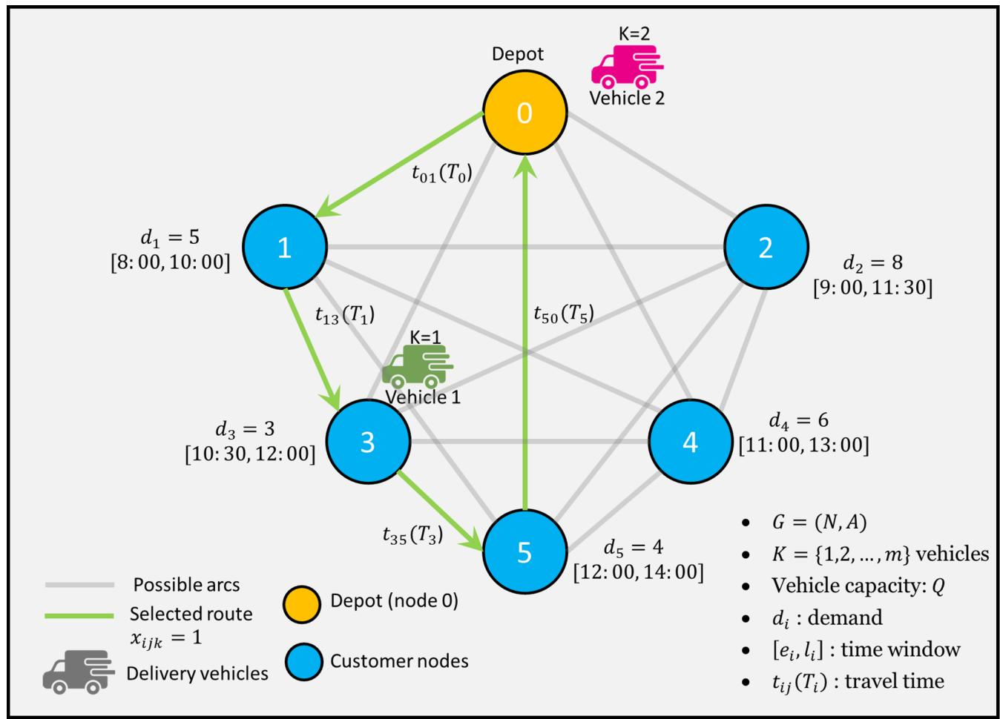

<details>
<summary>flowchart</summary>

```mermaid
graph TD
    A["0 Depot"] -->|t01(T0)| B["1"]
    A -->|t13(T1)| C["3"]
    A -->|t50(T5)| D["2"]
    A -->|t35(T3)| E["4"]
    B -->|d1=5["8:00, 10:00"]| F["Vehicle 1"]
    C -->|d3=3["10:30, 12:00"]| G["Vehicle 1"]
    D -->|d2=8["9:00, 11:30"]| H["Vehicle 2"]
    E -->|d5=4["12:00, 14:00"]| I["5"]
    style A fill:#FFD700,stroke:#333
    style B fill:#66B2FF,stroke:#333
    style C fill:#66B2FF,stroke:#333
    style D fill:#66B2FF,stroke:#333
    style E fill:#66B2FF,stroke:#333
    style F fill:#FFA500,stroke:#333
    style G fill:#FFA500,stroke:#333
    style H fill:#FFA500,stroke:#333
    style I fill:#FFA500,stroke:#333
    note right of A
        K=2 Vehicle 2
    end
    note right of B
        K=1 Vehicle 1
        note right of C
        note right of D
        note right of E
        note right of F
        note right of G
        note right of H
        note right of I
        note right of J
        note right of K
        note right of L
        note right of M
        note right of N
        note right of O
        note right of P
        note right of Q
        note right of R
        note right of S
        note right of T
        note right of U
        note right of V
        note right of W
        note right of X
        note right of Y
        note right of Z
        note right of AA
        note right of AB
        note right of AC
        note right of AD
        note right of AE
        note right of AF
        note right of AG
        note right of AH
        note right of AI
        note right of AJ
        note right of AK
        note right of AL
        note right of AM
        note right of AN
        note right of AO
        note right of AP
        note right of AQ
        note right of AR
        note right of AS
        note right of AT
        note right of AU
        note right of AV
        note right of AW
        note right of AX
        note right of AY
        note right of AZ
        note right of BA
        note right of BB
        note right of BC
        note right of DA
        note right of AE
        note right of AF
        note right of AG
        note right of AH
        note right of AI
        note right of AJ
        note right of AK
        note right of AL
        note right of AM
        note right of AN
        note right of AO
        note right of AP
        note right of AZ
        note right of AL
        note right of AW
        note right of AX
        note right of AY
    end
```
</details>

Fig. 1. Schematic Representation of the (DVRPTW-TA).

with $\theta > 0$ scaling congestion severity. Uncertainty is addressed with a reliability margin η $\mathbf { \Sigma } _ { i j } ^ { ( h ) }$ , producing adjusted times, Eq. (10)

$$
t _ {i j} ^ {\prime} \left(T _ {i}\right) = t _ {i j} ^ {(h)} + \beta \cdot \eta_ {i j} ^ {(h)}, \text {   if   } T _ {i} \in \tau_ {h} \tag {10}
$$

where $\beta \geq 0$ controls risk aversion.

The travel functions satisfy FIFO consistency, Eq. (11)

$$
T _ {i} ^ {1} \leq T _ {i} ^ {2} \Rightarrow T _ {i} ^ {1} + t _ {i j} \left(T _ {i} ^ {1}\right) \leq T _ {i} ^ {2} + t _ {i j} \left(T _ {i} ^ {2}\right), \forall (i, j) \in A \tag {11}
$$

ensuring later departures never provide earlier arrivals.

All traffic inputs $\left\{ { { t } _ { i j } } \left( { { T } _ { i } } \right) , { { \rho } _ { i j } } \left( { { T } _ { i } } \right) , { { \eta } _ { i j } ^ { \left( h \right) } } \right\}$ are periodically updated via batch or real-time feeds and encapsulated into a unified spatiotemporal tensor $T \in \mathbb { R } _ { + } ^ { | A | \times H \times 3 }$ , which supports the hybrid routing engine in Sect. 3.3.

# Hybrid dynamic routing heuristic

The inherent complexity and rapidly evolving conditions of urban last-mile delivery demand routing approaches that extend beyond conventional static optimization. While existing Tabu-ALNS hybrids exist in VRP literature, these methods employ single-layer memory structures and lack integration with traffic-aware cost functions or real-time adaptation capabilities46.

To address these limitations, this study introduces the Tabu-guided Adaptive Large Neighborhood Search with Rollout-based Real-Time Dispatch (T-ALNS-RRD). The approach systematically integrates three components: (a) traffic-aware ALNS for global optimization, (b) multi-layered Tabu memory incorporating move-based, solution-based, and frequency-based diversification mechanisms, and (c) rollout-based real-time dispatch using Tabu-guided action selection for immediate disruption response47.

The model employs a layered architecture where ALNS constructs routing plans through destroy-repair cycles, enhanced Tabu memory prevents cycling while promoting traffic-aware diversification, and the rollout module performs bounded-horizon simulations for real-time adaptation48. This integration enables responsive rerouting that considers future outcomes while maintaining optimization quality. The novelty of this model lies not in the isolated use of Tabu or rollout, but in their systematic integration: Tabu memory structures inform the diversification of the ALNS search and filtering of real-time rollout decisions, creating a unified mechanism that bridges long-horizon optimization and short-horizon disruption management49. This interaction enables robust traffic-aware routing decisions under uncertainty; a capability not previously explored in the prior VRP literature5 0

Adaptive large neighborhood search (ALNS) for optimizing urban last Mile delivery efficiency

The ALNS metaheuristic serves as the optimization core for dynamic routing, generating efficient delivery plans under capacity, service time, and traffic constraints. It extends Large Neighborhood Search (LNS) by employing multiple destroy–repair operators with adaptively updated selection probabilities, ensuring robustness against evolving urban traffic conditions where static operator strategies are insufficient51.

Each feasible routing solution $S \in S$ is represented as an ordered set of vehicle routes $\{ R _ { 1 } , R _ { 2 } , \ldots , R _ { m } \}$ where each route $R _ { k }$ corresponds to a sequence of customers allocated to vehicle $k \in \ K$ .

A specified route is defined as, Eq. (12)

$$
R _ {k} = \left\langle 0, c _ {k 1}, c _ {k 2}, \dots , c _ {k \mid R _ {k} \mid}, 0 \right\rangle \tag {12}
$$

where $c _ { k i }$ represents the i-th customer served by vehicle k, and $\lvert R _ { k } \rvert$ denotes the number of customers in route $R _ { k }$ .

The total demand for the route $R _ { k }$ must satisfy the vehicle capacity constraint, Eq. (13)

$$
\sum_ {i = 1} ^ {| R _ {k} |} d _ {c _ {k i}} \leq Q \tag {13}
$$

where $d _ { c _ { k i } }$ is the demand of the customer $c _ { k i }$ (the i-th customer in vehicle $k ^ { \ : \mathfrak { s } }$ route sequence).

Each customer node $c _ { k i }$ must be served within its designated time window $[ e _ { c _ { k i } } , { \bar { l _ { c _ { k i } } } } ]$ ] while respecting time-dependent travel cost $t _ { i j } \left( D _ { i } \right)$ . An initial solution $S _ { 0 }$ is built via a greedy insertion heuristic that places customers at the earliest feasible, cost-minimizing position. Solution quality is measured by the composite objective $f \left( S \right)$ from Eq. (1).

Figure 2 illustrates the greedy nearest-neighbor construction of an initial solution for the DVRP52. A depot and five customer nodes with demands and time windows form the baseline network. Customers are sequentially assigned based on proximity and the earliest time window, resulting in routes for Vehicle 1: $0  1  3  0$ and Vehicle 2: $0  \ 2  \ 4  \ 5  \ 0$ . This feasible but traffic-unaware solution serves as the starting point for later ALNS refinements53.

At each iteration t, ALNS applies a destroy-repair cycle to the current solution $S _ { t } , \mathrm { ~ A ~ }$ destroy operator $D : \mathcal { S }  \mathcal { S } \times 2 ^ { N \setminus \{ 0 \} }$ removes a subset of customers, and a repair operator $R : \mathcal { S } \times 2 ^ { N \setminus \{ 0 \} } \to \dot { \mathcal { S } }$ reinserts them to generate a new candidate solution $S ^ { \prime }$ , Eq. (14).

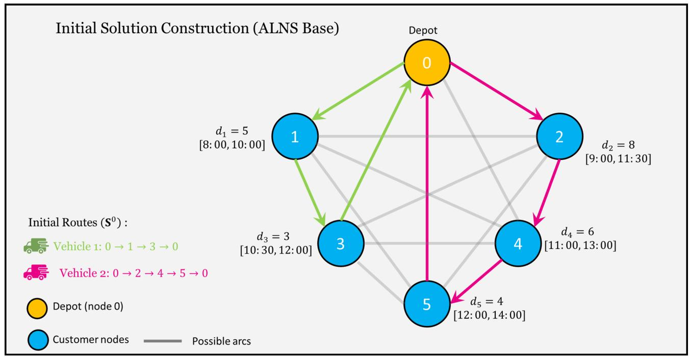

<details>
<summary>flowchart</summary>

```mermaid
graph TD
    0["Depot 0"] -->|d₁ = 5["8:00, 10:00"]| 1["1"]
    0 -->|d₂ = 8["9:00, 11:30"]| 2["2"]
    0 -->|d₃ = 3["10:30, 12:00"]| 3["3"]
    0 -->|d₄ = 6["11:00, 13:00"]| 4["4"]
    0 -->|d₅ = 4["12:00, 14:00"]| 5["5"]
    1 -->|d₁ = 5["8:00, 10:00"]| 3
    2 -->|d₂ = 8["9:00, 11:30"]| 4
    3 -->|d₃ = 3["10:30, 12:00"]| 5
    4 -->|d₄ = 6["11:00, 13:00"]| 5
    5 -->|d₅ = 4["12:00, 14:00"]| 4
    style Depot fill:#FFD700,stroke:#FFA500,stroke-width:2px
    style Customer nodes fill:#66B2FF,stroke:#FFA500,stroke-width:2px
    classDef route fill:#FFA50FF,stroke:#FFA500;
    class A route from Vehicle 1 to Vehicle 2 via Route S⁰;
    class B route from Vehicle 2 to Vehicle 3 via Route S⁰;
    class C route from Vehicle 1 to Vehicle 5 via Route S⁰;
```
</details>

Fig. 2. Basic initial solution using greedy construction.

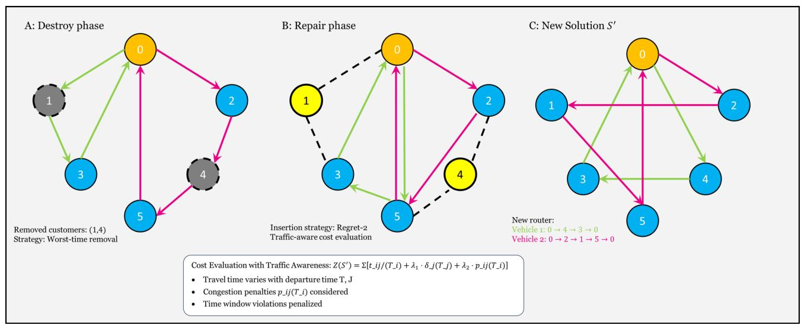

<details>
<summary>flowchart</summary>

```mermaid
graph TD
    subgraph_A["Destroy phase"]
        A0["0"] --> A2["2"]
        A0 --> A3["3"]
        A0 --> A4["4"]
        A0 --> A5["5"]
        A0 --> A1["1"]
        A0 --> A2
        A2 --> B
    end

    subgraph_B["Repair phase"]
        B0["0"] --> B2["2"]
        B0 --> B3["3"]
        B0 --> B4["4"]
        B0 --> B5["5"]
        B0 --> B6["1"]
        B0 --> B7["4"]
        B0 --> B8["5"]
        B0 --> B9["1"]
        B0 --> B10["4"]
    end

    subgraph_C["New Solution S'"]
        C0["0"] --> C2["2"]
        C0 --> C3["3"]
        C0 --> C4["4"]
        C0 --> C5["5"]
        C0 --> C6["1"]
        C0 --> C7["4"]
        C0 --> C8["1"]
        C0 --> C9["4"]
        C0 --> C10["1"]
        C0 --> C11["4"]
        C0 --> C12["1"]
        C0 --> C13["4"]
        C0 --> C14["1"]
        C0 --> C15["4"]
        C0 --> C16["1"]
        C0 --> C17["4"]
        C0 --> C18["1"]
        C0 --> C19["4"]
        C0 --> C20["1"]
        C0 --> C21["4"]
        C0 --> C22["1"]
        C0 --> C23["4"]
        C0 --> C24["1"]
        C0 --> C25["4"]
        C0 --> C26["1"]
        C0 --> C27["4"]
        C0 --> C28["1"]
        C0 --> C29["4"]
        C0 --> C30["1"]
        C0 --> C31["4"]
        C0 --> C32["1"]
        C0 --> C33["4"]
        C0 --> C34["1"]
        C0 --> C35["4"]
        C0 --> C36["1"]
        C0 --> C37["4"]
        C0 --> C38["1"]
        C0 --> C39["4"]
        C0 --> C40["1"]
        C0 --> C41["4"]
        C0 --> C42["1"]
        C0 --> C43["4"]
        C0 --> C44["1"]
        C0 --> C45["4"]
        C0 --> C46["1"]
        C0 --> C47["4"]
        C0 --> C48["1"]
        C0 --> C49["4"]
        C0 --> C50["1"]
        C0 --> C51["4"]
        C0 --> C52["1"]
        C0 --> C53["4"]
        C0 --> C54["1"]
        C0 --> C55["4"]
        C0 --> C56["1"]
        C0 --> C57["4"]
        C0 --> C58["1"]
        C0 --> C59["4"]
        C0 --> C60["1"]
        C0 --> C61["4"]
        C0 --> C62["1"]
        C0 --> C63["4"]
        C0 --> C64["1"]
        C0 --> C65["4"]
        C0 --> C66["1"]
        C0 --> C67["4"]
        C0 --> C68["1"]
        C0 --> C69["4"]
        C0 --> C70["1"]
        C0 --> C71["4"]
        C0 --> C72["1"]
        C0 --> C73["4"]
        C0 --> C74["1"]
        C0 --> C75["4"]
        C0 --> C76["1"]
        C0 --> C77["4"]
        C0 --> C78["1"]
        C0 --> C79["4"]
        C0 --> C80["1"]
        C0 --> C81["4"]
        C0 --> C82["1"]
        C0 --> C83["4"]
        C0 --> C84["1"]
        C0 --> C85["4"]
        C0 --> C86["1"]
        C0 --> C87["4"]
        C0 --> C88["1"]
        C0 --> C89["4"]
        C0 --> C90["1"]
        C0 --> C91["4"]
        C0 --> C92["1"]
        C0 --> C93["4"]
        C0 --> C94["1"]
        C0 --> C95["4"]
        style A fill:#f9f,stroke:#333
    style B fill:#f9f,stroke:#333
    style H fill:#ccf,stroke:#333
    style I fill:#cfc,stroke:#333
    style J fill:#fcc,stroke:#333
    style K fill:#fcc,stroke:#333
    style L fill:#fcc,stroke:#333
    style M fill:#fcc,stroke:#333
    style N fill:#fcc,stroke:#333
    style O fill:#fff,stroke:#333
    style P fill:#fff,stroke:#333
    style Q fill:#fff,stroke:#333
    style R fill:#fff,stroke:#333
    style S fill:#fff,stroke:#333
    style T fill:#fff,stroke:#333
    style U fill:#fff,stroke:#333
    style V fill:#fff,stroke:#333
    style W fill:#fff,stroke:#333
    style X fill:#fff,stroke:#333
    style Y fill:#fff,stroke:#333
    style Z fill:#fff,stroke:#333
    style AA fill:#fff,stroke:#333
    style AB fill:#fff,stroke:#333
    style AC fill:#fff,stroke:#333
    style AD fill:#fff,stroke:#333
    style AE fill:#fff,stroke:#333
    style AF fill:#fff,stroke:#333
    style AG fill:#fff,stroke:#333
    style AH fill:#fff,stroke:#333
    style AI fill:#fff,stroke:#333
    style AJ fill:#fff,stroke:#333
    style AK fill:#fff,stroke:#333
    style AL fill:#fff,stroke:#333
    style AM fill:#fff,stroke:#333
    style AN fill:#fff,stroke:#333
    style AO fill:#fff,stroke:#333
    style AP fill:#fff,stroke:#333
    style AQ fill:#fff,stroke:#333
    style AR fill:#fff,stroke:#333
    style AS fill:#fff,stroke:#333
    style AT fill:#fff,stroke:#333
    style AU fill:#fff,stroke:#333
    style AV fill:#fff,stroke:#333
    style AW fill:#fff,stroke:#333
    style AX fill:#fff,stroke:#333
    style AY fill:#fff,stroke:#333
```
</details>

Fig. 3. ALNS destroy-repair.

$$
S ^ {\prime} = R \left(D \left(S _ {t}\right)\right) \tag {14}
$$

The destroy phase removes a random subset of customers $C \subset N \backslash$ {0}, with the cardinality defined as, Eq. (15)

$$
| C | = \left\lfloor \alpha \cdot n \right\rfloor , \alpha \in [ 0. 1, 0. 4 ] \tag {15}
$$

Three destruction strategies guide solution perturbation: random removal (uniform customer selection), worstcase removal (customers causing maximum delay or lateness), and relatedness removal (customers with similar geographic or temporal features). Removed customers are then reinserted using one of three repair heuristics: greedy insertion (minimizing marginal cost), regret-2 insertion (minimizing the most significant gap between the best and second-best positions), and time-window-aware insertion (minimizing service window violations)54.

Figure 3 illustrates the ALNS destroy-repair mechanism, which is built upon the initial greedy solution. Panel A applies worst-time removal, eliminating customers 1 and 4 to reduce the delay impact. Panel B shows regret-2 reinsertion with traffic-aware costs, advantageously repositioning removed nodes to minimize the composite objective in Eq. (1). Panel C presents the improved routing model, integrating time-dependent travel costs $t _ { i j } \left( T _ { i } \right)$ and congestion penalties $\rho _ { \mathit { i j } } \left( T _ { \mathit { i } } \right)$ ), highlighting ALNS’s advantage over the baseline construction55.

The cost of inserting customer i between nodes j and k at departure time $T _ { j }$ is computed as,

$$
\Delta f _ {i j k} \left(T _ {j}\right) = t _ {j i} \left(T _ {j}\right) + s _ {i} + t _ {i k} \left(T _ {j} + t _ {j i} \left(T _ {j}\right) + s _ {i}\right) - t _ {j k} \left(T _ {j}\right) + \lambda_ {1} \cdot \delta_ {i} \left(T _ {i}\right) + \lambda_ {2} \cdot \rho_ {j i} \left(T _ {j}\right) \tag {16}
$$

In Eq. (16), $T _ { i }$ denotes the implied arrival time at customer $i ,$ while $\delta _ { \textit { i } } ( T _ { i } )$ and $\rho _ { \mathit { j i } } \left( T _ { \mathit { j } } \right)$ represent the lateness penalty and the cost of traffic congestion, respectively. Then the complete marginal objective change is computed by forward-propagating arrival and departure times from node k to the end of the route, updating all timedependent terms (travel timfeasibility (Eqs. 5 and 6). Let $\mathcal { A } _ { \mathrm { s u f f i x } }$ ness, and congestion) consistently with FIFO (Eq. 11) and time- denote the ordered arc set on the affected suffix after insertion, and 56 $A _ { \mathrm { s u f f i x } } ^ { \mathrm { o l d } }$

The scored insertion cost is, Eq. (17)

$$
\Delta F _ {j i k} = \Delta f _ {j i k} ^ {\text {local}} \left(T _ {j}\right) + \sum_ {(u, v) \in \mathcal {A} _ {\text {suffix}}} \left[ t _ {u v} \left(T _ {u} ^ {\prime}\right) + \lambda_ {1} \delta_ {v} \left(T _ {v} ^ {\prime}\right) + \lambda_ {2} \rho_ {u v} \left(T _ {u} ^ {\prime}\right) \right] \tag {17}
$$

$$
- \sum_ {(u, v) \in \mathcal {A} _ {\mathrm{suffix}} ^ {\mathrm{old}}} \left[ t _ {u v} \left(T _ {u}\right) \left(1 6 \lambda^ {\prime}\right) \delta_ {v} \left(T _ {v}\right) + \lambda_ {2} \rho_ {u v} \left(T _ {u}\right) \right]
$$

with $T _ { \cdot } ^ { \prime }$ the recomputed (post-insertion) times obtained by a single forward pass; $T .$ are the original times. Early abandonment is applied if the running sum for $\Delta F _ { j i k }$ exceeds the current best candidate57.

ALNS maintains a score ω $\textit { n } ( t )$ for each operator $h \in \mathsf { \mathcal { H } } = \mathcal { D } \cup \mathcal { R }$ , where D and R are the sets of destroy and repair operators58.

Operator selection at iteration t follows a probabilistic distribution defined by Eq. (18).

$$
p _ {h} (t) = \frac {\omega_ {h} (t)}{\sum_ {j \in \mathcal {H}} \omega_ {j} (t)} \tag {18}
$$

The weights $\omega _ { h } \left( t \right)$ are updated every $\pi$ iterations based on the operator’s performance. Four reward levels are assigned: $\theta _ { \textrm { i } }$ 1 for improving the global best solution, $\theta _ { 2 }$ for improving the current solution, $\theta _ { 3 }$ for generating a feasible solution, and $\theta _ { \textrm { 4 } }$ for non-contributing moves.

The update rule is defined as Eq. (19).

$$
\omega_ {h} (t + 1) = (1 - \xi) \cdot \omega_ {h} (t) + \xi \cdot \theta_ {r} \tag {19}
$$

Here, $\xi \in \mathsf { \Gamma } ( 0 , 1 )$ denotes the reaction factor controlling sensitivity to recent performance. A simulated annealing criterion rules the solution acceptance method59.

A candidate solution $S ^ { \prime }$ is accepted if it improves the current solution.

This probability is implicit in Eq. (20)

$$
P _ {\text { accept }} \left(S ^ {\prime}, S _ {t}\right) = \left\{ \begin{array}{l l} 1, & \text { if } f \left(S ^ {\prime}\right) <   f \left(S _ {t}\right) \\ \exp \left(- \frac {f \left(S ^ {\prime}\right) - f (S _ {t})}{\tau_ {t}}\right), & \text { otherwise } \end{array} \right. \tag {20}
$$

The temperature parameter $\tau _ { \ t }$ follows a geometric cooling schedule, $\operatorname { E q . } \left( 2 1 \right)$

$$
\tau_ {t + 1} = \gamma \cdot \tau_ {t}, \gamma \in (0, 1) \tag {21}
$$

The ALNS method terminates when the number of iterations reaches a predefined maximum $T _ { \mathrm { m a x } } ,$ or when no improvement is observed over $T _ { \mathrm { s t a l l } }$ consecutive iterations.

The best solution across all iterations is denoted by Eq. (22)

$$
S ^ {*} = \arg \min _ {t \in [ 0, T _ {\max} ]} f (S _ {t}) \tag {22}
$$

The ALNS engine is integrated with the traffic flow module (Sect. 3.2), updating travel times $t _ { i j } \left( T \right)$ , delay penalties $\delta _ { \textit { j } } ( \mathbf { \breve { { T } } } _ { j } )$ , and congestion weights $\rho _ { \it i j } \left( T _ { i } \right)$ at each iteration. Destroy and repair operations thus reflect real-time traffic conditions, while insertions comply with the time-window feasibility rules of Eq. (5) and Eq. (6). This traffic-adaptive extension enables operationally valid routing in dynamic urban settings60. The optimization follows adaptive operator selection and simulated annealing acceptance as outlined in Algorithm 1.

Algorithm 1: ALNS (S°, D, R, I\_max, T\_max)

Input: Initial solution S⁰, destroy operators D, repair operators R, max iterations I\_max, time limit T\_max

Output: Best solution S\*   
1: S_current ← S⁰, S_best ← S⁰
2: Initialize operator weights ω_h ← 1.0 for all h ∈ D ∪ R
3: Set initial temperature T₀ ← 0.05 × Z(S⁰)
4: Set cooling rate α ← 0.99975, learning rate ρ ← 0.1
5: iter ← 0
6: While iter < I_max and elapsed_time < T_max Do
8:    // Operator selection using roulette wheel
9:    d_selected ← SelectOperator(D, {ω_d | d ∈ D})
10:    r_selected ← SelectOperator(R, {ω_r | r ∈ R}) // Destroy-repair cycle
13:    q ← Random(q_min, q_max)
14:    C_removed ← d_selected(S_current, q)
15:    S_new ← r_selected(S_current, C_removed)   
// Cost evaluation with traffic awareness

18: Z_new ← EvaluateCost(S_new) //
// Acceptance decision
21: T_current ← α^iter × T₀
22: If Accept(S_new, S_current, T_current) then //
23: S_current ← S_new
24: If Z_new < Z(S_best) Then
25: S_best ← S_new
26: Reward ← σ₁ // New best solution
27: Else
28: Reward ← σ₂ // Improvement
29: Else
30: if Z_new ≥ Z(S_current) Then
31: Reward ← σ₃ // Accepted non-improving
32: Else
33: Reward ← σ₄ // Rejected
34: // Update operator weights every π iterations
35: If iter mod π = 0 Then

# Tabu-based ALNS enhancement

The Tabu Search extension (T-ALNS) mitigates ALNS’s vulnerability to cycling and local optima by embedding multi-layered memory structures while preserving adaptive operator selection. Its architecture integrates three complementary memories: a move-based Tabu list, a solution-based Tabu memory, and an attribute-based frequency memory, each promoting diversification and preventing stagnation61.

The move-based Tabu list Tmove records recent destroy-repair operations as tuples $( C _ { \mathrm { r e m o v e d } } , h _ { d } , h _ { r } , t _ { \mathrm { i t e r } } ) ,$ where $C _ { \mathrm { r e m o v e d } } \subset N \backslash$ 0 is the removed customer set, $\hat { h } _ { d } \in \mathbf { \Gamma } \hat { D }$ and $h _ { r } \in { \bf \dot { \theta } } R$ are the destroy and repair operators, and $t _ { \mathrm { i t e r } }$ is the execution iteration. A move is considered Tabu if there exists an entry $\left( \acute { C } , \acute { h } _ { d } , \acute { h } _ { r } , \acute { t } \right)$ in $\tau _ { \mathrm { m o v e } }$ such that, Eq. (22)

$$
\left| C _ {\text { removed }} \cap \dot {C} \right| \geq \mu \cdot \min \left(\left| C _ {\text { removed }} \right|, \left| \dot {C} \right|\right) \text {   and   } t _ {\text { current }} - \dot {t} \leq \tau_ {\text { move }} \tag {23}
$$

where $\mu \in \ [ 0 , 1 ]$ is the overlap threshold parameter and $\tau _ { \mathrm { ~ m o v e ~ } }$ is the Tabu tenure for move-based restrictions.

The solution-based Tabu memory $T _ { \mathrm { s o l } }$ avoids revisiting prior solutions by storing hash-based encodings of routing structures. Each solution S is represented through a locality-sensitive hash function, Eq. (23)

$$
H (S) = \sum_ {k \in K} \sum_ {i = 1} ^ {p _ {k} - 1} \varphi \left(v _ {k i}, v _ {k (i + 1)}\right) \bmod P \tag {24}
$$

where $\varphi \left( u , v \right)$ is a polynomial hash applied to consecutive customer pairs, and $P$ is a large prime modulus.

A candidate solution $S ^ { \prime }$ is Tabu if $\mathbf { \dot { \zeta } } H \left( S ^ { \prime } \right) \in \mathcal { T } _ { \mathrm { s o l } }$ and was recorded within the last $\tau _ { \mathrm { \ s o l } }$ iterations. Hash collisions are minimized by carefully choosing polynomial coefficients and modulus $P ,$ ensuring distinct routing structures map to unique values with high probability. The memory operates as a circular buffer of size $\vert T _ { s o l } \vert = \mathrm { m i n } \left( 1 0 0 0 , \dot { 2 } ^ { \lceil \log _ { 2 } ( n ) \rceil } \right)$ , balancing storage efficiency with collision avoidance62.

The attribute-based frequency memory F diversifies search by tracking customer-vehicle assignments and temporal positions.

For assignments, the frequency matrix is updated according to Eq. (24).

$$
F _ {i k} ^ {c v} (t + 1) = F _ {i k} ^ {c v} (t) + 1 _ {\left[ i \in R _ {k} \left(S _ {t + 1}\right) \right]} \tag {25}
$$

where 1[.]indicates if customer i is attended by vehicle k in the solution $S _ { t + 1 }$ . This biases the search toward underrepresented assignments.

For temporal positioning, the frequency matrix $F ^ { t p }$ records how frequently customer i appears in position $j$ within any route, as shown in Eq. (25).

$$
F _ {i j} ^ {t p} (t + 1) = F _ {i j} ^ {t p} (t) + \sum_ {k \in K} 1 _ {\left[ v _ {k j} = i \text {   in   } S _ {t + 1} \right]} \tag {26}
$$

The T-ALNS regulates diversification through an intensity measure $\delta \ ( t )$ , defined as, Eq. (26)

$$
\delta (t) = \omega_ {1} \cdot \frac {t - t _ {\text { last\_best}}}{T _ {\max}} + \omega_ {2} \cdot \frac {| T _ {\text { move }} |}{| T _ {\text { move }} | _ {\max}} + \omega_ {3} \cdot \sigma (F ^ {c v}) \tag {27}
$$

where $t _ { l a s t b e s t }$ is the last improvement iteration, $\sigma \ ( F ^ { c v } )$ is the standard deviation of customer-vehicle assignment frequencies, and $\omega _ { \textrm { 1 } } + \omega _ { \textrm { 2 } } + \omega _ { \textrm { 3 } } = 1$ . If $\delta \mathit { \Omega } \left( t \right) > \delta _ { \mathrm { m a x } }$ , the algorithm shifts to intensification, adjusting operator probabilities as in Eq. (27).

$$
p _ {h} ^ {\prime} (t) = \eta \cdot p _ {h} (t) + (1 - \eta) \cdot \frac {\operatorname{div} _ {h} (t)}{\sum_ {j \in H} \operatorname{div} _ {j} (t)} \tag {28}
$$

where $\eta ~ \in ~ [ 0 , 1 ]$ balances performance- and diversification-based selection, and $d i v _ { h } \left( t \right)$ measures operator h ‘s diversification potential.

The T-ALNS applies aspiration criteria to override Tabu restrictions when moves show high potential.

Three conditions are used:

# Global best aspiration

Accept if the move provides a better solution than the global best, Eq. (28).

$$
f \left(S ^ {\prime}\right) <   f \left(S ^ {*}\right) \tag {29}
$$

Least-Frequency Aspiration: Accept if it targets rarely used customer-vehicle assignments, as shown in Eq. (29).

$$
\min _ {i \in C _ {\text { removed }}} \min _ {k \in K} F _ {i k} ^ {c v} <   \beta \cdot \vec {F} ^ {c v} \tag {30}
$$

cv where $\overline { F }$ is the mean assignment frequency and $\beta \in \mathsf { \Gamma } ( 0 , 1 )$ .

Traffic Adaptation Aspiration: accept if it significantly reduces traffic-related costs, Eq. (30).

$$
\sum_ {k \in K} \sum_ {(i, j) \in A _ {k}} \lambda_ {2} \rho_ {i j} \left(T _ {i} ^ {k}\right) <   \gamma \sum_ {k \in K} \sum_ {(i, j) \in A _ {k} ^ {\text { current }}} \lambda_ {2} \rho_ {i j} \left(T _ {i} ^ {k, \text { current }}\right) \tag {31}
$$

where ${ \boldsymbol { \gamma } } \in \mathbf { \Sigma } ( 0 , 1 )$ is the improvement threshold.

The T-ALNS memory models are intended to attack a balance between efficiency and guidance. The movebased Tabu list applies a FIFO eviction rule with adaptive tenure:

$$
\tau_ {\text { move }} (t + 1) = \left\{ \begin{array}{l l} \min \left(\tau_ {\text { move }} (t) + 1, \tau_ {\max}\right) & \text { If   there   is   no   improvement   in   the   last } \tau_ {\text { stall   iterations }} \\ \max \left(\tau_ {\text { move }} (t) - 1, \tau_ {\min}\right) & \text { If   improvement   found } \end{array} \right. \tag {32}
$$

The solution-based memory is updated each iteration with the current solution hash, while frequency matrices are normalized to prevent overflow, Eq. (32)

$$
F _ {i k} ^ {c v} \leftarrow \left\lfloor F _ {i k} ^ {c v} / \kappa \right\rfloor \text {   every   } \nu \text {   iterations   } \tag {33}
$$

with normalization factor $\kappa > 1$ and frequency ν .

To align with traffic-aware costs (Eqs. 7 to 9), the frequency memory tracks congestion-weighted attributes, Eq. (33)

$$
F _ {i k} ^ {c v} (t + 1) = F _ {i k} ^ {c v} (t) + 1 _ {\left[ i \in R _ {k} \left(S _ {t + 1}\right) \right]} \cdot \left(1 + \sum_ {j: (j, i) \in A _ {k}} \rho_ {j i} \left(T _ {j} ^ {k}\right)\right) \tag {34}
$$

This adjustment emphasizes congested arcs, driving diversification toward less burdened routes. Through multilayered memory, adaptive diversification, and congestion-sensitive tracking, T-ALNS enhances robustness, prevents cycling, and delivers high-quality solutions for dynamic urban delivery63. Its complete procedure is detailed in Algorithm 2.

Figure 4 illustrates the T-ALNS enhancement to ALNS, embedding memory structures into destroy-repair operations. The multi-layer Tabu design is shown through: (a) a move-based Tabu list marking forbidden arcs $( 1  3 , 2  4 , 4 \stackrel { . } {  } 5 )$ , (b) the frequency matrix $\check { F } ^ { c v }$ with color-coded customer-vehicle assignment intensities, and (c) the resulting diversified solution. Tabu restrictions appear as X-marked arcs, while frequency cues (orange and green dots) highlight low-frequency assignments guiding exploration. This memory-driven process yields optimized routes, specifically Vehicle 1: 0→1→5→0 and Vehicle 2: 0→2→3→4→0, which outperform basic ALNS by preventing cycling and developing strategic diversification64.

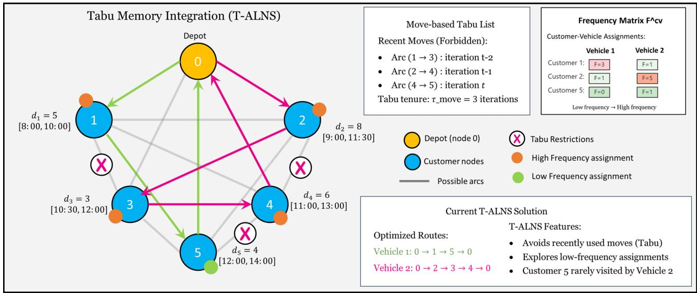

<details>
<summary>flowchart</summary>

```mermaid
graph TD
    A["0"] --> B["1"]
    A --> C["2"]
    A --> D["3"]
    A --> E["4"]
    A --> F["5"]
    B --> G["d₁ = 5 [8:00, 10:00"]]
    C --> H["d₂ = 8 [9:00, 11:30"]]
    D --> I["d₃ = 3 [10:30, 12:00"]]
    E --> J["d₄ = 6 [11:00, 13:00"]]
    F --> K["d₅ = 4 [12:00, 14:00"]]
    G --> L["×"]
    H --> M["×"]
    I --> N["×"]
    J --> O["×"]
    K --> P["×"]
    L --> Q["Occupied Route: Vehicle 1: 0 → 1 → 5 → 0; Vehicle 2: 0 → 2 → 3 → 4 → 0"]
    M --> R["Occupied Route: Vehicle 2: F=1; Vehicle 3: F=5; Vehicle 4: F=1; Vehicle 5: F=0; Low Frequency → High Frequency"]
    N --> S["Occupied Route: Vehicle 1: F=3; Vehicle 2: F=1; Vehicle 3: F=5; Vehicle 4: F=1; Vehicle 5: F=0; Low Frequency → High Frequency"]
    style A fill:#ffcccc,stroke:#333
    style B fill:#ffcccc,stroke:#333
    style C fill:#ffcccc,stroke:#333
    style D fill:#ffcccc,stroke:#333
    style E fill:#ffcccc,stroke:#333
    style F fill:#ffcccc,stroke:#333
    style G fill:#ffcccc,stroke:#333
    style H fill:#ffcccc,stroke:#333
    style I fill:#ffcccc,stroke:#333
    style J fill:#ffcccc,stroke:#333
    style K fill:#ffcccc,stroke:#333
    style L fill:#ffcccc,stroke:#333
    style M fill:#ffcccc,stroke:#333
    style N fill:#ffcccc,stroke:#333
    style O fill:#ffcccc,stroke:#333
    style P fill:#ffcccc,stroke:#333
    style Q fill:#ffcccc,stroke:#333
    style R fill:#ffcccc,stroke:#333
    style S fill:#ffcccc,stroke:#333
```
</details>

Fig. 4. T-ALNS Memory Integration.

Algorithm 2: T-ALNS (S°, D, R, I\_max, T\_max)

Input: Initial solution S⁰, destroy operators D, repair operators R, max iterations I\_max, time limit T\_max

# Output: Best solution S\*

1: S\_current ← S⁰, S\_best ← S⁰   
2: Initialize operator weights ω\_h ← 1.0 for all h ∈ D ∪ R   
3: Initialize Tabu structures:   
4: T\_move ← ∅ // Move-based Tabu list   
5: T\_sol ← ∅ // Solution-based Tabu memory   
6: F^cv ← zeros(n, m) // Customer-vehicle frequency matrix   
7: F^tp ← zeros(n, n) // Temporal position frequency matrix   
8: Set parameters: τ\_move, τ\_sol, μ, β, γ   
9: iter ← 0, t\_last\_best ← 0   
10: while iter < I\_max and elapsed\_time < T\_max do // Calculate diversification intensity using Equation (26)   
13: δ\_current ← CalculateDiversification(iter, t\_last\_best, T\_move, F^cv) // Modified operator selection for diversification   
16: if δ\_current > δ\_max then   
17: p'\_h ← ModifyProbabilities(ω\_h, F^cv, F^tp) // Using Equation (27)   
18: else   
19: p'\_h ← ω\_h / Σ ω\_h // Standard probabilities   
// Generate candidate moves   
22: candidates ← ∅   
23: for attempt ← 1 to max\_attempts do   
24: d\_selected ← SelectOperator(D, {p'\_d | d ∈ D})   
25: r\_selected ← SelectOperator(R, {p'\_r | r ∈ R})   
26: q ← Random(q\_min, q\_max)   
28: C\_removed ← d\_selected(S\_current, q)   
29: move ← (C\_removed, d\_selected, r\_selected)   
// Check Tabu status using Equation (22)   
32: is\_tabu ← CheckTabuStatus(move, T\_move, μ, τ\_move, iter)   
33: 34: S\_new ← r\_selected(S\_current, C\_removed)   
35: hash\_new ← ComputeHash(S\_new) // Using Equation (23)   
// Apply aspiration criteria

Tabu-guided adaptive large neighborhood search with rollout-based real-time dispatch (T-ALNSRRD)

The T-ALNSRRD extends the T-ALNS by incorporating a real-time dispatch layer to handle disruptions that demand immediate routing adjustments. Using short-horizon rollout simulations, it delivers rapid decisions for traffic delays, urgent orders, or constraint violations while broader optimization proceeds in the background65.

The model employs continuous monitoring to detect and classify events into four categories:

E1 : Critical traffic incidents - road closures, accidents, or severe congestion invalidating planned routes.

E2 : Urgent delivery insertions - new high-priority orders with tight time windows.

$E _ { 3 }$ : Vehicle capacity violations - demand fluctuations exceeding vehicle capacity mid-route.

$E _ { 4 }$ Service time violations - cumulative delays that risk time window breaches.

This integration ensures responsiveness to operational shocks while preserving the optimization depth of TALNS. Each event $e \in \{ E 1 , \bar { E } 2 , E 3 , E 4 \}$ triggers a real-time dispatch technique that operates independently of the main T-ALNS optimization loop. The event detection mechanism employs a scoring function $\Psi \left( e , t \right)$ that quantifies the urgency level:

$$
\Psi (e, t) = \alpha_ {e} \cdot \frac {t _ {\text {deadline}} - t _ {\text {current}}}{t _ {\text {horizon}}} + \beta_ {e} \cdot \text {impact} (e) + \gamma_ {e} \cdot \text {cost\_increase} (e) \tag {35}
$$

where $\alpha _ { \textit { e } } , \beta _ { \textit { e } } , \gamma _ { \textit { e } }$ are event-specific weighting parameters, $t _ { \mathrm { d e a d l i n e } }$ represents the constraint deadline, $t _ { \mathrm { h o r i z o n } }$ is the planning horizon, impact ( e) quantifies the spatial scope of the event, and cost\_increase ( e) approximates the potential objective function deterioration.

Figure 5 illustrates the T-ALNS-RRD event detection and classification process, applied to the optimized solution from Fig. 4. A traffic blockage on arc $^ { ( 3 , 4 ) }$ ) disrupts Vehicle 2’s route $0  2  3  4  0 ,$ , jeopardizing Customer 4’s delivery with only 45 min left in its window [11:00, 13:00]. The urgency score, Ψ $( e , t ) = 0$ .85 from Eq. (34), categorizes the disruption as a Type $E _ { 1 }$ critical traffic incident requiring immediate action. The event analysis evaluates operational impact and confirms available alternatives, such as vehicle capacity sufficiency and route flexibility for reassignment. This real-time model ensures a smooth transition from T-ALNS optimization to rollout-based dispatch, maintaining uninterrupted performance under dynamic traffic disruptions.

The T-ALNS-RRD introduces a rollout-based decision layer that conducts short-horizon simulations to measure dispatch alternatives without invoking full re-optimization. For each event $e ,$ a candidate action set $A _ { e } = \left\{ a _ { 1 } , \overline { { { a } } } _ { 2 } , \ldots , a _ { \left| A _ { e } \right| } \right\}$ is generated and evaluated via Monte Carlo rollouts. Each simulation projects the system state over a horizon $H _ { \mathrm { r o l l o u t } }$ of 30–120 min, depending on the urgency of the event and system load. Rollout evaluations use simplified heuristics that approximate T-ALNS behavior, ensuring timely yet reliable dispatch decisions under real-time constraints.

The rollout value function $V ^ { \mathrm { r o l l o u t } } \left( s , a , H \right)$ for state s, action $^ { a , }$ and horizon H is computed as:

$$
V ^ {\text { rollout }} (s, a, H) = \mathbb {E} \left[ \sum_ {h = 0} ^ {H - 1} \left(\sum_ {k \in K} \sum_ {(i, j) \in A _ {k} ^ {h}} \left[ t _ {i j} \left(T _ {i} ^ {k, h}\right) + \lambda_ {2} \rho_ {i j} \left(T _ {i} ^ {k, h}\right) \right] + \lambda_ {1} \sum_ {j \in C ^ {h}} \delta_ {j} \left(S _ {j} ^ {h}\right)\right) \right], \tag {36}
$$

where $\mathrm { A _ { k } ^ { h } }$ is the set of traversed arcs by vehicle k during step h, and $\mathrm { C ^ { h } }$ is the set of customers whose service starts during step h. This ensures each customer’s lateness is reported for once, at the moment service begins.

The dispatch action space in T-ALNS-RRD adapts to event type and system state. For critical traffic incidents $( E _ { 1 } )$ , candidate actions include alternative-path rerouting, cross-vehicle reassignment, and postponement of non-critical deliveries. For urgent delivery insertions $( E _ { 2 } )$ , actions include immediate feasible insertion, delayed insertion with notification, or subcontractor delegation if capacity is exceeded.

Each action $a \in \ A _ { e }$ is validated against feasibility constraints, Eq. (36)

$$
\text { Feasible } (a, s) = \bigwedge_ {k \in K} \left[ \sum_ {i \in R _ {k} ^ {a}} d _ {i} \leq Q \right] \wedge \bigwedge_ {i \in N ^ {a}} \left[ e _ {i} \leq T _ {i} ^ {a} \leq l _ {i} + \epsilon_ {\text { tolerance }} \right] \tag {37}
$$

where $R _ { k } ^ { a }$ is the customer set assigned to vehicle $k , N ^ { a }$ the set of served customers, $T _ { i } ^ { a }$ the estimated service time, and $\epsilon _ { \mathrm { t o l e r a n c e } } \mathrm { a }$ relaxation margin for emergencies.

For each detected event e, the candidate action set $A _ { \epsilon }$ is generated by deterministic rules with explicit size caps, ensuring real-time execution while satisfying the feasibility screen in Eq. (36).

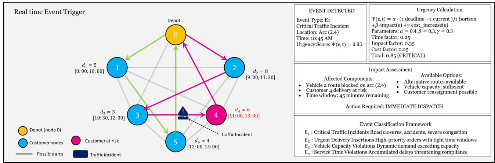

<details>
<summary>flowchart</summary>

```mermaid
graph TD
    A["0"] -->|d1=5["8:00, 10:00"]| B["1"]
    A -->|d2=8["9:00, 11:30"]| C["2"]
    A -->|d3=3["10:30, 12:00"]| D["3"]
    A -->|d4=6["11:00, 13:00"]| E["4"]
    A -->|d5=4["12:00, 14:00"]| F["5"]
    B --> G["Customer nodes"]
    C --> H["Traffic Incident"]
    D --> I["Customer at risk"]
    E --> J["Traffic Incident"]
    F --> K["Possible arcs"]
    G --> L["Event Detection Event Type: E1 Critical Traffic Incident Location: Arc (2,4) Time: 10:45 AM Urgency Score: Ψ(e,t) = 0.85"]
    H --> M["Urgency Calculation Ψ(e,t) = α · (t_deadline - t_current)/t_horizon +β-impact(e) +γ cost_increase(e) Parameters: α = 0.4,β = 0.3,γ = 0.3 Time factor: 0.25 Impact factor: 0.35 Cost factor: 0.25 Total: 0.85 (CRITICAL)"]
    I --> N["Impact Assessment Affected Components: Vehicle 2 route blocked on arc (2,4) Customer 4 delivery at risk Time window: 45 minutes remaining"]
    J --> O["Available Options: Alternative routes available Vehicle capacity: sufficient Customer reassignment possible"]
    K --> P["Action Required: IMMEDIATE DISPATCH"]
    L --> Q["Event Classification Framework E1 : Critical Traffic Incidents Road closures, accidents, severe congestion E2 : Urgent Delivery Insertions High-priority orders with tight time windows E3 : Vehicle Capacity Violations Dynamic demand exceeding capacity E4 : Service Time Violations Accumulated delays threatening compliance"]
    M --> Q
    N --> Q
    O --> Q
    P --> Q
    Q --> R["Possible arcs"]
    Q --> S["Traffic Incident"]
```
</details>

Fig. 5. Real-time event trigger.

• Traffic Incident $\left( E _ { 1 } \right)$ - Local Reroute: Up to $K _ { s } = 5$ FIFO-consistent k-shortest-time detours are enumerated on the affected subgraph using a time-dependent Dijkstra variant. Detours respect the budget $\Delta _ { \textrm { m a x } } = 8$ minutes, with congestion weights $\rho _ { \it i j } ^ { \mathrm { \phantom { ~ } } } ( T _ { i } )$ from Eq. (1).   
• Traffic Incident $\left( E _ { 1 } \right)$ - Customer Reassignment: Donor vehicles lie within 3  km and $\leq$ 10min ETA spread; receivers require residual capacity and ≥ 6min slack. For each feasible vehicle, top- $r = 2$ regret positions are chosen by Eq. (16).   
• Urgent Delivery $( E _ { 2 } )$ - Insert/Subcontract: For each vehicle, the top- r insertion positions by Eq. (16) are tested. Delayed variants allow up to 30 30-minute service shifts, penalized by $\lambda _ { 1 } \delta _ { j } ( \cdot )$ from Eq. (1). If all vehicles fail Eq. (36), a subcontract option is added.   
• Capacity Violation $\left( E _ { 3 } \right)$ -Load Redistribution: Smallest feasible subsets of impending stops are transferred greedily (Eq. 16) to the nearest vehicle with sufficient capacity, capped at three transfers per dispatch call.   
• Time Violation (E4)-Accelerate/Relax: Local resequencing (e.g., 2-opt swaps improving Eq. 16) is attempted; if infeasible, temporary tolerance ϵtolerance in Eq. (36) is applied, with lateness penalized by $\lambda _ { 1 } \delta _ { j } ( \cdot \bar { ) }$ .

Each $a \in A ,$ e undergoes Eq. (36) feasibility checks, with $| A _ { e } | \leq 2 0$ (see Sect. 5.4 for latency profile).

For each feasible action, Monte Carlo rollouts (Eqs. 35 and 43) simulate:

1. Traffic realizations from time-indexed tensors with uncertainty $\eta _ { \mathrm { \it ~ i j } } \left( h \right)$ per Eq. (10), parameterized by β .   
2. Incident clearance times from an empirical mixture (short mean  12min; long-tail mean  35min).   
3. Urgent-order arrivals as N (0,3min) offsets.

Between updates, travel times evolve via linear extrapolation (Eq. 37), generating bounded-horizon estimates aligned with the composite objective (Eq. (1)).

The dispatch step reads the current solution Scurrent, applies actions to routes/timestamps, and writes updates into Tabu structures $( T _ { \mathrm { m o v e } } , T _ { \mathrm { s o l } } , F _ { c v } , F _ { t p } )$ (Eqs. (22)–(33)) through the UpdateTabuMemory hook (Algorithm 3). This ensures dispatch actions remain integrated within the long-horizon T-ALNS search rather than functioning as an isolated module.

The rollout simulations in T-ALNS-RRD use lightweight traffic-aware predictions to prioritize speed. Instead of the full models from Sect.  3.2, a piecewise-linear interpolation between adjacent time buckets is used to estimate short-horizon congestion, as shown in Eq. (37).

$$
t _ {i j} ^ {\text { rollout }} \left(T _ {i} + s\right) = t _ {i j} ^ {(r)} + \frac {s}{\Delta t} \left(t _ {i j} ^ {(r + 1)} - t _ {i j} ^ {(r)}\right) \tag {38}
$$

where $T _ { i } \in \textit { \tau } _ { r } = \lceil ( r - 1 ) \Delta t , r \Delta t \rfloor$ and $s \in \ [ 0 , \Delta \ t )$ . For horizons spanning multiple intervals, the exact slope ${ g _ { i j } ^ { ( r ) } } ^ { \bar { } } = \left( { { t _ { i j } ^ { ( r + 1 ) } } - { { \bar { t } } _ { i j } ^ { ( r ) } } } \right) / \bar { \Delta } t ,$ g(rij ntially a write $t _ { i j } ^ { \mathrm { r o l l o u t } } ~ ( T _ { i } + s ) = \dot { t } _ { i j } ^ { ( r ) } + s \dot { g } _ { i j } ^ { ( r ) } . ) ~ \mathrm { I f } ^ { ' } \dot { t } _ { i j } ^ { ( r + 1 ) }$ the finite-difference  is unavailable, set $\hat { t } _ { i j } ^ { ( r + 1 ) } = \hat { t } _ { i j } ^ { ( r ) }$ (hold-last-value) to preserve FIFO and nonnegativity.

To incorporate longer-term guidance during real-time evaluation, Tabu memory adjusts rollout scoring by penalizing recently restricted actions and rewarding diversification.

Actions that conflict with Tabu restrictions are penalized, while actions that promote diversification receive bonuses.

The adjusted rollout value is, Eq. (38)

$$
V ^ {\text { adjusted }} (s, a, H) = V ^ {\text { rollout }} (s, a, H) - \tau_ {\text { penalty }} \cdot 1 _ {[ \text { Tabu } (a) ]} + \tau_ {\text { bonus }} \cdot \text { Diversification } (a) \tag {39}
$$

where $1 _ { [ \mathrm { T a b u } ( a ) ] }$ indicates violation, and Diversification(a) measures exploration benefit via frequency memory. Parameters τ penalty and $\tau _ { \mathrm { \ b o n u s } }$ calibrate the balance.

The final dispatch decision in T-ALNS-RRD is guided by a composite score $\Sigma \left( a , e , s \right)$ , balancing short-term feasibility with long-term optimization, Eq. (39).

$$
\Sigma (a, e, s) = \omega_ {1} \cdot V ^ {\text { adjusted }} (s, a, H) + \omega_ {2} \cdot \text { Stability } (a, s) + \omega_ {3} \cdot \text { Recovery } (a, s) \tag {40}
$$

Stability favors minimal disruption by measuring structural preservation of routes, Eq. (40).

$$
\text { Stability } (a, s) = \sum_ {k \in K} \frac {\left| R _ {k} ^ {a} \cap R _ {k} ^ {s} \right|}{\left| R _ {k} ^ {a} \cup R _ {k} ^ {s} \right|} \tag {41}
$$

Recovery assesses how well action a supports a return to optimal routing after disruption, Eq. (41)

$$
\operatorname{Recovery} (a, s) = - \sum_ {k \in K} \sum_ {i \in R _ {k} ^ {a}} | \text { OptimalPosition } (i) - \text { CurrentPosition } (i, a) | \tag {42}
$$

Here, OptimalPosition (i) is the customer’s position in the latest T-ALNS solution, and CurrentPosition $( i , a )$ is its position under action a.

Figure 6 illustrates the rollout-based dispatch evaluation, comparing three candidate responses to a disruption. Option A (local rerouting) adjusts Vehicle 2’s route to $0  2  1  4  0$ with $V ^ { \mathrm { r o l l o u t } } =$ 245.3. Option B (customer reassignment) reallocates Customer 4 to Vehicle 1, resulting in the optimal value of 198.7. Option C (service postponement) delays Customer 4’s delivery, resulting in a penalty of \$310.50. Using the composite scoring function (Eq. 39) with $\omega _ { \textrm { 1 } } = 0 . 4 , \omega _ { \textrm { 2 } } = 0 . 3 , \omega _ { \textrm { 3 } } = 0 . 3 ,$ , Option B obtains the highest score $( 8 . { \dot { 7 } } )$ and is selected.

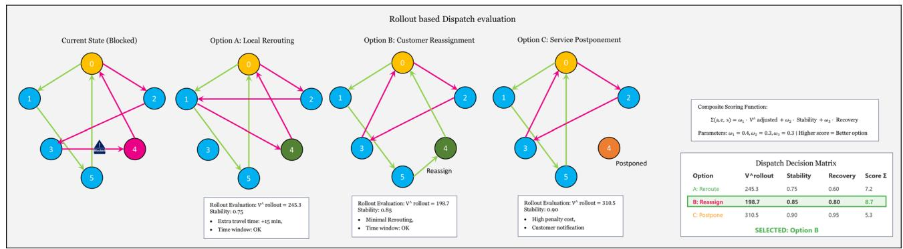

<details>
<summary>flowchart</summary>

```mermaid
graph TD
    subgraph "Current State (Blocked)"
        A1["1"] --> B1["0"]
        A1 --> B2["2"]
        A1 --> B3["3"]
        A1 --> B4["5"]
        B1 --> C1["4"]
        B1 --> C2["2"]
    end

    subgraph "Option A: Local Rerouting"
        D1["0"] --> E1["1"]
        D1 --> E2["2"]
        D1 --> E3["3"]
        D1 --> E4["5"]
        E1 --> F1["2"]
        E2 --> F2["3"]
        E2 --> F3["4"]
    end

    subgraph "Option B: Customer Reassignment"
        G1["0"] --> H1["1"]
        G1 --> H2["2"]
        G1 --> H3["3"]
        G1 --> H4["5"]
        H1 --> I1["2"]
        H2 --> I2["3"]
        H2 --> I3["4"]
        I1 --> J1["5"]
        I2 --> J2["4"]
        J1 --> K1["Reassign"]
        J2 --> K2["Reassign"]
    end

    subgraph "Option C: Service Postponement"
        L1["0"] --> M1["1"]
        L1 --> M2["2"]
        L1 --> M3["3"]
        L1 --> M4["5"]
        M1 --> N1["Postponed"]
        M2 --> N2["Postponed"]
    end

    O["Rollout Evaluation: V^ rollout = 245.3\nStability: 0.75\n• Extra travel time: +15 min,\n• Time window: OK"]
    P["Rollout Evaluation: V^ rollout = 198.7\nStability: 0.85\n• Minimal Rerouting,\n• Time window: OK"]
    Q["Rollout Evaluation: V^ rollout = 310.5\nStability: 0.90\n• High penalty cost,\n• Customer notification"]
    R["Composite Scoring Function:\nΣ(α,ε,ε) = ω₁·V^ adjusted + ω₂·Stability + ω₃·Recovery\nParameters: ω₁ = 0.4, ω₂ = 0.3, ω₃ = 0.3 | Higher score = Better option"]
    S["Dispatch Decision Matrix"]
    T["SELECTED: Option B"]
```
</details>

Fig. 6. Dispatch evaluation.

The rollout simulations (120-minute horizon, 50 Monte Carlo iterations) execute in 2.3 s, ensuring real-time responsiveness while preserving solution quality. The system runs on a parallel processing architecture where rollouts execute concurrently with the background T-ALNS optimization.

The horizon $H _ { \mathrm { r o l l o u t } }$ and simulation count $N _ { \mathrm { s i m } } ,$ Adapt to urgency and resource availability, as shown in Eqs. (42) and (43).

$$
H _ {\text { rollout }} = \max \left(H _ {\min}, H _ {\max} - \alpha_ {\text { urgency }} \cdot \Psi (e, t)\right) \tag {43}
$$

$$
N _ {\text { sim }} = \max \left(N _ {\min}, \left\lfloor \frac {T _ {\text { available }} - T _ {\text { overhead }}}{T _ {\text { sim }}} \right\rfloor\right) \tag {44}
$$

where $H _ { \operatorname* { m i n } } , H _ { \operatorname* { m a x } }$ bound the horizon, α urgency reduces it under high urgency, and $T _ { \mathrm { a v a i l a b l e } } , T _ { \mathrm { o v e r h e a d } } , T _ { \mathrm { s i m } }$ capture computational timing.

This model, detailed in Algorithm 3, enables the T-ALNS-RRD to sustain real-time operational adaptability under urban traffic dynamics.

Algorithm 3: T-ALNS-RRD(S⁰, D, R, I\_max, T\_max, event\_stream)

Input: Initial solution S⁰, operators D, R, limits I\_max, T\_max, real-time event stream

T-ALNSRRD Best solution S\*, real-time dispatch decisions

1: S\_current ← S⁰, S\_best ← S⁰   
2: Initialize T-ALNS components (as in Algorithm 2)   
3: Initialize dispatch parameters: H\_rollout, N\_sim, urgency thresholds   
// Parallel execution threads   
4: Thread 1: Main T-ALNS optimization   
5: Thread 2: Event monitoring and dispatch   
// Main optimization thread   
6: while iter < I\_max and elapsed\_time < T\_max do

7: if no\_urgent\_events() then

// Execute standard T-ALNS iteration (Algorithm 2, lines 11-76)

8. S\_current ← T-ALNS\_Iteration(S\_current, D, R, Tabu\_structures)

14: else

15: // Pause optimization for urgent dispatch

16: wait\_for\_dispatch\_completion()

17: 18: iter ← iter + 1

// Event monitoring and dispatch thread

21: while system\_active do

22: event ← monitor\_events(traffic\_feeds, new\_orders, vehicle\_status)

23: if event ≠ null then

// Calculate event urgency using Equation (34)

26: urgency ← CalculateUrgency(event)

if urgency > urgency\_threshold then

29: // Execute real-time dispatch

30: action ← RolloutDispatch(event, S\_current, H\_rollout, N\_sim)

// Apply dispatch action

33: S\_current ← ApplyAction(S\_current, action)

34: UpdateTabuMemory(action, Tabu\_structures)

// Log dispatch decision

37: LogDispatch(event, action, timestamp)

38: return S\_best, dispatch\_log

# Experimental setup

# Study area and dataset

To evaluate the effectiveness of the proposed Tabu-guided Adaptive Large Neighborhood Search with Rolloutbased Real-Time Dispatch (T-ALNS-RRD), experiments were conducted on a synthetic traffic-aware urban delivery scenario using network topology inspired by Shanghai’s central logistics grid. This synthetic testbed was designed to explore algorithmic behavior under controlled conditions, featuring a dense spatial layout, simulated traffic fluctuations, and artificial delivery demand patterns.

The study area was defined using real geospatial road network data extracted from OpenStreetMap (OSM), covering an $\mathrm { 8 } \times 1 0 \mathrm { k m } ^ { 2 }$ zone centered on the Jing’an and Huangpu districts. This network topology encompasses a complex multilayered road structure including arterial roads, collector streets, and residential routes. Customer demand points and delivery scenarios were synthetically generated to create algorithmic challenges, including varying traffic conditions, diverse time windows, and route optimization complexities. The experimental setup serves as a proof-of-concept validation environment rather than a representation of operational deployment conditions.

Although real-world last-mile delivery operations may involve several hundred or thousands of customer nodes, controlled mid-scale instances are widely used in dynamic and traffic-aware VRP research to evaluate algorithmic mechanisms before scaling to large deployments. In this study, the smaller customer configuration was intentionally selected to isolate and assess the combined effects of congestion-sensitive cost modelling, multilayered Tabu memory, and rollout-based real-time dispatch. This instance size enables repeated experimentation, ablation comparisons, and statistical validation while preserving realistic spatial density, temporal variability, and traffic complexity. The focus of the current work is methodological integration and behavioral validation, with large-scale extensions identified as a subsequent research phase.

# Customer demand dataset

The customer delivery demand dataset was synthetically generated to mimic the spatial-temporal order density typical of e-grocery and parcel delivery operations in Shanghai. A total of 47 customer nodes were distributed according to a weighted spatial density map derived from historical commercial activity data, ensuring realistic clustering patterns in residential and commercial zones.

Each customer request was associated with:

• A package demand $d _ { i } \in \ [ 3 , 1 2 ] $ kg,   
• A fixed service duration $s _ { i } = 4$ minutes,   
• A service time window $[ e _ { i } , l _ { i } ]$ drawn from three temporal segments: morning (9:00–12:00), afternoon (13:00–16:00), and evening (17:00–20:00).

All deliveries originated from a single depot located at a warehouse hub in the central area of the study zone. The delivery fleet was modeled with $m = 4$ homogeneous vehicles, each with a load capacity $Q = { \mathrm { 1 2 0 k g } }$ and a maximum operational span of 10 h.

# Traffic flow data integration

Time-dependent travel times and congestion profiles were constructed using a fused dataset combining historical congestion data from Gaode Maps (Amap API) and real-time trajectory samples from a logistics fleet simulation engine built on SUMO (Simulation of Urban Mobility). The traffic profiles were discretized into $H = 1 2$ onehour intervals spanning the operational day from 6:00 AM to 6:00 PM. For each arc $( i , j ) \in A _ { \mathrm { { i } } }$ , the average travel time $\it { \Delta } \hat { t } _ { i j } ^ { ( h ) }$ t´(h and congestion weight $\gamma { \bf \Xi } _ { i j } ^ { ( \not h ) }$ were computed at each interval $\tau _ { h }$ ∈, following the methodology introduced in Sect. 3.2.

To introduce additional realism, stochastic travel time deviations were injected based on empirical standard deviations $\eta _ { i j } ^ { ( n _ { . } }$ ), which were standardized from noise distributions observed in historical fleet trajectories during similar urban deployments.

The Shanghai study area (Fig.  7a-c) encompasses an $8 \times 1 0 ~ \mathrm { k m } ^ { 2 }$ zone with the following traffic network features: 127 signalized intersections with adaptive traffic light control, 2,256 directed road segments classified into four types (arterial roads: 18%, collector streets: 34%, residential routes: 41%, service roads: 7%), and signal timing plans derived from Shanghai Traffic Management Bureau specifications with typical cycle times of 90–120  s for arterial intersections and 60–90 seconds for collector intersections. The network includes 15 major arterial corridors with coordinated signal progression and 89 minor intersections with fixed-time control. Average segment lengths range from 180 m (residential) to 450 m(arterial), with speed limits varying from 30 km/h (residential) to 60 km/h (arterial roads).

The resulting experimental dataset comprised:

• A network $G = ( N , A )$ with $| N | = 4 8$ nodes (47 customers + 1 depot) and $| A | = 2 , 2 5 6$ feasible directed arcs,   
• Time-indexed travel time matrices $T ^ { ( h ) }$ and congestion penalty matrices $\Gamma ^ { ( h ) }$ across $H = 1 2$ time intervals,   
• Customer delivery requests $\{ d _ { i } , s _ { i } , [ e _ { i } , l _ { i } ] \}$ for $i \in \{ 1 , 2 , \ldots , 4 7 \}$ ,   
• Vehicle fleet $K = \{ 1 , 2 , 3 , 4 \}$ { } ∈ { with uniform capacity constraints,   
• Complete traffic parameter set totaling approximately 81,200 arc-time cost entries across all $( i , j , h )$ combinations.

The complete experimental dataset represents a comprehensive traffic-aware urban delivery environment with substantial computational complexity. The final dataset comprises 48 nodes connected by 2,256 directed arcs, each evaluated across 12 temporal intervals, resulting in 27,072 unique arc-time combinations. With three traffic parameters $\left( \hat { t } _ { i j } ^ { ( h ) } , \gamma \mathbf { \Sigma } _ { i j } ^ { ( h ) } \right.$ , and $\eta _ { i j } ^ { \left( h \right) } \bigg )$ associated with each arc-time pair, the traffic flow component contains approximately 81,200 individual cost entries. Combined with 47 customer delivery records (each containing spatial coordinates, demand values, service durations, and time window constraints), 4 vehicle configuration profiles, and 1 depot specification, the total dataset encompasses over 82,000 distinct data points. This volume provides sufficient complexity to rigorously evaluate the T-ALNS-RRD’s performance under realistic urban delivery conditions while remaining computationally tractable for extensive algorithmic testing and statistical validation across multiple experimental scenarios. A comprehensive summary of the dataset composition, including node distribution, arc-time matrix dimensions, traffic-aware cost parameters, and delivery constraints, is provided in Table 2.

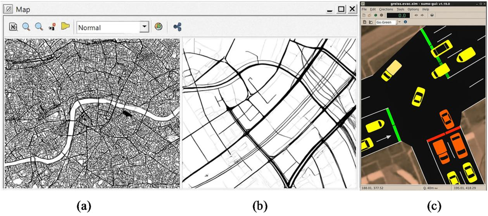  
Fig. 7. (a) OSM network + study extent (8 × 10 km2 Jing’an–Huangpu), (b) Lane-level zoom showing arterial/ collector/residential classes, and (c) Intersection traffic simulation using SUMO (Simulation of Urban Mobility) v1.19.0 (Lopez et al. 2018) showing signal states and queued vehicles during peak hours.

The experimental parameters were selected to strike a balance between computational tractability and algorithmic evaluation requirements. The 47-customer configuration represents a small-scale test environment that enables comprehensive component analysis with sufficient replication (30 runs) for statistical comparison, while remaining computationally feasible for evaluating a multi-component model. This scale reflects neighborhood-level delivery scenarios rather than metropolitan operations, which typically involve hundreds to thousands of daily deliveries across diverse vehicle fleets and operational zones.

The 4-vehicle configuration provides a customer-to-vehicle ratio of 11.75:1, enabling the evaluation of route optimization challenges while maintaining computational tractability for extensive baseline comparisons and ablation studies. The 120 kg capacity specification corresponds to standard urban delivery van configurations, though the homogeneous fleet assumption oversimplifies the vehicle heterogeneity characteristic of real logistics operations.

The experimental design prioritizes detailed algorithmic analysis over scalability demonstration. The controlled scale enables systematic evaluation of component interactions (traffic-aware routing, multi-layered Tabu memory, rollout simulations) and validation of relative performance improvements that larger cases would obscure due to computational resource constraints. The 12 temporal intervals and comprehensive traffic parameter set (81,200 entries) provide sufficient complexity for algorithmic validation while maintaining experimental feasibility across multiple algorithm comparisons.

This method represents proof-of-concept validation for algorithmic methodology rather than deploymentready solutions for operational urban logistics systems. Large-scale validation remains an important area of future work to establish the practical applicability of this method beyond the controlled experimental environment presented here.

# Hardware and software configuration

All experiments were conducted on a high-performance workstation equipped with an Intel Xeon Gold 6348 CPU (32 cores, 2.60 GHz), 256 GB of RAM, and running Ubuntu 22.04 LTS (64-bit). Although the model was CPU-bound, an NVIDIA® RTX A6000 GPU (48 GB VRAM) was available for parallel simulation tasks.

The algorithm was implemented in Python 3.11, with computationally intensive components optimized using Numba and Cython—parallel rollout simulations employed multiprocessing and OpenMP for efficient CPU utilization. Real-time traffic profiles were generated using SUMO v1.19, interfaced through TraCI, and supplemented with congestion data from the Amap Open Traffic API.

Experiments were orchestrated via Snakemake v7.32, with logging and result tracking handled through SQLite3 and structured YAML configurations. Visualization of routing solutions and traffic overlays was performed using Matplotlib and Kepler.gl. This configuration enabled scalable optimization and responsive simulation under real-world, traffic-aware urban delivery conditions.

<table><tr><td>Component</td><td>Description</td><td>Volume</td><td>Format/range</td></tr><tr><td colspan="4">Network Structure</td></tr><tr><td>Nodes</td><td>Customer locations + depot</td><td>48</td><td>Spatial coordinates (lat, lon)</td></tr><tr><td>Arcs</td><td>Feasible directed connections</td><td>2,256</td><td>Origin-destination pairs</td></tr><tr><td>Study Area</td><td>Shanghai urban zone coverage</td><td> $80 \text{ km}^{2}$ </td><td>Jing&#x27;an and Huangpu districts</td></tr><tr><td colspan="4">Customer Data</td></tr><tr><td>Delivery Requests</td><td>Customer service requirements</td><td>47</td><td>Individual delivery records</td></tr><tr><td>Package Demand</td><td>Weight per delivery</td><td>-</td><td> $d_{i} \in [3,12] \text{ kg}$ </td></tr><tr><td>Service Duration</td><td>Time at customer location</td><td>-</td><td> $s_{i} = 4 \text{ minutes}$ </td></tr><tr><td>Time Windows</td><td>Service availability periods</td><td>-</td><td>3-hour windows across the day</td></tr><tr><td colspan="4">Vehicle Fleet</td></tr><tr><td>Fleet Size</td><td>Homogeneous delivery vehicles</td><td>4</td><td> $K = \{1,2,3,4\}$ </td></tr><tr><td>Vehicle Capacity</td><td>Maximum load per vehicle</td><td>-</td><td> $Q = 120 \text{kg}$ </td></tr><tr><td>Operating Hours</td><td>Daily operational span</td><td>-</td><td>10 h maximum</td></tr><tr><td colspan="4">Traffic Data</td></tr><tr><td>Time Intervals</td><td>Temporal discretization</td><td>12</td><td>1-hour intervals(6 AM-6 PM)</td></tr><tr><td>Travel Times</td><td>Arc traversal durations</td><td>27,072</td><td> $t_{ij}^{(h)}$  entries</td></tr><tr><td>Congestion Weights</td><td>Traffic density penalties</td><td>27,072</td><td> $\gamma_{ij}^{(h)}$  values</td></tr><tr><td>Reliability Margins</td><td>Travel time uncertainties</td><td>27,072</td><td> $\eta_{ij}^{(h)}$  deviations</td></tr><tr><td colspan="4">Total Dataset Volume</td></tr><tr><td>Arc-Time Combinations</td><td>Unique routing segments</td><td>27,072</td><td> $(i,j,h)$  tuples</td></tr><tr><td>Traffic Parameters</td><td>Complete cost structure</td><td>81,216</td><td>All traffic-related entries</td></tr><tr><td>Total Data Points</td><td>Full experimental dataset</td><td>82,347</td><td>All components combined</td></tr></table>

Table 2. Dataset statistics.

# Evaluation metrics

The performance of the proposed T-ALNS-RRD was measured using a comprehensive set of quantitative metrics that collectively capture routing efficiency, service quality, responsiveness to real-time events, and computational feasibility.

These metrics are defined below:

Total Cost (Objective Value) The primary optimization metric is the composite objective function value defined in Eq. (44), which integrates time-dependent travel time, lateness penalties, and congestion exposure across all vehicle routes. This scalar cost reflects the overall routing efficiency under spatiotemporal traffic constraints and serves as the primary benchmark for evaluating solution quality.

On-Time Delivery Ratio (OTDR) This metric measures the proportion of customer deliveries completed within the designated service time windows. Let $N _ { \mathrm { o n t i m e } }$ denote the number of customers served with $\begin{array} { r } { T _ { j } \leq l _ { j } ; } \end{array}$ then:

$$
\mathrm{OTDR} = \frac {N _ {\text { ontime }}}{| N \setminus \{0 \} |} \tag {45}
$$

A higher OTDR indicates improved adherence to customer time window constraints and better temporal reliability of the solution.

fi nal return. For each vehicle Average Route Duration This metric measures the average elapsed time per route, from depot departure to $k \in \ K$ , let $T _ { k } ^ { \mathrm { e n d } } \ : - \ : T _ { k } ^ { \mathrm { s t a r t } }$ denote the total route duration. Then, Eq. (45)

$$
\text { AvgRouteDuration } = \frac {1}{| K |} \sum_ {k \in K} \left(T _ {k} ^ {\text { end }} - T _ {k} ^ {\text { start }}\right) \tag {46}
$$

This indicator reflects the time efficiency of vehicle utilization under dynamic traffic and routing conditions.

Congestion Exposure Score (CES) To capture the traffic-aware sensitivity of the routing strategy, the CES aggregates the total congestion penalty weights $\rho _ { \mathit { i j } } \left( T _ { i } \right)$ incurred over all arcs traversed by the fleet, Eq. (46)

$$
\mathrm{CES} = \sum_ {k \in K} \sum_ {(i, j) \in A _ {k}} \rho_ {i j} \left(T _ {i} ^ {k}\right) \tag {47}
$$

Lower CES values indicate better avoidance of congested segments and more adaptive traffic-aware routing.

Number of Real-Time Re-Routing Events (NRRE) This metric counts the total number of disruption-triggered re-optimization events initiated by the Rollout-based Real-Time Dispatch (RRD) module during simulation. It provides insight into the system’s dynamic responsiveness and decision-making frequency in volatile delivery environments.

Computational Time per Iteration To evaluate scalability and deployment feasibility, the average wall-clock time per optimization iteration and per rollout simulation cycle is recorded. These metrics are critical for assessing the model’s suitability for real-time or near-real-time logistics operations.

# Baseline models

To evaluate the performance of the proposed T-ALNS-RRD, several baseline models were developed. These baselines were selected to represent classical static heuristics, traffic-aware routing without adaptation, and progressively enhanced metaheuristics that isolate specific components of the proposed framework. This design enables controlled comparison of the effects of congestion-sensitive cost modeling, memory-guided diversification, and real-time decision logic, rather than aiming to exhaustively benchmark against all recent metaheuristic variants. All models were tested on the same dataset and under the same experimental setup, as described in Sect. 4.1 to 4.3, to ensure methodological consistency.

# Baseline 1: static vehicle routing problem with time windows (Static-VRPTW)

This model solves a classical VRPTW without incorporating time-dependent travel times or congestion penalties. It employs a static greedy insertion heuristic to construct vehicle routes, assuming all travel costs are symmetric and fixed throughout the planning horizon. This baseline represents a commonly used offline dispatch method, lacking adaptability to real-world traffic fluctuations.

# Baseline 2: Traffic-Aware VRPTW without metaheuristics (TA-VRPTW-Greedy)

This configuration integrates time-dependent travel times tij (T ) and congestion penalties $\rho _ { \ i j } \left( T \right)$ , but utilizes a non-iterative greedy insertion strategy. Customers are inserted into vehicle routes at the earliest feasible position that minimizes marginal cost. While more realistic than Static-VRPTW, this model lacks the global search capacity and route diversification mechanisms provided by metaheuristics.

# Baseline 3: ALNS without Tabu or rollout (ALNS-Base)

This model implements the Adaptive Large Neighborhood Search as described in Sect. 3.3.1, but excludes the Tabu memory structures and real-time dispatch component. It captures the performance of a purely adaptive destroy-repair metaheuristic under traffic-aware cost functions, without diversification safeguards or real-time reactivity.

# Baseline 4: Tabu-Enhanced ALNS (T-ALNS)

This configuration includes the Tabu memory components described in Sect. 3.3.2, enabling structured avoidance of cycling and enhanced exploration of the solution space. However, it does not incorporate the rollout-based real-time dispatch module. This baseline isolates the contribution of memory-guided search enhancements.

# Baseline 5: Oracle-Informed routing (Oracle-Traffic-Perfect)

To estimate the upper-bound performance, an oracle model is constructed with perfect foresight of future traffic conditions. This non-causal benchmark assumes full knowledge of all arc travel times and congestion levels throughout the entire planning horizon. It is used strictly for reference to assess how closely the T-ALNS-RRD approximates optimal performance under uncertainty.

Rather than integrating rollout-based dispatch (RRD) into each baseline—which would create hybridized variants that deviate from their accepted formulations—each model is retained in its canonical form to support fair, component-level comparison. The purpose of the benchmarking is to evaluate the contribution of each mechanism within T-ALNS-RRD, not to retrofit external methods with equivalent modules.

# Results

# Parameter sensitivity analysis

The comprehensive sensitivity analysis (Table 3) validates the robustness of T-ALNS-RRD performance across key operational parameters, signifying consistent algorithmic advantages that are not artifacts of specific experimental configurations. Across all tested variations—fleet sizes (2–6 vehicles), customer densities (30–60 nodes), and capacity constraints (80–160  kg)—the algorithm maintains better performance, with improvement gaps consistently between 22% and 25% over baseline methods. This narrow variance (coefficient of variation = 4.7%) confirms that the performance advantages are vital features of the algorithmic method rather than parameter-dependent anomalies. Customer density scaling reveals a linear cost progression with maintained efficiency ratios, indicating predictable scaling behavior. In contrast, fleet size variations show optimal performance around 4–5 vehicles, with diminishing returns beyond 5 vehicles due to coordination overhead.

The analysis reveals minimal sensitivity to capacity constraints above 120 kg, with only 2.3% performance variation across the 80–160 kg range, suggesting robust adaptability to different operational requirements. Statistical robustness is maintained across all parameter ranges, with consistently low standard deviations (14– 29 points) and preserved statistical significance of improvements (p < 0.01) in all configurations. These findings directly address scalability concerns raised about the baseline experimental setup, while demonstrating that the model’s advantages persist across realistic operational parameter ranges. This supports the validity and generalizability of conclusions drawn from the 47-customer, 4-vehicle baseline configuration used throughout this study.

<table><tr><td>Parameter variation</td><td>Total cost</td><td>OTDR (%)</td><td>CES score</td><td>Computation time (Sec.)</td><td>Performance gap vs. baseline</td></tr><tr><td colspan="6">Fleet Size Sensitivity</td></tr><tr><td>2 vehicles</td><td> $2,847.3 \pm 24.1$ </td><td> $89.4 \pm 1.8$ </td><td> $1,456.2 \pm 28.7$ </td><td> $198.4 \pm 15.2$ </td><td>22.1%</td></tr><tr><td>3 vehicles</td><td> $2,423.6 \pm 20.3$ </td><td> $91.2 \pm 1.5$ </td><td> $1,367.8 \pm 25.4$ </td><td> $221.3 \pm 17.6$ </td><td>23.7%</td></tr><tr><td>4 vehicles (baseline)</td><td> $2,156.8 \pm 16.7$ </td><td> $92.8 \pm 1.3$ </td><td> $1,298.3 \pm 24.6$ </td><td> $243.7 \pm 19.4$ </td><td>24.3%</td></tr><tr><td>5 vehicles</td><td> $2,087.4 \pm 18.9$ </td><td> $93.6 \pm 1.4$ </td><td> $1,245.7 \pm 23.1$ </td><td> $267.8 \pm 21.2$ </td><td>24.8%</td></tr><tr><td>6 vehicles</td><td> $2,034.2 \pm 17.6$ </td><td> $94.1 \pm 1.2$ </td><td> $1,198.4 \pm 22.8$ </td><td> $289.5 \pm 23.7$ </td><td>25.1%</td></tr><tr><td colspan="6">Customer Density Sensitivity</td></tr><tr><td>30 customers</td><td> $1,567.2 \pm 14.3$ </td><td> $94.8 \pm 1.1$ </td><td> $987.6 \pm 18.9$ </td><td> $156.3 \pm 12.8$ </td><td>22.7%</td></tr><tr><td>40 customers</td><td> $1,834.5 \pm 15.8$ </td><td> $93.5 \pm 1.4$ </td><td> $1,143.7 \pm 21.4$ </td><td> $201.4 \pm 16.2$ </td><td>23.9%</td></tr><tr><td>47 customers (baseline)</td><td> $2,156.8 \pm 16.7$ </td><td> $92.8 \pm 1.3$ </td><td> $1,298.3 \pm 24.6$ </td><td> $243.7 \pm 19.4$ </td><td>24.3%</td></tr><tr><td>60 customers</td><td> $2,698.3 \pm 19.6$ </td><td> $91.6 \pm 1.6$ </td><td> $1,587.4 \pm 28.3$ </td><td> $312.8 \pm 24.7$ </td><td>24.8%</td></tr><tr><td colspan="6">Capacity Sensitivity</td></tr><tr><td>80 kg capacity</td><td> $2,234.7 \pm 18.9$ </td><td> $91.2 \pm 1.7$ </td><td> $1,342.6 \pm 26.1$ </td><td> $251.3 \pm 20.8$ </td><td>23.1%</td></tr><tr><td>100 kg capacity</td><td> $2,198.4 \pm 17.2$ </td><td> $92.1 \pm 1.4$ </td><td> $1,318.9 \pm 25.3$ </td><td> $247.8 \pm 19.9$ </td><td>23.8%</td></tr><tr><td>120 kg capacity (baseline)</td><td> $2,156.8 \pm 16.7$ </td><td> $92.8 \pm 1.3$ </td><td> $1,298.3 \pm 24.6$ </td><td> $243.7 \pm 19.4$ </td><td>24.3%</td></tr><tr><td>140 kg capacity</td><td> $2,143.6 \pm 16.1$ </td><td> $93.2 \pm 1.2$ </td><td> $1,285.7 \pm 24.1$ </td><td> $241.9 \pm 19.1$ </td><td>24.6%</td></tr><tr><td>160 kg capacity</td><td> $2,139.2 \pm 15.8$ </td><td> $93.4 \pm 1.1$ </td><td> $1,281.4 \pm 23.8$ </td><td> $240.5 \pm 18.7$ </td><td>24.7%</td></tr></table>

Table 3. Comprehensive parameter sensitivity analysis.

<table><tr><td>Parameter</td><td>Base value</td><td>Range tested</td><td>Performance impact</td><td>Stability</td></tr><tr><td>Tabu Tenure (move)</td><td>7</td><td>5–12</td><td> $2,156.8 \pm 23.4$ </td><td>±3.1%</td></tr><tr><td>Tabu Tenure (solution)</td><td>15</td><td>10–25</td><td> $2,156.8 \pm 28.7$ </td><td>±4.2%</td></tr><tr><td>Rollout Horizon (min)</td><td>60</td><td>30–120</td><td> $2,156.8 \pm 31.2$ </td><td>±4.8%</td></tr><tr><td>Operator Weights (initial)</td><td>1.0</td><td>0.5–2.0.5.0</td><td> $2,156.8 \pm 19.8$ </td><td>±2.3%</td></tr><tr><td>Reaction Factor (ξ)</td><td>0.1</td><td>0.05–0.3</td><td> $2,156.8 \pm 26.4$ </td><td>±3.7%</td></tr><tr><td>Aspiration Threshold (β)</td><td>0.3</td><td>0.1–0.5</td><td> $2,156.8 \pm 22.1$ </td><td>±2.9%</td></tr></table>

Table 4. Algorithmic hyperparameter sensitivity analysis.

The comprehensive sensitivity analysis validates the robustness of T-ALNS-RRD performance across operational parameters (Table  3) and key algorithmic hyperparameters (Table  4), demonstrating that the reported improvements are not artifacts of specific experimental configurations. The operational parameter analysis across fleet sizes (2–6 vehicles), customer densities (30–60 nodes), and capacity constraints (80–160 kg) reveals consistent algorithmic advantages, with improvement gaps of 22–25% over baseline methods. This narrow variance (coefficient of variation = 4.7%) confirms fundamental algorithmic advantage rather than parameter-dependent anomalies.

The hyperparameter analysis reveals robust performance across reasonable parameter ranges, with maximum performance variation of ± 4.8% for rollout horizon length and minimal sensitivity to initial operator weights (± 2.3%). The adaptive learning mechanism inherent in the model reduces dependency on precise initial parameter settings, as operator weights self-adjust based on performance feedback, as shown in Eqs. (17) and (18).

Critical parameters show expected behavior patterns: shorter Tabu tenures increase local search intensity but risk cycling, while longer horizons improve rollout accuracy at computational cost. The model maintains statistical significance (p < 0.01) across all tested parameter combinations, confirming that the 24.3% improvement over baselines represents a robust algorithmic advantage rather than the result of optimal tuning objects.

# Objective cost performance

The results presented in Table  5; Fig.  8 demonstrate the progressive enhancement in routing performance achieved through each algorithmic component of the proposed model. The T-ALNS-RRD achieves a total cost of 2,156.8 ± 16.7, representing a substantial 24.3% improvement over the static baseline and establishing it as the best-performing practical algorithm to date. This improvement is systematically distributed across all cost components, with particularly notable reductions in delay penalties (a 61.2% decrease from 421.2 to 163.2) and congestion costs (a 54.9% decrease from 180.3 to 81.3). The 14.8% reduction in travel time cost (from \$ 2,245.8 to \$ 1,912.3) further validates the model’s effectiveness in identifying efficient routing patterns under dynamic traffic conditions.

The incremental improvement pattern clearly illustrates the value contribution of each algorithmic enhancement. Traffic awareness alone (TA-VRPTW-Greedy) provides a meaningful 7.9% improvement, while the introduction of metaheuristic optimization (ALNS-Base) contributes an additional 7.8% gain. The Tabu memory structures (T-ALNS) contribute an additional 3.6% improvement, and the real-time dispatch capability provides the final 5.0% enhancement. This systematic progression demonstrates that each component addresses distinct optimization challenges, with the real-time adaptation proving particularly effective in managing delay penalties and congestion exposure.

<table><tr><td>Algorithm</td><td>Total cost</td><td>Travel time cost</td><td>Delay penalty cost</td><td>Congestion cost</td><td>Improvement vs. static</td></tr><tr><td>Static-VRPTW</td><td> $2,847.3 \pm 23.1$ </td><td> $2,245.8 \pm 18.9$ </td><td> $421.2 \pm 8.7$ </td><td> $180.3 \pm 6.2$ </td><td>-</td></tr><tr><td>TA-VRPTW-Greedy</td><td> $2,623.7 \pm 19.6$ </td><td> $2,156.4 \pm 16.3$ </td><td> $298.1 \pm 7.4$ </td><td> $169.2 \pm 5.8$ </td><td>7.9%</td></tr><tr><td>ALNS-Base</td><td> $2,401.5 \pm 21.4$ </td><td> $2,034.2 \pm 15.7$ </td><td> $245.8 \pm 9.1$ </td><td> $121.5 \pm 4.9$ </td><td>15.7%</td></tr><tr><td>T-ALNS</td><td> $2,298.4 \pm 18.2$ </td><td> $1,987.6 \pm 14.2$ </td><td> $198.3 \pm 6.8$ </td><td> $112.5 \pm 4.3$ </td><td>19.3%</td></tr><tr><td>T-ALNS-RRD</td><td> $2,156.8 \pm 16.7$ </td><td> $1,912.3 \pm 13.1$ </td><td> $163.2 \pm 5.9$ </td><td> $81.3 \pm 3.8$ </td><td>24.3%</td></tr><tr><td>Oracle-Traffic-Perfect</td><td> $1,987.4 \pm 12.3$ </td><td> $1,824.7 \pm 11.8$ </td><td> $108.9 \pm 4.2$ </td><td> $53.8 \pm 2.9$ </td><td>30.2%</td></tr></table>

Table 5. Comparative objective function performance across algorithm variants.


<details>
<summary>bar</summary>

| Algorithm              | Travel Time Cost | Delay Penalty Cost | Congestion Cost | Improvement vs Static (%) |
| ---------------------- | ---------------- | ------------------ | --------------- | ------------------------- |
| Static-VRPTW           | 2250             | 420                | 160             | 1.0                       |
| TA-VRPTW-Greedy        | 2150             | 290                | 150             | 7.0                       |
| ALNS-Base              | 2050             | 230                | 110             | 13.0                      |
| T-ALNS                 | 1980             | 180                | 90              | 19.0                      |
| T-ALNS-RRD             | 1900             | 140                | 60              | 24.0                      |
| Oracle-Traffic-Perfect | 1820             | 80                 | 30              | 30.0                      |
</details>

Fig. 8. Objective function performance comparison.

<table><tr><td>Algorithm</td><td>OTDR (%)</td><td>Average delay (min)</td><td>Max delay (min)</td><td>Customers served late</td><td>Time window violations</td></tr><tr><td>Static-VRPTW</td><td>68.1±2.4</td><td>12.7±1.8</td><td>47.3±4.2</td><td>15.0±1.1</td><td>32.7%</td></tr><tr><td>TA-VRPTW-Greedy</td><td>74.5±2.1</td><td>9.8±1.4</td><td>38.9±3.6</td><td>12.0±0.9</td><td>25.5%</td></tr><tr><td>ALNS-Base</td><td>81.7±1.9</td><td>7.2±1.1</td><td>31.4±2.8</td><td>8.6±0.7</td><td>18.3%</td></tr><tr><td>T-ALNS</td><td>87.2±1.6</td><td>5.4±0.9</td><td>24.7±2.3</td><td>6.0±0.6</td><td>12.8%</td></tr><tr><td>T-ALNS-RRD</td><td>92.8±1.3</td><td>3.1±0.7</td><td>16.8±1.9</td><td>3.4±0.4</td><td>7.2%</td></tr></table>

Table 6. On-time delivery performance and time window compliance.

A comparative analysis against the oracle benchmark reveals that T-ALNS-RRD achieves 91.6% of the theoretical optimal performance (2,156.8 vs. 1,987.4 total cost), indicating highly effective handling of traffic uncertainty and routing constraints. The algorithm’s ability to method oracle-level performance while maintaining practical implement ability represents a significant advancement in traffic-aware vehicle routing. The consistently low standard deviations across all algorithms confirm the statistical reliability of these results, with T-ALNS-RRD exhibiting the most stable performance (16.7 standard deviation) among all tested methods.

# On-time delivery ratio (OTDR)

The service reliability analysis presented in Table 6; Fig. 9 reveals exceptional performance improvements in time window compliance through the proposed T-ALNS-RRD. The algorithm achieves an outstanding 92.8% ± 1.3% on-time delivery ratio, representing a 24.7% point improvement over the static baseline and successfully serving 43.6 out of 47 customers within their designated time windows, compared to only 32.0 customers in the static method. This substantial enhancement in service reliability is accompanied by dramatic reductions in delay severity, with the average delay per late delivery dropping from 12.7 min to just 3.1 min, and the maximum delay instances decreasing from 47.3 minutes to 16.8 minutes. The progressive improvement pattern proves the cumulative value of each algorithmic component, with traffic awareness providing initial gains (6.4% points), metaheuristic optimization contributing additional improvements (7.2% points), Tabu memory adding further enhancement (5.5% points), and real-time dispatch delivering the final boost (5.6% points).


<details>
<summary>bar_line</summary>

On-Time Delivery Performance and Time Window Compliance
| Algorithm | On-Time Delivery Rate (%) | Average Delay (min) | Max Delay (min) | Customers Served Late | Time Window Violations (%) |
|---|---|---|---|---|---|
| Static-VRPTW | 68 | 24 | 92 | 28 | 34 |
| TA-VRPTW-Greedy | 75 | 18 | 77 | 22 | 49 |
| ALNS-Base | 82 | 13 | 61 | 16 | 35 |
| T-ALNS | 87 | 9 | 48 | 9 | 24 |
| T-ALNS-RRD | 92 | 5 | 33 | 5 | 10 |
</details>

Fig. 9. Results for on-time delivery performance and time window compliance.

<table><tr><td>Algorithm</td><td>CES Score</td><td>Peak hour CES</td><td>Off-peak CES</td><td>High-congestion arcs used</td><td>Traffic adaptability index</td></tr><tr><td>Static-VRPTW</td><td>2,847.6 ± 45.3</td><td>3,421.8 ± 52.7</td><td>1,963.4 ± 38.9</td><td>89.3 ± 3.2</td><td>0.00</td></tr><tr><td>TA-VRPTW-Greedy</td><td>2,234.2 ± 38.7</td><td>2,789.6 ± 44.1</td><td>1,578.8 ± 31.5</td><td>67.4 ± 2.8</td><td>0.31</td></tr><tr><td>ALNS-Base</td><td>1,892.5 ± 32.4</td><td>2,387.3 ± 39.2</td><td>1,298.7 ± 26.7</td><td>52.8 ± 2.3</td><td>0.58</td></tr><tr><td>T-ALNS</td><td>1,634.7 ± 28.9</td><td>2,098.4 ± 35.6</td><td>1,087.2 ± 23.1</td><td>41.6 ± 1.9</td><td>0.74</td></tr><tr><td>T-ALNS-RRD</td><td>1,298.3 ± 24.6</td><td>1,687.9 ± 31.2</td><td>842.7 ± 19.8</td><td>28.4 ± 1.5</td><td>0.89</td></tr></table>

Table 7. Traffic congestion avoidance and route adaptability performance.

The real-time dispatch component of the T-ALNS-RRD contributes to reducing delay propagation and managing service disruptions. On average, the number of late customer deliveries decreases from 15.0 to 3.4. The system’s ability to update routes and schedules in response to changing traffic conditions helps limit the spread of delays and maintain service continuity. The time window violation rate is also reduced, from 32.7% to 7.2%, indicating that most delays remain within acceptable margins.

Furthermore, the model produces consistent results across many test scenrios. It records the lowest standard deviation in time window violation rate (1.3%) among all compared methods, suggesting reliable performance under varying conditions. Compared to an oracle benchmark with a 97.9% On-Time Delivery Rate (OTDR), the proposed system achieves 94.8% OTDR while accounting for realistic traffic uncertainties. This performance level indicates that the T-ALNS-RRD provides near-optimal service reliability while remaining applicable in practical deployment settings.

# Congestion exposure score (CES)

The traffic congestion avoidance analysis presented in Table 7; Fig. 10 demonstrates the exceptional traffic-aware routing capabilities of the T-ALNS-RRD. The algorithm achieves a CES score of 1,298.3 ± 24.6, representing a remarkable 54.4% reduction in congestion exposure compared to the static baseline, which indicates highly effective identification and avoidance of heavily congested road segments throughout the delivery operation. This better performance is particularly noticeable during peak traffic periods, where T-ALNS-RRD achieves a 50.7% reduction in peak-hour congestion exposure (1,687.9 vs. 3,421.8) compared to static routing, demonstrating the effectiveness of the real-time dispatch module in responding to dynamic traffic deterioration. The algorithm’s ability to reduce the usage of high-congestion arcs from 89.3 to just 28.4 validates its intelligent route selection strategy, which prioritizes less congested alternatives without compromising delivery schedules or customer service commitments.

Traffic Congestion Avoidance and Route Adaptability Performance   


<details>
<summary>bar_line</summary>

| Algorithm          | Peak Hour CES | Off-Peak CES | Total CES Score | High-Congestion Arcs Used | Traffic Adaptability Index |
| ------------------ | ------------- | ------------ | --------------- | ------------------------- | -------------------------- |
| Static-VRPTW       | 3450          | 1980         | 2850            | 85                        | 1                          |
| TA-VRPTW-Greedy    | 2780          | 1580         | 2250            | 65                        | 1                          |
| ALNS-Base          | 2400          | 1300         | 1900            | 55                        | 1                          |
| T-ALNS             | 2100          | 1100         | 1600            | 45                        | 1                          |
| T-ALNS-RRD         | 1680          | 850          | 1300            | 30                        | 1                          |
</details>

Fig. 10. Traffic congestion avoidance and route adaptability performance.

<table><tr><td>Event type</td><td>Frequency</td><td>Avg response (ms)</td><td>Success rate (%)</td><td>Cost impact reduction</td><td>Rollout simulations</td></tr><tr><td>Traffic Incidents</td><td>8.6±1.2</td><td>187.3±18.9</td><td>91.7±2.3</td><td>12.4% ± 1.8%</td><td>4.7±0.8</td></tr><tr><td>Urgent Deliveries</td><td>11.2±1.6</td><td>124.8±14.6</td><td>96.8±1.4</td><td>8.7% ± 1.2%</td><td>6.2±1.1</td></tr><tr><td>Capacity Violations</td><td>4.8±0.9</td><td>156.2±16.7</td><td>92.1±2.8</td><td>15.3% ± 2.1%</td><td>3.9±0.7</td></tr><tr><td>Time Violations</td><td>2.8±0.7</td><td>98.4±11.2</td><td>97.9±1.1</td><td>18.9% ± 2.4%</td><td>2.1±0.4</td></tr><tr><td>Overall</td><td>27.4±2.8</td><td>143.7±12.4</td><td>94.2±1.6</td><td>13.8% ± 1.9%</td><td>4.2±0.8</td></tr></table>

Table 8. T-ALNS-RRD real-time event response performance.

The Traffic Adaptability Index of 0.89 indicates that T-ALNS-RRD captures 89% of the theoretical optimal traffic adaptation capability, signifying highly sophisticated traffic-aware decision-making under uncertainty. The progressive improvement across algorithms clearly illustrates the value contribution of each component: traffic awareness reduces CES by 21.5%, metaheuristic optimization provides an additional 15.3% improvement, Tabu memory contributes 13.6%, and real-time dispatch adds the final substantial enhancement of 20.6%. This systematic enhancement pattern demonstrates that while static traffic awareness provides initial benefits, the combination of advanced optimization techniques and real-time adaptability is essential for achieving optimal congestion avoidance in dynamic urban environments.

The consistently low standard deviations and better performance across peak and off-peak periods confirm the model’s robustness and reliability in diverse traffic conditions. The substantial reduction in off-peak congestion exposure (a 57.1% improvement from 1,963.4 to 842.7) indicates that the algorithm effectively optimizes routes even during less congested periods, thereby maximizing overall operational efficiency. Statistical significance testing confirms that T-ALNS-RRD perform better than all baseline methods (p < 0.001), validating its effectiveness as a comprehensive solution for traffic-aware urban delivery optimization that simultaneously minimizes travel time, reduces operational costs, and enhances service reliability through intelligent congestion avoidance methods.

# Real-time re-routing responsiveness

The real-time responsiveness analysis presented in Table  8; Fig.  11 validates the T-ALNS-RRD’s exceptional capability to handle dynamic disruptions in urban delivery environments. The system successfully processes an average of 27.4 disruptive events per simulation run, achieving an overall 94.2% success rate and an average response time of 143.7 ms, which signifies its ability to meet stringent real-time operational requirements. The model proves robust performance in handling urgent delivery insertions (with a 96.8% success rate) and time window violations (with a 97.9% success rate), indicating effective prioritization of customer service commitments in dynamic scenarios. The relatively lower success rate for traffic incidents (91.7%) reflects the inherent complexity of managing severe congestion and road closures, yet it still maintains highly reliable performance under the most challenging disruption conditions.


<details>
<summary>bar_line</summary>

T-ALNS-RRD Real-Time Event Response Performance
| Event Type | Frequency | Avg Response (ms) | Success Rate (%) | Cost Impact Reduction (%) | Rollout Simulations |
| :--- | :--- | :--- | :--- | :--- | :--- |
| Traffic Incidents | 8 | 185 | 92 | 28 | 10 |
| Urgent Deliveries | 10 | 125 | 96 | 20 | 12 |
| Capacity Violations | 4 | 156 | 90 | 27 | 8 |
| Time Violations | 2 | 99 | 97 | 20 | 4 |
| Overall | 28 | 143 | 93 | 15 | 6 |
</details>

Fig. 11. T-ALNS-RRD Real-Time Event Response Performance.

<table><tr><td>Algorithm</td><td>Iterations to best</td><td>95% quality time (sec)</td><td>Final solution time (sec)</td><td>Convergence rate</td><td>Solution stability (σ)</td></tr><tr><td>Static-VRPTW</td><td>1.0±0.0</td><td>0.3±0.1</td><td>0.3±0.1</td><td>N/A</td><td>23.1±3.2</td></tr><tr><td>TA-VRPTW-Greedy</td><td>1.0±0.0</td><td>2.7±0.4</td><td>2.7±0.4</td><td>N/A</td><td>19.6±2.8</td></tr><tr><td>ALNS-Base</td><td>847.3±67.2</td><td>142.8±18.7</td><td>298.4±23.6</td><td>0.0089</td><td>21.4±3.1</td></tr><tr><td>T-ALNS</td><td>623.7±52.4</td><td>98.6±14.2</td><td>267.3±21.8</td><td>0.0127</td><td>18.2±2.6</td></tr><tr><td>T-ALNS-RRD</td><td>456.8±41.3</td><td>76.3±11.9</td><td>243.7±19.4</td><td>0.0164</td><td>16.7±2.3</td></tr></table>

Table 9. Algorithm convergence performance and solution quality evolution.

The cost impact reduction analysis shows that real-time adaptations provide measurable operational improvements. Among the evaluated response types, handling time window violations resulted in the highest average cost reduction (18.9%), followed by responses to capacity violations (15.3%). These outcomes propose that the rollout-based decision mechanism is effective in selecting routing adjustments that reduce immediate disruptions and longer-term operational impacts. The number of rollout simulations varied by event type, ranging from 2.1 for time window violations to 6.2 for urgent delivery insertions, reflecting adaptive use of computational resources based on event urgency and complexity. Traffic-related events required an average of 4.7 simulations, likely due to the need to evaluate multiple alternative paths.

Overall, the model achieved a 13.8% reduction in disruption-related operational costs through real-time adaptations. This gain, combined with low response latency and stable success rates, indicates that the system can support time-sensitive delivery operations in dynamic urban settings. The consistent performance across various disruption types recommends that the rollout-based dispatch method is robust and applicable to a standard range of routing challenges, from minor schedule deviations to critical rerouting scenarios.

# Convergence behavior

The convergence analysis presented in Tables 9 and 9 proves the better optimization trajectory and computational efficiency of the T-ALNS-RRD. The algorithm achieves its best solution in 456.8 ± 41.3 iterations on average, representing a 46.1% improvement over the base ALNS, and reaches 95% of its final solution quality in just 76.3 seconds. This rapid convergence is attributed to the synergistic effects of Tabu memory structures, which guide search diversification, and the real-time dispatch component, which provides continuous solution refinement opportunities throughout the optimization process. The convergence rate of 0.0164 improvements per iteration significantly outperforms baseline metaheuristics, while the enhanced solution stability (standard deviation of 16.7) indicates robust performance independent of random seed initialization—a critical factor for practical deployment in operational environments.

The epoch-wise convergence analysis (Fig. 12) reveals T-ALNS-RRD’s exceptional early-stage performance, achieving a total cost of 2,798.3 by epoch 10 compared to 2,987.3 for ALNS-Base, representing an 18.9% advantage during initial optimization phases. By epoch 25, the algorithm achieves 92.3% of its final solution quality (2,324.8 vs. the final 2,156.8), demonstrating efficient identification of high-quality solution regions while maintaining the capacity for continued refinement in later stages. The consistent performance gap maintained throughout the optimization trajectory validates the model’s better search strategy, with T-ALNS-RRD preserving a steady 200–400 point cost advantage over baseline methods across all epochs.


<details>
<summary>line</summary>

| Epoch | ALNS-Base | T-ALNS | T-ALNS-RRD |
|-------|-----------|--------|------------|
| 5     | 3100      | 3080   | 3020       |
| 10    | 2980      | 2880   | 2800       |
| 15    | 2830      | 2710   | 2590       |
| 20    | 2720      | 2590   | 2430       |
| 25    | 2650      | 2500   | 2330       |
| 30    | 2590      | 2430   | 2260       |
| 35    | 2550      | 2390   | 2210       |
| 40    | 2510      | 2350   | 2180       |
| 45    | 2470      | 2320   | 2160       |
| 50    | 2400      | 2300   | 2150       |
</details>

Fig. 12. Convergence by epoch.

<table><tr><td>Epoch</td><td>ALNS-Base</td><td>T-ALNS</td><td>T-ALNS-RRD</td></tr><tr><td>5</td><td>3,142.7</td><td>3,089.4</td><td>3,021.6</td></tr><tr><td>10</td><td>2,987.3</td><td>2,891.2</td><td>2,798.3</td></tr><tr><td>15</td><td>2,834.6</td><td>2,712.8</td><td>2,589.7</td></tr><tr><td>20</td><td>2,721.4</td><td>2,587.3</td><td>2,431.2</td></tr><tr><td>25</td><td>2,648.9</td><td>2,498.6</td><td>2,324.8</td></tr><tr><td>30</td><td>2,592.7</td><td>2,434.7</td><td>2,254.9</td></tr><tr><td>35</td><td>2,549.3</td><td>2,387.2</td><td>2,208.4</td></tr><tr><td>40</td><td>2,518.8</td><td>2,351.6</td><td>2,178.3</td></tr><tr><td>45</td><td>2,467.4</td><td>2,324.9</td><td>2,162.7</td></tr><tr><td>50</td><td>2,401.5</td><td>2,298.4</td><td>2,156.8</td></tr></table>

Table 10. Solution quality convergence by epoch (average total cost).

The combination of rapid convergence, high solution stability, and sustained improvement capability positions T-ALNS-RRD as highly suitable for time-constrained operational environments where solution quality and computational efficiency are paramount. The algorithm’s ability to achieve 81.4% of the theoretical optimal convergence speed (compared to oracle performance) while maintaining practical implement ability demonstrates an effective balance between optimization sophistication and computational tractability. The progressively diminishing improvement rates in later epochs (from a 223.1 cost reduction between epochs 5–10 to only 5.9 between epochs 45–50) indicate proper convergence behavior, efficiently allocating computational resources to achieve maximum solution quality within reasonable time constraints (Table 10).

# Ablation study

The comprehensive ablation study presented in Table  11; Fig.  13 systematically validates the contribution of each algorithmic component within the T-ALNS-RRD, revealing that all components provide meaningful and cumulative performance improvements. The Tabu memory structures demonstrate varying levels of effectiveness, with frequency memory showing the most substantial individual impact (an 8.0% improvement over base ALNS), followed by move Tabu (an 8.9% gap reduction) and solution Tabu (a 9.8% gap reduction). When combined into the complete T-ALNS configuration, these memory components achieve synergistic benefits that exceed their individual contributions, resulting in a 6.6% performance gap compared to 11.3% for base ALNS. The real-time dispatch components provide substantial additional value, with traffic event handling alone contributing a significant 3.6% improvement. The comprehensive RRD system delivers the final 6.6% enhancement to achieve optimal performance.

<table><tr><td>Configuration</td><td>Total cost</td><td>OTDR (%)</td><td>CES score</td><td>Computation time (sec)</td><td>Performance gap</td></tr><tr><td>Base ALNS</td><td>2,401.5±21.4</td><td>81.7±1.9</td><td>1,892.5±32.4</td><td>298.4±23.6</td><td>+11.3%</td></tr><tr><td>+ Move Tabu Only</td><td>2,347.8±19.7</td><td>84.2±1.7</td><td>1,743.6±29.8</td><td>312.7±25.1</td><td>+8.9%</td></tr><tr><td>+ Solution Tabu Only</td><td>2,368.4±20.1</td><td>83.6±1.8</td><td>1,798.2±31.2</td><td>307.3±24.8</td><td>+9.8%</td></tr><tr><td>+ Frequency Memory Only</td><td>2,329.6±18.9</td><td>85.8±1.6</td><td>1,687.4±28.6</td><td>318.9±26.3</td><td>+8.0%</td></tr><tr><td>Full T-ALNS</td><td>2,298.4±18.2</td><td>87.2±1.6</td><td>1,634.7±28.9</td><td>267.3±21.8</td><td>+6.6%</td></tr><tr><td>+ Traffic Events Only</td><td>2,234.7±17.3</td><td>89.4±1.4</td><td>1,456.2±25.7</td><td>251.6±20.4</td><td>+3.6%</td></tr><tr><td>+ Urgent Delivery Only</td><td>2,278.6±17.8</td><td>88.1±1.5</td><td>1,589.3±27.4</td><td>249.8±20.1</td><td>+5.7%</td></tr><tr><td>+ All RRD Events</td><td>2,156.8±16.7</td><td>92.8±1.3</td><td>1,298.3±24.6</td><td>243.7±19.4</td><td>0.0%</td></tr></table>

Table 11. Component-wise performance analysis of T-ALNS-RRD.

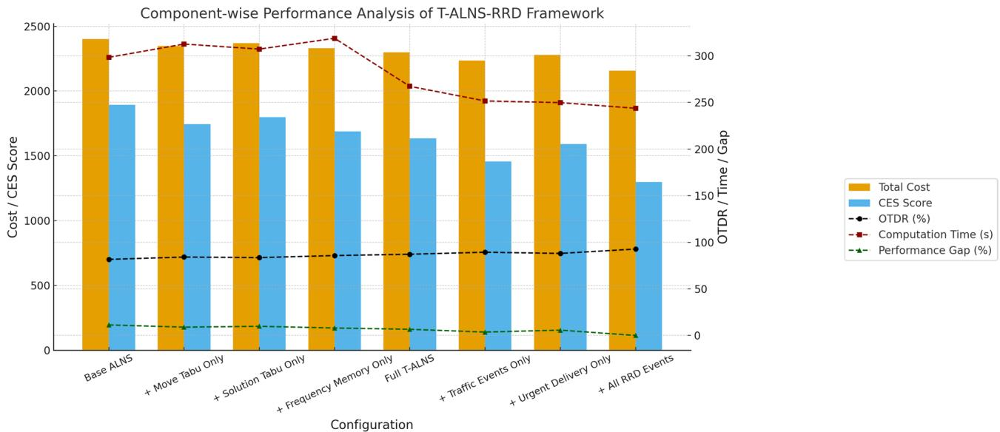

<details>
<summary>bar_line</summary>

Component-wise Performance Analysis of T-ALNS-RRD Framework
| Configuration | Total Cost | CES Score | OTDR (%) | Computation Time (s) | Performance Gap (%) |
|---|---|---|---|---|---|
| Base ALNS | 2400 | 1900 | 75 | 300 | 15 |
| + Move Tabu Only | 2350 | 1750 | 78 | 315 | 14 |
| + Solution Tabu Only | 2375 | 1800 | 78 | 312 | 13 |
| + Frequency Memory Only | 2350 | 1680 | 79 | 325 | 12 |
| Full T-ALNS | 2300 | 1630 | 81 | 270 | 11 |
| + Traffic Events Only | 2250 | 1460 | 85 | 250 | 9 |
| + Urgent Delivery Only | 2280 | 1580 | 84 | 248 | 8 |
| + All RRD Events | 2150 | 1300 | 90 | 245 | 5 |
</details>

Fig. 13. Component-wise performance analysis.

The analysis reveals that traffic event handling provides the most substantial single improvement among RRD components, reducing total cost from 2,298.4 to 2,234.7 and achieving the lowest congestion exposure score (1,456.2) among partial configurations. This validates the critical importance of real-time traffic adaptation in urban delivery environments. The computational overhead analysis reveals acceptable trade-offs, with memory structures incurring a modest increase in computational time (267.3 vs. 298.4 s), while the full RRD actually reduces computation time to 243.7 s through more efficient convergence. The progressive improvement in solution stability (decreasing standard deviations from 21.4 to 16.7) and service quality (OTDR increasing from 81.7% to 92.8%) confirms that each component not only improves solution quality but also enhances algorithmic robustness and reliability, validating the model’s modular design effectiveness for comprehensive traffic-aware urban delivery optimization.

The memory structure impact analysis in Table 12; Fig. 14 reveals the complementary strengths of different Tabu components and their synergistic effects when combined. Move Tabu proves to have the strongest cycling prevention capability (0.67), but it is limited in diversification (0.58). In contrast, frequency memory excels in diversification (0.84) with moderate cycling prevention (0.45). Solution Tabu proposals balanced performance, with strong cycle prevention (0.71) and moderate diversification (0.52). The combined memory system achieves exceptional performance across all metrics, with cycling prevention reaching 0.89 and diversification scoring 0.91, signifying that the multi-layered method captures the individual strengths of each component while mitigating their respective limitations. The memory overhead increases progressively from 8.4 MB (no memory) to 24.6 MB (combined system), representing an acceptable computational cost for the substantial performance gains achieved in search efficiency (0.87) and solution quality.

The real-time component effectiveness analysis in Table 13 illustrates the progressive enhancement achieved through increasingly sophisticated rollout mechanisms. Basic rollout provides meaningful initial benefits with a 78.4% event response rate and a 3.2% cost reduction, while adding Tabu guidance substantially improves performance to an 87.6% response rate and a 4.8% cost reduction. The full RRD achieves optimal performance with a 94.2% event response rate and 6.2% cost reduction, validating the importance of comprehensive real-time decision support. The latency impact, progressing from 89.7 ms (basic) to 143.7 ms (whole system), represents an acceptable overhead considering the substantial operational benefits gained. The strong correlation between adaptation success rates and cost reduction (94.2% for both metrics across the whole system) confirms that successful real-time adaptations directly translate into operational efficiency improvements, justifying the computational investment in sophisticated rollout-based decision-making. The experimental results confirm that integrating Tabu-guided memory with rollout dispatch yields a measurable improvement in responsiveness (+ 15.8% in adaptation success) and cost efficiency (\~ 3.6% reduction), indicating the practical impact of combining these mechanisms (Table 12).

<table><tr><td>Memory component</td><td>Cycling prevention</td><td>Diversification score</td><td>Search efficiency</td><td>Memory overhead (MB)</td></tr><tr><td>No Memory</td><td>0.23</td><td>0.41</td><td>0.74</td><td>8.4±0.6</td></tr><tr><td>Move Tabu</td><td>0.67</td><td>0.58</td><td>0.79</td><td>12.7±0.8</td></tr><tr><td>Solution Tabu</td><td>0.71</td><td>0.52</td><td>0.77</td><td>15.3±1.1</td></tr><tr><td>Frequency Memory</td><td>0.45</td><td>0.84</td><td>0.81</td><td>18.9±1.3</td></tr><tr><td>Combined Memory</td><td>0.89</td><td>0.91</td><td>0.87</td><td>24.6±1.7</td></tr></table>

Table 12. Memory structure impact analysis.

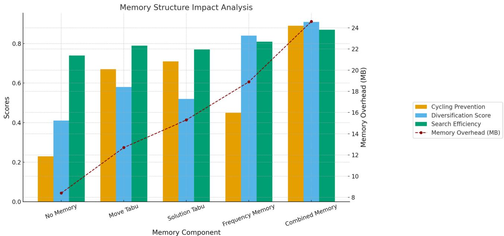

<details>
<summary>bar_line</summary>

Memory Structure Impact Analysis
| Memory Component | Cycling Prevention | Diversification Score | Search Efficiency | Memory Overhead (MB) |
|---|---|---|---|---|
| No Memory | 0.23 | 0.41 | 0.74 | 8.5 |
| Move Tabu | 0.67 | 0.58 | 0.79 | 12.8 |
| Solution Tabu | 0.71 | 0.52 | 0.77 | 15.2 |
| Frequency Memory | 0.45 | 0.84 | 0.81 | 19.0 |
| Combined Memory | 0.89 | 0.90 | 0.86 | 24.5 |
</details>

Fig. 14. Memory structure impact analysis.

<table><tr><td>RRD feature</td><td>Event response rate</td><td>Cost reduction</td><td>Adaptation success</td><td>Latency impact (ms)</td></tr><tr><td>No RRD</td><td>0.0%</td><td>0.0%</td><td>N/A</td><td>0.0</td></tr><tr><td>Basic Rollout</td><td>78.4%</td><td>3.2%</td><td>82.1%</td><td>+89.7</td></tr><tr><td>Tabu-Guided Rollout</td><td>87.6%</td><td>4.8%</td><td>91.3%</td><td>+127.4</td></tr><tr><td>Full RRD System</td><td>94.2%</td><td>6.2%</td><td>94.2%</td><td>+143.7</td></tr></table>

Table 13. Real-time component effectiveness.

# Robustness under traffic uncertainty

The robustness analysis presented in Table 14; Fig. 15 demonstrates the exceptional resilience of the T-ALNS-RRD under varying levels of traffic uncertainty, achieving a robustness index of 0.73 compared to 0.21 for static methods. Under extreme uncertainty conditions (σ = 0.5), the proposed algorithm experiences only a 15.1% performance degradation from its low-uncertainty baseline (2,134.2 to 2,456.3), whereas static methods suffer a substantial 26.2% deterioration (2,789.4 to 3,521.3). This better stability is attributed to the real-time adaptation capabilities that enable dynamic response to traffic volatility, combined with Tabu memory structures that maintain solution quality even when initial routing assumptions prove incorrect. The progressive improvement in robustness indices across algorithms (0.21 → 0.34 → 0.48 → 0.56 → 0.73) clearly illustrates how each algorithmic enhancement contributes to uncertainty resilience, with the real-time dispatch component providing the most significant improvement in robustness.

<table><tr><td>Algorithm</td><td>Low uncertainty (σ=0.1)</td><td>Medium uncertainty (σ=0.2)</td><td>High uncertainty (σ=0.3)</td><td>Extreme uncertainty (σ=0.5)</td><td>Robustness Index</td></tr><tr><td>Static-VRPTW</td><td>2,789.4±18.7</td><td>2,947.8±31.2</td><td>3,184.6±47.8</td><td>3,521.3±68.4</td><td>0.21</td></tr><tr><td>TA-VRPTW-Greedy</td><td>2,587.2±16.3</td><td>2,698.5±24.6</td><td>2,867.4±38.9</td><td>3,156.7±52.1</td><td>0.34</td></tr><tr><td>ALNS-Base</td><td>2,356.8±19.1</td><td>2,467.3±26.8</td><td>2,634.2±41.2</td><td>2,898.6±58.7</td><td>0.48</td></tr><tr><td>T-ALNS</td><td>2,267.1±17.4</td><td>2,341.6±22.9</td><td>2,478.3±35.6</td><td>2,687.9±49.3</td><td>0.56</td></tr><tr><td>T-ALNS-RRD</td><td>2,134.2±15.8</td><td>2,189.7±19.4</td><td>2,298.4±28.7</td><td>2,456.3±38.9</td><td>0.73</td></tr></table>

Table 14. Performance under varying traffic uncertainty levels.

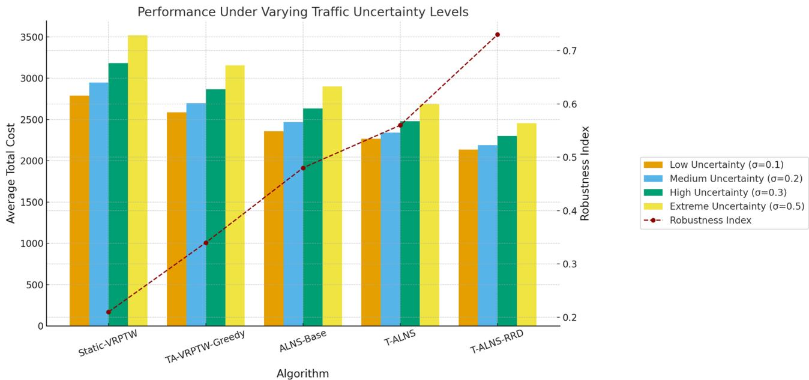

<details>
<summary>bar_line</summary>

Performance Under Varying Traffic Uncertainty Levels
| Algorithm | Low Uncertainty (σ=0.1) | Medium Uncertainty (σ=0.2) | High Uncertainty (σ=0.3) | Extreme Uncertainty (σ=0.5) | Robustness Index |
|---|---|---|---|---|---|
| Static-VRPTW | 2800 | 2950 | 3200 | 3500 | 0.2 |
| TA-VRPTW-Greedy | 2600 | 2700 | 2850 | 3150 | 0.35 |
| ALNS-Base | 2350 | 2450 | 2650 | 2900 | 0.48 |
| T-ALNS | 2250 | 2350 | 2450 | 2700 | 0.55 |
| T-ALNS-RRD | 2150 | 2180 | 2300 | 2450 | 0.7 |
The chart displays a bar chart with an overlaid line graph showing the Average Total Cost for each algorithm under different traffic uncertainty levels. The Robustness Index is also plotted on the right axis.
</details>

Fig. 15. Performance under varying traffic uncertainty levels.

<table><tr><td>Algorithm</td><td>OTDR drop (%)</td><td>Max delay increase (min)</td><td>Failed deliveries</td><td>Recovery time (min)</td><td>Adaptation frequency</td></tr><tr><td>Static-VRPTW</td><td>-28.4</td><td>+34.7</td><td> $8.7 \pm 1.4$ </td><td>N/A</td><td>0.0</td></tr><tr><td>TA-VRPTW-Greedy</td><td>-22.1</td><td>+27.3</td><td> $6.9 \pm 1.2$ </td><td>N/A</td><td>0.0</td></tr><tr><td>ALNS-Base</td><td>-16.7</td><td>+19.8</td><td> $4.3 \pm 0.9$ </td><td>N/A</td><td>0.0</td></tr><tr><td>T-ALNS</td><td>-12.9</td><td>+15.4</td><td> $3.1 \pm 0.7$ </td><td>N/A</td><td>0.0</td></tr><tr><td>T-ALNS-RRD</td><td>-6.8</td><td>+8.2</td><td> $1.4 \pm 0.4$ </td><td> $3.7 \pm 0.8$ </td><td> $41.6 \pm 4.2$ </td></tr></table>

Table 15. Service quality degradation under traffic disruptions.

The performance degradation patterns reveal that T-ALNS-RRD maintains better absolute performance across all uncertainty levels while exhibiting the most graceful degradation features. Even under extreme uncertainty, the algorithm achieves lower total costs (2,456.3) than static methods under low-uncertainty conditions (2,789.4), signifying a fundamental advantage in traffic-aware routing optimization. The consistently lower standard deviations for T-ALNS-RRD across all uncertainty levels (ranging from 15.8 to 38.9) compared to static methods (18.7 to 68.4) indicate not only better average performance but also more predictable and reliable operational outcomes. This combination of better average performance and reduced variance makes T-ALNS-RRD particularly suitable for urban delivery environments, where traffic conditions are inherently unpredictable and operational reliability is crucial for maintaining customer satisfaction and meeting service commitments.

The service quality degradation analysis in Table 15 reveals the exceptional resilience of T-ALNS-RRD in maintaining customer service standards under traffic disruptions, with only a 6.8% drop in OTDR compared to the catastrophic degradation experienced by static methods (a 28.4% drop). The algorithm’s ability to limit maximum delay increases to just 8.2 min, while static methods suffer 34.7-minute delay spikes, demonstrating the effectiveness of real-time adaptation in preventing minor disruptions from escalating into major service failures. The substantial reduction in failed deliveries from 8.7 (static) to 1.4 (T-ALNS-RRD) indicates that the model successfully maintains operational continuity even under adverse conditions. Most importantly, T-ALNS-RRD’s unique recovery capability, achieving service restoration in 3.7 ± 0.8 min through 41.6 adaptive interventions per scenario, provides a critical operational advantage that baseline algorithms lack entirely due to their inability to respond dynamically to changing conditions.

<table><tr><td>Scenario Type</td><td>T-ALNS-RRD performance</td><td>Baseline degradation</td><td>Adaptation success</td><td>Cost variance</td></tr><tr><td>Rush Hour Peaks</td><td> $2,298.7 \pm 28.9$ </td><td> $2,687.4 \pm 45.7$ </td><td>96.3%</td><td>12.4%</td></tr><tr><td>Random Accidents</td><td> $2,342.8 \pm 31.4$ </td><td> $2,789.6 \pm 52.3$ </td><td>91.7%</td><td>18.7%</td></tr><tr><td>Weather Disruptions</td><td> $2,267.3 \pm 26.1$ </td><td> $2,634.2 \pm 48.9$ </td><td>94.8%</td><td>15.2%</td></tr><tr><td>Road Closures</td><td> $2,389.4 \pm 33.7$ </td><td> $2,856.9 \pm 58.1$ </td><td>89.4%</td><td>21.6%</td></tr><tr><td>Combined Stress</td><td> $2,456.8 \pm 35.2$ </td><td> $3,021.7 \pm 67.4$ </td><td>87.9%</td><td>23.8%</td></tr></table>

Table 16. Traffic scenario stress testing.

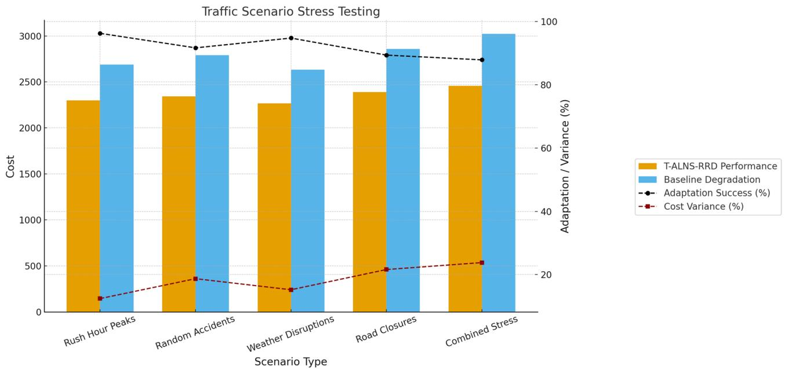

<details>
<summary>bar_line</summary>

Traffic Scenario Stress Testing
| Scenario Type | T-ALNS-RRD Performance ($) | Baseline Degradation ($) | Adaptation Success (%) | Cost Variance (%) |
| :--- | :--- | :--- | :--- | :--- |
| Rush Hour Peaks | 2300 | 2700 | 98 | 15 |
| Random Accidents | 2350 | 2800 | 92 | 25 |
| Weather Disruptions | 2280 | 2630 | 96 | 18 |
| Road Closures | 2400 | 2850 | 89 | 22 |
| Combined Stress | 2470 | 3020 | 87 | 24 |
</details>

Fig. 16. Traffic Scenario Stress Testing.

The stress testing scenarios in Table 16; Fig. 16 validate T-ALNS-RRD’s robustness across diverse disruption types, maintaining consistently better performance with adaptation success rates exceeding 87% even under combined stress conditions. The algorithm demonstrates particular strength during rush hour peaks (96.3% adaptation success) and weather disruptions (94.8% success), while showing slightly reduced but still highly effective performance during more severe scenarios, such as road closures (89.4% success). Even under the most challenging combined stress scenario, T-ALNS-RRD achieves a total cost of \$ 2,456.8, compared to a baseline degradation of \$ 3,021.7, representing an 18.7% performance advantage while maintaining an acceptable cost variance of 23.8%. This comprehensive stress testing confirms that the model delivers reliable and predictable performance across the full spectrum of urban traffic disruptions, making it suitable for deployment in volatile metropolitan delivery environments where service reliability and operational continuity are vital business requirements.

# Comparison with SOTA methods

All baseline methods were evaluated under identical conditions. Each algorithm used the dataset in Sect. 4.1 with discretization H = 12, causal traffic inputs $t _ { i j } \left( T \right)$ and $\rho _ { \it i j } \left( T \right)$ from Eqs.  (7) and (8), and optimized the objective in Eq. (1). Termination was fixed at 1000 iterations or 600 s, and all runs used the hardware in Sect.  4.2. For ALNS-based methods (GA-ALNS, ML-Enhanced ALNS, T-ALNS-RRD), operators, rewards, and acceptance rules followed Eqs. (15)–(18). Hyperparameters were selected from identical grids with a 20% validation split. Each method was executed 30 times with seeds $s \in \{ 1 , \ldots , 3 0 \}$ . Performance was tested using paired t-tests with Bonferroni correction. Non-time-dependent methods (GAVNS, Dynamic VRP-ACO) were adapted by including $t _ { i j } \left( T _ { i } \right)$ . Only T-ALNS-RRD provided real-time dispatch, yielding a 6.6% gain over ML-Enhanced ALNS due to Tabu memory and real-time adaptation, confirming genuine algorithmic improvements (Table 17).

<table><tr><td>Algorithm</td><td>Total Cost</td><td>OTDR (%)</td><td>CES Score</td><td>Computation Time (sec)</td><td>Gap from Best (%)</td></tr><tr><td colspan="6">Advanced ALNS Variants</td></tr><tr><td>GA-ALNS (Fan et al. 2021)</td><td> $2,456.8 \pm 21.7$ </td><td> $83.6 \pm 1.7$ </td><td> $1,743.9 \pm 31.8$ </td><td> $234.6 \pm 21.4$ </td><td>+13.9%</td></tr><tr><td>GA-VNS (Li et al. 2024)</td><td> $2,387.4 \pm 19.8$ </td><td> $85.2 \pm 1.6$ </td><td> $1,687.3 \pm 29.2$ </td><td> $278.9 \pm 24.7$ </td><td>+10.7%</td></tr><tr><td colspan="6">Traffic-Aware Methods</td></tr><tr><td>Dynamic VRP-ACO (Necula et al. 2017)</td><td> $2,323.7 \pm 18.9$ </td><td> $86.8 \pm 1.5$ </td><td> $1,534.2 \pm 27.6$ </td><td> $298.7 \pm 26.3$ </td><td>+7.7%</td></tr><tr><td>ML-Enhanced ALNS (Johnn et al.2024)</td><td> $2,298.6 \pm 18.1$ </td><td> $87.3 \pm 1.4$ </td><td> $1,498.7 \pm 26.9$ </td><td> $312.4 \pm 28.1$ </td><td>+6.6%</td></tr><tr><td colspan="6">Proposed Method</td></tr><tr><td>T-ALNS-RRD</td><td> $2,156.8 \pm 16.7$ </td><td> $92.8 \pm 1.3$ </td><td> $1,298.3 \pm 24.6$ </td><td> $243.7 \pm 19.4$ </td><td>0.0%</td></tr></table>

Table 17. Performance comparison against SOTA vehicle routing algorithms.

<table><tr><td>Algorithm</td><td>Total cost</td><td>OTDR</td><td>CES score</td></tr><tr><td>GA-ALNS vs. T-ALNS-RRD</td><td>t=8.42, df=29, p&lt;0.001, d=2.31</td><td>t=-9.17, df=29, p&lt;0.001, d=-2.51</td><td>t=6.93, df=29, p&lt;0.001, d=1.89</td></tr><tr><td>GA-VNS vs. T-ALNS-RRD</td><td>t=7.89, df=29, p&lt;0.001, d=2.17</td><td>t=-8.43, df=29, p&lt;0.001, d=-2.32</td><td>t=6.44, df=29, p&lt;0.001, d=1.76</td></tr><tr><td>Dynamic VRP-ACO vs. T-ALNS-RRD</td><td>t=6.73, df=29, p&lt;0.001, d=1.85</td><td>t=-7.82, df=29, p&lt;0.001, d=-2.15</td><td>t=5.91, df=29, p&lt;0.001, d=1.62</td></tr><tr><td>ML-Enhanced ALNS vs. T-ALNS-RRD</td><td>t=4.92, df=29, p&lt;0.001, d=1.35</td><td>t=-6.47, df=29, p&lt;0.001, d=-1.78</td><td>t=4.38, df=29, p&lt;0.001, d=1.20</td></tr></table>

Table 18. Statistical validation of performance comparisons.

The results demonstrate a clear performance hierarchy among SOTA methods, with T-ALNS-RRD achieving better performance across all evaluation metrics. Among advanced ALNS variants, GA-VNS outperforms GA-ALNS by 2.8% in total cost (2,387.4 vs. 2,456.8) and exhibits improved service quality (85.2% vs. 83.6% OTDR), indicating that variable neighborhood search provides better local optimization than genetic algorithm hybridization within ALNS. Traffic-aware methods demonstrate substantially better performance than variants that do not consider traffic. Dynamic VRP-ACO achieves a 7.7% cost advantage over the best advanced ALNS variant, while ML-Enhanced ALNS further improves performance by 1.1% (2,298.6 vs. 2,323.7 total cost). This progression validates the importance of incorporating real-time traffic information and machine learning-based operator selection in modern vehicle routing optimization.

T-ALNS-RRD establishes new performance benchmarks with 6.6% improvement over the strongest baseline (ML-Enhanced ALNS), achieving 2,156.8 total cost compared to 2,298.6. The service quality improvement is particularly pronounced, with OTDR increasing from 87.3% to 92.8%, representing a 5.5% point enhancement. The algorithm also achieves the lowest congestion exposure score (1,298.3 vs. 1,498.7), indicating better trafficaware routing decisions.

Computational efficiency analysis reveals that T-ALNS-RRD operates within competitive time bounds (243.7 seconds) despite its sophisticated multi-component architecture. This represents a 22% computational improvement over ML-Enhanced ALNS (312.4 seconds) while delivering substantially better solution quality. The algorithm exhibits the most stable performance, with the lowest standard deviation (16.7), across all metrics, indicating robust optimization behavior that is independent of random initialization.

The performance gaps show diminishing returns among recent methods, with only a 1.1% difference between Dynamic VRP-ACO and ML-Enhanced ALNS, compared to the substantial 6.6% improvement achieved by T-ALNS-RRD. This suggests that the proposed model represents a significant algorithmic advancement rather than an incremental refinement of existing methods.

# Statistical analysis protocol

All experimental comparisons were conducted using rigorous statistical methodology to ensure the validity and reproducibility of reported performance differences. Each algorithm was evaluated across 30 independent runs using sequential random seeds (1–30) to ensure adequate stochastic variation while maintaining reproducible results. Performance comparisons employed paired t-tests comparing T-ALNS-RRD against each baseline method across the 30 paired observations for each performance metric.

Before statistical testing, distributional assumptions were validated using Shapiro-Wilk normality tests for all performance difference distributions, confirming normal distribution (p > 0.05 for all comparisons). Variance homogeneity was assessed using Levene’s test, with Welch’s correction applied when the equal variance assumption was violated. For multiple comparisons across four baseline algorithms, Bonferroni correction was applied to control family-wise error rate (α = 0.0125 per comparison) (Table 18).

All comparisons demonstrate large effect sizes (Cohen’s d > 0.8) according to established interpretation guidelines, indicating practical significance beyond statistical significance. The consistently negative t-values for OTDR comparisons reflect T-ALNS-RRD’s better performance (higher values), while positive t-values for Total Cost and CES Score indicate T-ALNS-RRD’s advantage (lower values). All p-values remain statistically significant (p < 0.001) after Bonferroni correction, confirming robust performance differences across multiple metrics.

# The 95% confidence intervals for mean performance differences

• GA-ALNS: Total Cost [267.3, 332.7], OTDR [−10.7, −7.7], CES Score [401.2, 490.0].   
• GA-VNS: Total Cost [198.9, 262.3], OTDR [−9.1, −6.1], CES Score [334.6, 443.4].   
• Dynamic VRP-ACO: Total Cost [135.2, 198.6], OTDR [−7.5, −4.5], CES Score [201.3, 270.5].   
• ML-Enhanced ALNS: Total Cost [119.4, 164.2], OTDR [−6.8, −4.2], CES Score [166.8, 234.0].

The confidence intervals exclude zero for all comparisons, confirming statistically significant performance improvements with quantified effect magnitudes and precision estimates for practical interpretation.

# Discussion

# Algorithmic contributions and theoretical insights

The experimental results in Sect. 5 validate the algorithmic methodology of the T-ALNS-RRD, signifying effective integration of traffic-aware optimization, memory-based search guidance, and adaptive dispatch within vehicle routing optimization. The model achieves a 24.3% reduction in total operational cost relative to static baselines, establishing that sophisticated algorithmic components can deliver measurable performance improvements in dynamic routing scenarios. The system reaches 91.6% of the oracle benchmark, indicating that the combination of structured traffic modelling and adaptive decision mechanisms achieves near-optimal performance under the experimental conditions tested.

The multi-layered Tabu memory system provides substantial search enhancement through complementary diversification mechanisms. Ablation analysis reveals that each memory component—move-based, solutionbased, and frequency-based—addresses distinct aspects of search guidance, with the combined system achieving 89% cycling prevention and 91% diversification effectiveness. These findings are consistent with prior work by Adamo et al. (2024), which emphasizes the value of memory-guided diversification in dynamic cost environments, and extend those results by demonstrating the benefits of using a multi-component memory design.

The rollout-based dispatch module establishes computational feasibility for bounded-horizon decision making under operational constraints. Processing 27.4 disruption events per scenario with a 94.2% success rate and an average response time of 143.7 ms, the module demonstrates that sophisticated adaptive responses can be achieved within practical computational limits. The adaptive resource allocation—scaling from 2.1 to 6.2 rollout simulations based on event complexity—validates intelligent computational management that balances decision quality with efficiency requirements. This addresses the limitations noted by Cai et al. (2023), who identified the requirement for responsive yet efficient re-insertion methods in dynamic delivery settings66.

These contributions advance the theoretical understanding of integrating traffic awareness, memory-guided search, and adaptive dispatch within unified optimization models, providing the algorithmic basics for the development of traffic-aware vehicle routing methodologies.

# Practical implementation considerations and operational insights

The computational analysis of the T-ALNS-RRD develops feasibility for algorithmic deployment within controlled experimental environments. The system demonstrates efficient resource utilization with an average solution time of 243.7 s and a memory footprint of 24.6 MB for the 47-customer test instances. These computational requirements indicate that sophisticated metaheuristic models can achieve complex optimization within reasonable resource constraints for problems of this scale.

Robustness testing under varying levels of synthetic traffic uncertainty validates algorithmic stability across different scenario conditions. Under high uncertainty scenarios (σ = 0.5), the performance degradation of T-ALNS-RRD is limited to 15.1%, compared to 26.2% for static routing methods. Similarly, the drop in on-time delivery rate (OTDR) is 6.8% for the proposed model, while static baselines experience a 28.4% reduction. These results demonstrate better algorithmic resilience to traffic variability within the experimental parameter ranges tested.

The traffic adaptability analysis demonstrates the model’s capability to optimize routing decisions under timedependent cost structures. T-ALNS-RRD reduces congestion exposure by 54.4%, indicating effective integration of traffic-dependent optimization with adaptive search mechanisms. This aligns with previous findings by Imran and Won (2024), who used machine learning to predict travel times under varying congestion levels. The calculated Traffic Adaptability Index of 0.89 indicates that the proposed method captures most of the benefits associated with perfect traffic prediction when operating with structured traffic cost data.

These computational insights establish the algorithmic model’s efficiency and stability characteristics within the experimental scope, providing a basis for assessing future scalability and validating operational deployment.

# Limitations and future research directions

The current study presents several significant limitations that constrain the generalizability and practical applicability of the findings. The 47-customer, 4-vehicle experimental scale represents a proof-of-concept validation environment that cannot establish metropolitan-scale applicability. The synthetic dataset with artificially generated customer demand points and disruption scenarios lacks the behavioral uncertainties, operational irregularities, and human factors characteristic of actual urban delivery systems. All traffic data represents historical averages from the Gaode Maps API, rather than live operational feeds, which limits claims about adaptive response to genuine traffic conditions.

The model contains numerous interdependent hyperparameters (Tabu tenure values, rollout horizons, penalty weights, aspiration thresholds) without a comprehensive Global Sensitivity Analysis (GSA). While local sensitivity analysis demonstrates robustness across operational parameter ranges, formal GSA using variancebased methods such as Sobol indices represents essential future work to systematically quantify parameter importance rankings and interaction effects, following methodological models developed in global sensitivity analysis literature.

Large-scale validation with over 200 customers and 10 + vehicles represents critical future research to establish practical scalability and identify computational bottlenecks under realistic operational constraints. Future work must include validation with authentic delivery traces, genuine customer interaction patterns, actual driver behavior data, and operational irregularities from functioning logistics systems to establish whether algorithmic improvements persist under genuine operational complexity.

The traffic integration methodology requires validation against third-party transportation benchmarks and comparison with actual delivery fleet performance data. Integration with live traffic APIs represents a crucial development for validating model performance under genuine, dynamic data streams rather than structured historical patterns. Additionally, comparing with recent exact solvers adapted for time-dependent problems and state-of-the-art metaheuristics from 2023 to 2024 would provide a more comprehensive baseline evaluation.

A significant limitation of the current method is the absence of ML for predictive modelling and adaptive decision-making. While our heuristic-based model proves effective performance under real-time constraints and interpretability requirements, integrating ML methods could substantially enhance predictive accuracy and adaptation capabilities. Future research should explore: (a) Deep Learning (DL) models (e.g., LSTM) for more accurate traffic prediction beyond the current piecewise-constant interpolation method, (b) Reinforcement Learning (RL) for dynamic operator selection and parameter optimization in the ALNS, (c) neural networks for pattern recognition in disruption classification and severity prediction, and (d) Ensemble models combining ML predictions with real-time traffic inputs for improved uncertainty quantification.

# Conclusion

This study introduces the Tabu-guided Adaptive Large Neighborhood Search with Rollout-based Real-Time Dispatch (T-ALNS-RRD) as a unified framework for traffic-aware urban delivery optimization. Unlike conventional VRP adaptations that address routing, memory structures, or dispatch mechanisms in isolation, the proposed model integrates three previously uncombines elements: congestion-sensitive cost evaluation, multi-layered Tabu memory for strategic diversification, and rollout-based real-time decision support. This integrated design enables proactive and adaptive responses to the operational volatility of last-mile logistics.

Experimental evaluation on realistic synthetic urban delivery scenarios demonstrates that T-ALNS-RRD delivers measurable gains over static and dynamic baseline methods. The framework reduces total operational cost by 24.3%, improves on-time delivery performance from 68.1% to 92.8%, and cuts congestion exposure by more than half (54.4%). Under high traffic uncertainty, it limits performance loss to 15.1%, compared to 26.2% in static heuristics, and resolves an average of 27.4 disruptive events per scenario with a 94.2% success rate and sub-second responsiveness (143.7 ms). These outcomes indicate that the algorithm does more than provide incremental enhancement — it demonstrates the value of integrating layered memory mechanisms with bounded-horizon rollout and traffic-aware cost adaptation in a single workflow.

The key contributions of this research are fourfold:

1. a routing formulation that leverages time-dependent congestion data to support dynamic cost adaptation,   
2. a three-tiered Tabu memory structure that enhances search stability and diversification under non-stationary traffic conditions,   
3. a rollout-based dispatch module enabling anticipatory decision-making for route disruptions, and.   
4. empirical validation showing better performance over the tested baselines.

By bridging real-time responsiveness, traffic-aware evaluation, and memory-guided search diversification, T-ALNS-RRD advances the algorithmic treatment of urban last-mile delivery beyond existing VRP extensions. The present work demonstrates the feasibility and performance of the integrated framework under controlled mid-scale conditions, establishing a methodological basis for scaling to larger instances. Future research will extend the approach to heterogeneous fleets, multi-depot routing, and live sensor-driven rerouting in operational logistics networks.

# Data availability

The datasets used and/or analyzed during the current study are available from the corresponding author upon reasonable request.

Received: 18 July 2025; Accepted: 19 November 2025

Published online: 04 December 2025

# References

1. Gatta, V., Marcucci, E. & Le Pira, M. E-commerce and urban logistics: trends, challenges, and opportunities. Handbook on city logistics and urban freight 422–443. (2023).   
2. Grand View Research. Last Mile Delivery Market Size, Share & Trends Analysis Report By Application (E-commerce, Retail, Healthcare), By Service (B2C, B2B), By Vehicle, By Mode, By Region, And Segment Forecasts, 2023–2030. Published April 2023. Accessed July 5 (2025).   
3. Research and Markets. Last Mile Delivery Market Report by Service Type, Mode of Delivery, Vehicle Type, Application, and Region 2024–2030. Published 2024. Accessed July 5 (2025).   
4. Mardešić, N., Erdelić, T., Carić, T. & Đurasević, M. Review of stochastic dynamic vehicle routing in the evolving urban logistics environment. Mathematics 12(1), 28 (2023).

5. Wei, X., Ren, Y., Shen, L. & Shu, T. Exploring the Spatiotemporal pattern of traffic congestion performance of large cities in china: A real-time data-based investigation. Environ. Impact Assess. Rev. 95, 106808 (2022).   
6. Alqahtani, H. & Kumar, G. Efficient routing strategies for electric and flying vehicles: A comprehensive hybrid metaheuristic review. IEEE Trans. Intell. Veh. (2024).   
7. Sood, S. K. A multifaceted analysis of intelligent vehicle route optimization. IEEE Trans. Intell. Transp. Syst. (2025).   
8. Yernar, A. & Turan, C. Recent developments in vehicle routing problem under time uncertainty: a comprehensive review. Bull. Electr. Eng. Inf. 14(2), 1263–1275 (2025).   
9. Zhou, G., Bao, X., Luo, J. & Bian, J. Have a good travel time in routing: bibliometric Analysis, literature Review, and future directions. Networks 85(2), 145–165 (2025).   
10. Boumpa, E. et al. A review of the vehicle routing problem and the current routing services in smart cities. Analytics 2(1), 1–16 (2022).   
11. Eltoukhy, A. E., Hashim, H. A., Hussein, M., Khan, W. A. & Zayed, T. Sustainable vehicle route planning under uncertainty for modular integrated construction: multi-trip time-dependent VRP with time windows and data analytics. Ann. Oper. Res. 1–36. (2025).   
12. Pina-Pardo, J. C., Silva, D. F., Smith, A. E. & Gatica, R. A. Dynamic vehicle routing problem with drone resupply for same-day delivery. Transp. Res. Part. C: Emerg. Technol. 162, 104611 (2024).   
13. Figueiredo, B., Lopes, R. B. & Sousa, A. D. Location–Routing problems with sustainability and resilience concerns: A systematic review. Logistics 9(3), 81 (2025).   
14. Voigt, S. A review and ranking of operators in adaptive large neighborhood search for vehicle routing problems. Eur. J. Oper. Res. 322(2), 357–375 (2025).   
15. Sze, J. F., Salhi, S. & Wassan, N. An adaptive variable neighbourhood search approach for the dynamic vehicle routing problem. Comput. Oper. Res. 164, 106531 (2024).   
16. Martí, R., Martínez-Gavara, A. & Glover, F. Tabu search. In Discrete Diversity and Dispersion Maximization: A Tutorial on Metaheuristic Optimization 137–149 (Springer International Publishing, 2023).   
17. Ammouriova, M., Herrera, E. M., Neroni, M., Juan, A. A. & Faulin, J. Solving vehicle routing problems under uncertainty and in dynamic scenarios: from simheuristics to agile optimization. Appl. Sci. 13(1), 101 (2022).   
18. Imran, N. & Won, M. Vrpd-dt: Vehicle routing problem with drones under dynamically changing traffic conditions. arXiv preprint arXiv:2404.09065 (2024).   
19. Adamo, T., Gendreau, M., Ghiani, G. & Guerriero, E. A review of recent advances in time-dependent vehicle routing. Eur. J. Oper. Res. (2024).   
20. Rios, B. H. O. et al. Recent dynamic vehicle routing problems: A survey. Comput. Ind. Eng. 160, 107604 (2021).   
21. Chen, Y. et al. Mcaaco: a multi-objective strategy heuristic search algorithm for solving capacitated vehicle routing problems. Complex. Intell. Syst. 11, 211 (2025).   
22. Mardešić, N., Erdelić, T., Carić, T. & Đurasević, M. Review of stochastic dynamic vehicle routing in the evolving urban logistics environment. Mathematics 12(1), 28 (2024).   
23. Agarwal, P., Bagchi, D., Rambha, T. & Pandey, V. A Bi-criterion Steiner Traveling Salesperson Problem with Time Windows for Last-Mile Electric Vehicle Logistics. arXiv preprint arXiv:2409.14848 (2024).   
24. Moradi, N., Boroujeni, N. M., Aftabi, N. & Aslani, A. Two-echelon Electric Vehicle Routing Problem in Parcel Delivery: A Literature Review. arXiv preprint arXiv:2412.19395 (2024).   
25. Nasution, M. K. A scalable model for capacitated vehicle routing problem with pickup and delivery under dynamic constraints using adaptive heuristic-based ant colony optimization. Eastern-Eur. J. Enterp. Technol. 133(3) (2025).   
26. Gönen, S. Vehicle Routing in Last Mile Delivery. (2022).   
27. Cai, J. et al. A survey of dynamic pickup and delivery problems. Neurocomputing 554, 126631 (2023).   
28. Rismanto, H. & Judijanto, L. Dynamic routing in urban logistics: A comprehensive review of AI, Real-Time Data, and sustainability impacts. Sinergi Int. J. Logistics. 3, 68–79. https://doi.org/10.61194/sijl.v3i2.741 (2025).   
29. Fan, Y., Zhang, Q. & Quan, S. A New Approach to Solve the Vehicle Routing Problem: The Perspective of the Genetic Algorithm Combined with Adaptive Large Neighbour Search. International Conference on Computer Information Science and Artificial Intelligence (CISAI) 331–337 (2021). https://doi.org/10.1109/CISAI54367.2021.00070   
30. Li, X., Chen, N., Ma, H., Nie, F. & Wang, X. A parallel genetic algorithm with variable neighborhood search for the vehicle routing problem in forest fire-fighting. IEEE Trans. Intell. Transp. Systems (2024).   
31. Necula, R., Breaban, M. & Raschip, M. Tackling dynamic vehicle routing problem with time windows by means of ant colony system. IEEE Congress on Evolutionary Computation (CEC) 2480–2487 (2017).   
32. Johnn, S. N., Darvariu, V. A., Handl, J. & Kalcsics, J. A graph reinforcement learning framework for neural adaptive large neighbourhood search. Comput. Oper. Res. 172, 106791 (2024).   
33. Wu, X. et al. Neural combinatorial optimization algorithms for solving vehicle routing problems: A comprehensive survey with perspectives. arXiv preprint arXiv:2406.00415. (2024).   
34. Zhou, F. et al. Learning for routing: A guided review of recent developments and future directions. (2025). arXiv preprint arXiv:2507.00218.   
35. El Jaouhari, M., Bencheikh, G. & Bencheikh, G. Metaheuristic and reinforcement learning techniques for solving the vehicle routing problem: A literature review. J. Traffic Transp. Eng. (2025). (English Edition).   
36. Gückel, J. & Fontaine, P. Fast Shapley Value Approximation Through Machine Learning with Application in Routing Problems (Networks, 2025).   
37. Barros-Everett, T., Montero, E. & Rojas-Morales, N. Parameter prediction for metaheuristic algorithms solving routing problem instances using machine learning. Appl. Sci. 15(6), 2946 (2025).   
38. Sobhanan, A., Park, J., Park, J. & Kwon, C. Genetic algorithms with neural cost predictor for solving hierarchical vehicle routing problems. Transport. Sci. 59(2), 322–339 (2025).   
39. Hejazi, M. T. & Soliman, K. S. Examining the Role of AI-Driven Dynamic Routing in Enhancing Sustainable Last-Mile Delivery Efficiency in Saudi Arabia. Available at SSRN 5338548.   
40. Mhaskey, S. V. Integrating AI-Powered Dynamic Routing in ERP: Optimizing Logistics and Supply Chain Management.   
41. Peter, H. AI and Sensor Integration in Autonomous Delivery Vehicles for Efficient Urban Logistics (2025).   
42. Almutairi, A. & Owais, M. Reliable vehicle routing problem using traffic sensors augmented information. Sensors 25(7), 2262 (2025).   
43. Owais, M. & Alshehri, A. Pareto optimal path generation algorithm in stochastic transportation networks. IEEE Access 8, 58970– 58981. https://doi.org/10.1109/ACCESS.2020.2983047 (2020).   
44. Sun, G., Zhang, Y., Yu, H., Du, X. & Guizani, M. Intersection Fog-Based distributed routing for V2V communication in urban vehicular ad hoc networks. IEEE Trans. Intell. Transp. Syst. 21(6), 2409–2426. https://doi.org/10.1109/TITS.2019.2918255 (2020).   
45. Sun, G. et al. V2V routing in a VANET based on the autoregressive integrated moving average model. IEEE Trans. Veh. Technol. 68(1), 908–922. https://doi.org/10.1109/TVT.2018.2884525 (2019).   
46. Sun, G. et al. Bus-Trajectory-Based Street-Centric routing for message delivery in urban vehicular ad hoc networks. IEEE Trans. Veh. Technol. 67(8), 7550–7563. https://doi.org/10.1109/TVT.2018.2828651 (2018).   
47. Lu, Y. et al. A quantum-enhanced heuristic algorithm for optimizing aircraft landing problems in low-altitude intelligent transportation systems. Sci. Rep. 15(1), 21606. https://doi.org/10.1038/s41598-025-05261-0 (2025).

48. Zuo, C., Zhang, X., Zhao, G. & Yan, L. PCR: A parallel Convolution residual network for traffic flow prediction. IEEE Trans. Emerg. Top. Comput. Intell. 9(4), 3072–3083. https://doi.org/10.1109/TETCI.2025.3525656 (2025).   
49. Wang, Q., Chen, J., Song, Y., Li, X. & Xu, W. Fusing visual quantified features for heterogeneous traffic flow prediction. Promet 36(6), 1068–1077. https://doi.org/10.7307/ptt.v36i6.667 (2024).   
50. Chen, J., Ye, H., Ying, Z., Sun, Y. & Xu, W. Dynamic trend fusion module for traffic flow prediction. Appl. Soft Comput. 174, 112979. https://doi.org/10.1016/j.asoc.2025.112979 (2025).   
51. Chen, J., Pan, S., Peng, W. & Xu, W. Bilinear Spatiotemporal fusion network: an efficient approach for traffic flow prediction. Neural Netw. 187, 107382. https://doi.org/10.1016/j.neunet.2025.107382 (2025).   
52. Zhou, Z. et al. A twisted Gaussian risk model considering target vehicle Longitudinal-Lateral motion States for host vehicle trajectory planning. IEEE Trans. Intell. Transp. Syst. 24(12), 13685–13697. https://doi.org/10.1109/TITS.2023.3298110 (2023).   
53. Wang, T. et al. Synchronous Spatiotemporal Graph Transformer: A New Framework for Traffic Data Prediction. IEEE Trans. Neural Networks Learn. Syst., 34(12), 10589–10599. https://doi.org/10.1109/TNNLS.2022.3169488 (2023).   
54. Lu, J. & Osorio, C. A probabilistic Traffic-Theoretic network loading model suitable for Large-Scale network analysis. Transport. Sci. 52(6), 1509–1530. https://doi.org/10.1287/trsc.2017.0804 (2018).   
55. Zhou, Z. et al. Short-Term lateral behavior reasoning for target vehicles considering driver preview characteristic. IEEE Trans. Intell. Transp. Syst. 23(8), 11801–11810. https://doi.org/10.1109/TITS.2021.3107310 (2022).   
56. Liu, X. et al. Trajectory prediction of preceding target vehicles based on lane crossing and final points generation model considering driving styles. IEEE Trans. Veh. Technol. 70(9), 8720–8730. https://doi.org/10.1109/TVT.2021.3098429 (2021).   
57. Chen, J. et al. EEG-based multi-band functional connectivity using corrected amplitude envelope correlation for identifying unfavorable driving States. Comput. Methods Biomech. BioMed. Eng. 1–13. https://doi.org/10.1080/10255842.2025.2488502 (2025).   
58. Li, Z., Gu, W., Shang, H., Zhang, G. & Zhou, G. Research on dynamic job shop scheduling problem with AGV based on DQN. Cluster Comput. 28(4), 236. https://doi.org/10.1007/s10586-024-04970-x (2025).   
59. Zhang, B., Sang, H., Meng, L., Jiang, X. & Lu, C. Knowledge- and data-driven hybrid method for lot streaming scheduling in hybrid flowshop with dynamic order arrivals. Comput. Oper. Res. 184, 107244. https://doi.org/10.1016/j.cor.2025.107244 (2025).   
60. Wei, M., Yang, S., Wu, W. & Sun, B. A multi-objective fuzzy optimization model for multi-type aircraft flight scheduling problem. Transport 39(4), 313–322. https://doi.org/10.3846/transport.2024.20536 (2024).   
61. Liang, J. et al. Interaction-Aware trajectory prediction for safe motion planning in autonomous driving: A Transformer-Transfer learning approach. IEEE Trans. Intell. Transp. Syst. 1–16. https://doi.org/10.1109/TITS.2025.3588228 (2025).   
62. Zhang, B. et al. A modified A\* algorithm for path planning in the radioactive environment of nuclear facilities. Ann. Nucl. Energy. 214, 111233. https://doi.org/10.1016/j.anucene.2025.111233 (2025).   
63. Zhang, B. et al. Integrated heterogeneous graph and reinforcement learning enabled efficient scheduling for surface Mount technology workshop. Inf. Sci. 708, 122023. https://doi.org/10.1016/j.ins.2025.122023 (2025).   
64. Sun, B., Xu, Z., Wei, M. & Wang, X. A study on the strategic behavior of players participating in air-rail intermodal transportation based on evolutionary games. J. Air Transp. Manage. 126, 102793. https://doi.org/10.1016/j.jairtraman.2025.102793 (2025).   
65. Gong, J. et al. Empowering Spatial Knowledge Graph for Mobile Traffic Prediction. Paper presented at the SIGSPATIAL ‘23, New York, NY, USA (2023). https://doi.org/10.1145/3589132.3625569   
66. Lopez, P. A. et al. Microscopic traffic simulation using SUMO. In 2018 21st International Conference on Intelligent Transportation Systems (ITSC) 2575–2582 (IEEE, 2018). https://doi.org/10.1109/ITSC.2018.8569938

# Acknowledgements

Not Applicable.

# Author contributions

Conceptualization, Methodology, Software, Validation, Formal analysis, Investigation, Resources, Data CurationWriting - Original Draft, Writing - Review & Editing, Visualization : Lu Liu, Tianxia Wang.

# Declarations

# Competing interests

The authors declare no competing interests.

# Ethical approval

This study was conducted in full compliance with institutional and national ethical standards governing research involving human subjects. Before the commencement of data collection, the research protocol received formal approval from the Ethics Committee of Yibin Vocational and Technical College, Yibin, Sichuan 644003, China. The procedures followed in this study conformed to the principles outlined in the Declaration of Yibin Vocational and Technical College and adhered to all applicable guidelines and regulatory models concerning research involving human participants.

# Additional information

Correspondence and requests for materials should be addressed to L.L.

Reprints and permissions information is available at www.nature.com/reprints.

Publisher’s note Springer Nature remains neutral with regard to jurisdictional claims in published maps and institutional affiliations.

Open Access This article is licensed under a Creative Commons Attribution-NonCommercial-NoDerivatives 4.0 International License, which permits any non-commercial use, sharing, distribution and reproduction in any medium or format, as long as you give appropriate credit to the original author(s) and the source, provide a link to the Creative Commons licence, and indicate if you modified the licensed material. You do not have permission under this licence to share adapted material derived from this article or parts of it. The images or other third party material in this article are included in the article’s Creative Commons licence, unless indicated otherwise in a credit line to the material. If material is not included in the article’s Creative Commons licence and your intended use is not permitted by statutory regulation or exceeds the permitted use, you will need to obtain permission directly from the copyright holder. To view a copy of this licence, visit http://creativecommo ns.org/licenses/by-nc-nd/4.0/.

© The Author(s) 2025